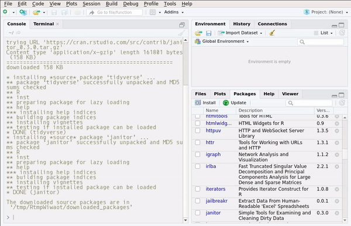
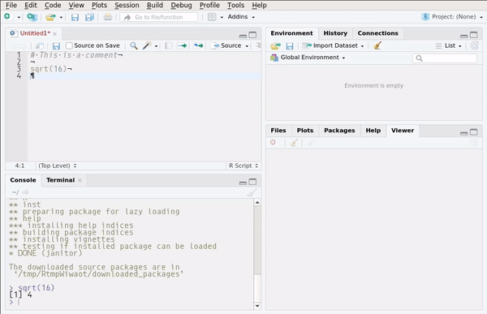

# Getting to know RStudio

## Panes

RStudio is divided into different panes. Each pane has a specific function. The gif below shows
some of these panes:

```{r, echo=FALSE}

```

Take some time to look around what each pane shows you. Some panes are empty; for example the *Plots*
pane or the *Viewer* pane. *Plots* shows you the plots you make. You can browse the plots and save
them. We will see this in more detail in a later chapter. *Viewer* shows you previews of documents
that you generate with R. More on this later.

## Console

The *Console* pane is where you can execute R code. Write the following in the console:

```{r, eval=FALSE}
2 + 3
```

and you'll get the answer, `5`. However, do not write a lot of lines in the console. It is better
write your code inside a script.

## Scripts

Look at the gif below:

```{r, echo=FALSE}
knitr::include_graphics("pics/rstudio_new_script.gif")
```

In this gif, we see the user creating a new R script. R scripts are simple text files that hold R
code. Think of `.do` files in STATA or `.c` files for C. R scripts have the extension `.r` or `.R`.

It is possible to create a lot of other files. We'll take a look at `R Markdown` files later.

### The help pane

The *Help* pane allows you to consult documentation for functions or packages. The gif below shows
how it works:

```{r, echo=FALSE}
knitr::include_graphics("pics/rstudio_help.gif")
```

you can also access help using the following syntax: `?lm`. This will bring up the documentation for
the function `lm()`. You can also type `??lm` which will look for the string `lm` in every package.

### The Environment pane

The *Environment* pane shows every object created in the current section. It is especially useful
if you have defined lists or have loaded data into R as it makes it easy to explore these more
complex objects.

## Options

It is also possible to customize RStudio's look and feel:

```{r, echo=FALSE}

```

Take some time to go through the options.

## Keyboard shortcuts

It is a good idea to familiarize yourself with at least some keyboard shortcuts. This is more
convenient than having to move the mouse around:

```{r, echo=FALSE}
knitr::include_graphics("pics/rstudio_shortcuts.gif")
```

If there is only one keyboard shortcut you need to know, it's `Ctrl-Enter` that executes a line of code
from your script. However, these other shortcuts are also worth knowing:

* `CTRL-ALT-R`: run entire script
* `CTRL-ALT-UP or DOWN`: make cursor taller or shorter, allowing you to edit multiple lines at the same time
* `CTRL-F`: Search and replace
* `ALT-UP or DOWN`: Move line up or down
* `CTRL-SHIFT-C`: Comment/uncomment line
* `ALT-SHIFT-K`: Bring up the list of keyboard shortcuts
* `CTRL-SHIFT-M`: Insert the pipe operator (`%>%`, more on this later)
* `CTRL-S`: Save script

This is just a few keyboard shortcuts that I personally find useful. However, I strongly advise you
to learn and use whatever shortcuts are useful to you!

## Projects

One of the best features of RStudio are projects. Creating a project is simple; the gif below
shows how you can create a project and how you can switch between projects.

```{r, echo=FALSE}
knitr::include_graphics("pics/rstudio_projects.gif")
```

Projects make a lot of things easier, such as managing paths. More on this in the chapter about
reading data. Another useful feature of projects is that the scripts you open in project A will
stay open even if you switch to another project B, and then switch back to the project A again.

You can also use version control (with git) inside a project. Version control is very useful, but
I won't discuss it here. You can find a lot of resources online to get you started with git.

## History

The *History* pane saves all the previous lines you executed. You can then select these lines and
send them back to the console or the script.

```{r, echo=FALSE}
knitr::include_graphics("pics/rstudio_history.gif")
```

## Plots

All the plots you make during a session are visible in the *Plots* pane. From there, you can
export them in different formats.

```{r, echo=FALSE}
knitr::include_graphics("pics/rstudio_plots.gif")
```

The plots shown in the gif are made using basic R functions. Later, we will learn how to make nicer
looking plots using the package `ggplot2`.

## Addins

Some packages install addins, which are accessible through the addins button:

```{r, echo=FALSE}
knitr::include_graphics("pics/rstudio_addins.png")
```

This addins make it easier to use some functions and you can read more about them [here](https://rstudio.github.io/rstudioaddins/#overview).

## Exercises

### Exercise 1 {-}

Change the look and feel of RStudio to suit your tastes! I personally like to move the console
to the right and use a dark theme. Take some 5 minutes to customize it and browse through all the options.
