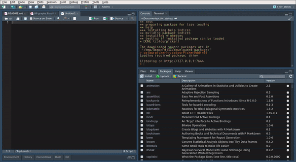
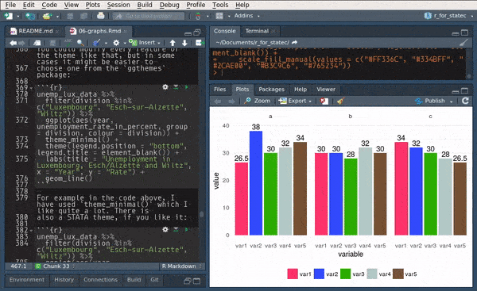

# Graphs

By default, it is possible to make a lot of graphs with R without the need of any external
packages. However, in this chapter, we are going to learn how to make graphs using `{ggplot2}` which
is a very powerful package that produces amazing graphs. There is an entry cost to `{ggplot2}` as it
works in a very different way than what you would expect, especially if you know how to make plots
with the basic R functions already. But the resulting graphs are well worth the effort and once
you will know more about `{ggplot2}` you will see that in a lot of situations it is actually faster
and easier. Another advantage is that making plots with `{ggplot2}` is consistent, so you do not need
to learn anything specific to make, say, density plots. There are a lot of extensions to `{ggplot2}`,
such as `{ggridges}` to create so-called ridge plots and `{gganimate}` to create animated plots. By
the end of this chapter you will know how to do basic plots with `{ggplot2}` and also how to use these
two extensions.

## Resources

Before showing some examples and the general functionality of `{ggplot2}`, I list here some online
resources that I keep coming back to:

* [Data Visualization for Social Science](http://socviz.co/)

* [R Graphics Cookbook](http://www.cookbook-r.com/Graphs/)

* [R graph gallery](http://www.r-graph-gallery.com/portfolio/ggplot2-package/)

* [Tufte in R](http://motioninsocial.com/tufte/)

* [ggplot2 extensions](http://www.ggplot2-exts.org/gallery/)

* [ggthemes Vignette](https://cran.r-project.org/web/packages/ggthemes/vignettes/ggthemes.html)

* [ggplot2 cheatsheet](https://www.rstudio.com/wp-content/uploads/2015/03/ggplot2-cheatsheet.pdf)

When I first started using `{ggplot2}`, I had a cookbook approach to it; I tried findinge examples
online that looked like what I needed, copy and paste the code and then adapted it to my case. The above resources
are the ones I consulted and keep consulting in these situations (I also go back to past code I've written, of
course). Don't hesitate to skim these resources for inspiration and to learn more about some
extensions to `{ggplot2}`. In the next subsections I am going to show you how to draw the most common
plots, as well as show you how to customize your plots with `{ggthemes}`, a package that contains pre-defined
themes for `{ggplot2}`.

## Examples

I think that the best way to learn how to use `{ggplot2}` is to jump right into it. Let's first start with
barplots.

### Barplots

To follow the examples below, load the following libraries:

```{r}
library(ggplot2)
library(ggthemes)
```

`{ggplot2}` is an implementation of the *Grammar of Graphics* by @wilkinson2006, but you don't need
to read the books to start using it. If we go back to the Star Wars data (contained in `dplyr`),
and wish to draw a barplot of the gender, the following lines are enough:


```{r}
ggplot(starwars, aes(gender)) +
  geom_bar()
```

The first argument of the function is the data (called `starwars` in this example), and then the
function `aes()`. This function is where you list the variables that you want to map to the aesthetics
of the *geoms* functions. On the second line, you see that we use the `geom_bar()` function. This
function creates a barplot of `gender` variable.
You can get different kind of plots by using different `geom_` functions. You can also provide the
`aes()` argument to the `geom_*()` function:

```{r}
ggplot(starwars) +
  geom_bar(aes(gender))
```

The difference between these two approaches is that when you specify the aesthetics in the `ggplot()` function,
all the `geom_*()` functions that follow will inherited these aesthetics. This is useful if you want to avoid
writing the same code over and over again, but can be problematic if you need to specify different aesthetics
to different `geom_*()` functions. This will become clear in a later example.

You can add options to your plots, for instance, you can change the coordinate system in your barplot:

```{r}
ggplot(starwars, aes(gender)) +
  geom_bar() +
  coord_flip()
```

This is the basic recipe to create plots using `{ggplot2}`: start with a call to `ggplot()` where you specify
the data you want to plot, and optionally the aesthetics. Then, use the `geom_*()` function you need; if you
did not specify the aesthetics in the call to the `ggplot()` function, do it here. Then, you can add different
options, such as changing the coordinate system, changing the theme, the colour palette used, changing the
position of the legend and much, much more. This chapter will only give you an overview of the capabilities
of `{ggplot2}`.

### Scatter plots

Scatter plots are very useful, especially if you are trying to figure out the relationship between two variables.
For instance, let's make a scatter plot of height vs weight of Star Wars characters:

```{r, warning = FALSE}
ggplot(starwars) +
  geom_point(aes(height, mass))
```

As you can see there is an outlier; a very heavy character! Star Wars fans already guessed it, it's Jabba the Hut.
To make the plot easier to read, let's remove this outlier:

```{r, warning = FALSE}
starwars %>%
  filter(!str_detect(name, "Jabba")) %>%
  ggplot() +
    geom_point(aes(height, mass))
```

There is a positive correlation between height and mass. Later, we are going to see how we can also plot a regression
line that goes through the scatter plot, but first, let's discover some other `geom_*()` functions.

### Density

`geom_density()` is the *geom* that allows you to get density plots:

```{r}
ggplot(starwars, aes(height)) +
  geom_density()
```

Let's go into more detail now; what if you would like to plot the densities for feminines and masculines
only (removing the droids from the data first)? This can be done by first filtering the data using
`dplyr` and then separating the dataset by gender:


```{r, eval=FALSE}
starwars %>%
  filter(gender %in% c("feminine", "masculine"))
```

The above lines do the filtering; only keep gender if gender is in the vector `"feminine", "masculine"`.
This is much easier than having to write `gender == "feminine" | gender == "masculine"`. Then, we pipe
this dataset to `ggplot`:

```{r}
starwars %>%
  filter(gender %in% c("feminine", "masculine")) %>%
  ggplot(aes(height, fill = gender)) +
  geom_density()
```

Let's take a closer look to the `aes()` function: I've added `fill = gender`. This means that
there will be one density plot for each gender in the data, and each will be coloured accordingly.
This is where `{ggplot2}` might be confusing; there is no need to write explicitly (even if it is
possible) that you want the *feminine* density to be red and the *masculine* density to be blue. You just
map the variable `gender` to this particular aesthetic. You conclude the plot by adding
`geom_density()` which is this case is the plot you want. We will see later how to change the
colours of your plot.

An alternative way to write this code is first to save the filtered data in a variable, and define
the aesthetics inside the `geom_density()` function:


```{r}
filtered_data <- starwars %>%
  filter(gender %in% c("feminine", "masculine"))

ggplot(filtered_data) +
  geom_density(aes(height, fill = gender))
```

### Line plots

For the line plots, we are going to use official unemployment data (the same as in the previous
chapter, but with all the available years). Get it from
[here](https://github.com/b-rodrigues/modern_R/tree/master/datasets/unemployment/all)
(downloaded from:
http://www.statistiques.public.lu/stat/TableViewer/tableView.aspx?ReportId=12950&IF_Language=eng&MainTheme=2&FldrName=3&RFPath=91).

Let's plot the unemployment for the canton of Luxembourg only:

```{r}
unemp_lux_data <- import("datasets/unemployment/all/unemployment_lux_all.csv")

unemp_lux_data %>%
  filter(division == "Luxembourg") %>%
  ggplot(aes(x = year, y = unemployment_rate_in_percent, group = 1)) +
  geom_line()
```

Because line plots are 2D, you need to specify the y and x axes. There is also another option you
need to add, `group = 1`. This is to tell `aes()` that the dots have to be connected with a single
line. What if you want to plot more than one commune?

```{r}
unemp_lux_data %>%
  filter(division %in% c("Luxembourg", "Esch-sur-Alzette")) %>%
  ggplot(aes(x = year, y = unemployment_rate_in_percent, group = division, colour = division)) +
  geom_line()
```

This time, I've specified `group = division` which means that there has to be one line per as many
communes as in the variable `division`. I do the same for colours. I think the next example
illustrates how `{ggplot2}` is actually brilliant; if you need to add a third commune, there is no
need to specify anything else; no need to add anything to the legend, no need to specify a third
colour etc:

```{r}
unemp_lux_data %>%
  filter(division %in% c("Luxembourg", "Esch-sur-Alzette", "Wiltz")) %>%
  ggplot(aes(x = year, y = unemployment_rate_in_percent, group = division, colour = division)) +
  geom_line()
```

The three communes get mapped to the colour aesthetic so whatever the number of communes, as long
as there are enough colours, the communes will each get mapped to one of these colours.

### Facets

In some case you have a factor variable that separates the data you wish to plot into different
categories. If you want to have a plot per category you can use the `facet_grid()` function.
Careful though, this function does not take a variable as an argument, but a formula, hence the `~`
symbol in the code below:

```{r}
starwars %>%
  mutate(human = case_when(species == "Human" ~ "Human",
                           species != "Human" ~ "Not Human")) %>%
  filter(gender %in% c("feminine", "masculine"), !is.na(human)) %>%
  ggplot(aes(height, fill = gender)) +
  facet_grid(. ~ human) + #<--- this is a formula
  geom_density()
```

I first created a factor variable that specifies if a Star Wars character is human or not, and then
use it for facetting. By changing the formula, you change how the facetting is done:

```{r}
starwars %>%
  mutate(human = case_when(species == "Human" ~ "Human",
                           species != "Human" ~ "Not Human")) %>%
  filter(gender %in% c("feminine", "masculine"), !is.na(human)) %>%
  ggplot(aes(height, fill = gender)) +
  facet_grid(human ~ .) +
  geom_density()
```

Recall the categorical variable `more_1` that we computed in the previous chapter? Let's use it as
a faceting variable:

```{r}
starwars %>%
  rowwise() %>%
  mutate(n_films = length(films)) %>%
  mutate(more_1 = case_when(n_films == 1 ~ "Exactly one movie",
                            n_films != 1 ~ "More than 1 movie")) %>%
  mutate(human = case_when(species == "Human" ~ "Human",
                           species != "Human" ~ "Not Human")) %>%
  filter(gender %in% c("feminine", "masculine"), !is.na(human)) %>%
  ggplot(aes(height, fill = gender)) +
  facet_grid(human ~ more_1) +
  geom_density()
```

### Pie Charts

I am not a huge fan of pie charts, but sometimes this is what you have to do. So let's see how you
can create pie charts.
First, let's create a mock dataset with the function `tibble::tribble()` which allows you to create a
dataset line by line:

```{r}
test_data <- tribble(
  ~id, ~var1, ~var2,  ~var3, ~var4, ~var5,
  "a", 26.5, 38, 30, 32, 34,
  "b", 30, 30, 28, 32, 30,
  "c", 34, 32, 30, 28, 26.5
)
```

This data is not in the right format though, which is wide. We need to have it in the long format
for it to work with `{ggplot2}`. For this, let's use `tidyr::gather()` as seen in the previous chapter:

```{r}
test_data_long = test_data %>%
  gather(variable, value, starts_with("var"))
```

Now, let's plot this data, first by creating 3 bar plots:

```{r}
ggplot(test_data_long) +
  facet_wrap(~id) +
  geom_bar(aes(variable, value, fill = variable), stat = "identity")
```

In the code above, I introduce a new option, called `stat = "identity"`. By default, `geom_bar()` counts
the number of observations of each category that is plotted, which is a statistical transformation.
By adding `stat = "identity"`, I force the statistical transformation to be the identity function, and
thus plot the data as is.

To create the pie chart, first we need to compute the share of each `id` to `var1`, `var2`, etc…

To do this, we first group by `id`, then compute the total. Then we use a new function `ungroup()`.
After using `ungroup()` all the computations are done on the whole dataset instead of by group, which
is what we need to compute the share:

```{r}
test_data_long <- test_data_long %>%
  group_by(id) %>%
  mutate(total = sum(value)) %>%
  ungroup() %>%
  mutate(share = value/total)
```

Let's take a look to see if this is what we wanted:

```{r}
print(test_data_long)
```

If you didn't understand what `ungroup()` did, rerun the last few lines with it and inspect the
output.

To plot the pie chart, we create a barplot again, but specify polar coordinates:

```{r}
ggplot(test_data_long) +
  facet_wrap(~id) +
  geom_bar(aes(y = share, x = "", fill = variable), stat = "identity") +
  theme() +
  coord_polar("y", start = 0)
```

As you can see, this typical pie chart is not very easy to read; compared to the barplots above it
is not easy to distinguish if `a` has a higher share than `b` or `c`. You can change the look of the
pie chart, for example by specifying `variable` as the `x`:

```{r}
ggplot(test_data_long) +
  facet_wrap(~id) +
  geom_bar(aes(y = share, x = variable, fill = variable), stat = "identity") +
  theme() +
  coord_polar("x", start = 0)
```

But as a general rule, avoid pie charts if possible. I find that pie charts are only interesting if
you need to show proportions that are hugely unequal, to really emphasize the difference between
said proportions.

### Adding text to plots

Sometimes you might want to add some text to your plots. This is possible with `geom_text()`:

```{r}
ggplot(test_data_long) +
  facet_wrap(~id) +
  geom_bar(aes(variable, value, fill = variable), stat = "identity") +
  geom_text(aes(variable, value + 1.5, label = value))
```

You can put anything after `label = ` but in general what you want are the values, so that's what
I put there. But you can also refine it, imagine the values are actually in euros:

```{r}
ggplot(test_data_long) +
  facet_wrap(~id) +
  geom_bar(aes(variable, value, fill = variable), stat = "identity") +
  geom_text(aes(variable, value + 1.5, label = paste(value, "€")))
```

You can also achieve something similar with `geom_label()`:

```{r}
ggplot(test_data_long) +
  facet_wrap(~id) +
  geom_bar(aes(variable, value, fill = variable), stat = "identity") +
  geom_label(aes(variable, value + 1.5, label = paste(value, "€")))
```


## Customization

Every plot you've seen until now was made with the default look of `{ggplot2}`. If you want to change
the look, you can apply a theme, and a colour scheme. Let's take a look at themes first by using the
ones found in the package `ggthemes`. But first, let's learn how to change the names of the axes
and how to title a plot.

### Changing titles, axes labels, options, mixing geoms and changing themes

The name of this subsection is quite long, but this is because everything is kind of linked. Let's
start by learning what the `labs()` function does. To change the title of the plot, and of the axes,
you need to pass the names to the `labs()` function:

```{r}
unemp_lux_data %>%
  filter(division %in% c("Luxembourg", "Esch-sur-Alzette", "Wiltz")) %>%
  ggplot(aes(year, unemployment_rate_in_percent, group = division, colour = division)) +
  labs(title = "Unemployment in Luxembourg, Esch/Alzette and Wiltz", x = "Year", y = "Rate") +
  geom_line()
```

What if you want to make the lines thicker?

```{r}
unemp_lux_data %>%
  filter(division %in% c("Luxembourg", "Esch-sur-Alzette", "Wiltz")) %>%
  ggplot(aes(year, unemployment_rate_in_percent, group = division, colour = division)) +
  labs(title = "Unemployment in Luxembourg, Esch/Alzette and Wiltz", x = "Year", y = "Rate") +
  geom_line(size = 2)
```

Each `geom_*()` function has its own options. Notice that the `size=2` argument is not inside
an `aes()` function. This is because I do not want to map a variable of the data to the size
of the line, in other words, I do not want to make the size of the line proportional to a certain
variable in the data. Recall the scatter plot we did earlier, where we showed that height and mass of
star wars characters increased together? Let's take this plot again, but make the size of the dots proportional
to the birth year of the character:

```{r, warning = FALSE}
starwars %>%
  filter(!str_detect(name, "Jabba")) %>%
  ggplot() +
    geom_point(aes(height, mass, size = birth_year))
```

Making the size proportional to the birth year (the age would have been more informative) allows
us to see a third dimension. It is also possible to "see" a fourth dimension, the gender for instance,
by changing the colour of the dots:

```{r, warning = FALSE}
starwars %>%
  filter(!str_detect(name, "Jabba")) %>%
  ggplot() +
    geom_point(aes(height, mass, size = birth_year, colour = gender))
```

As I promised above, we are now going to learn how to add a regression line to this scatter plot:

```{r, warning = FALSE}
starwars %>%
  filter(!str_detect(name, "Jabba")) %>%
  ggplot() +
    geom_point(aes(height, mass, size = birth_year, colour = gender)) +
    geom_smooth(aes(height, mass), method  = "lm")
```

`geom_smooth()` adds a regression line, but only if you specify `method = "lm"` ("lm" stands for
"linear model"). What happens if you remove this option?

```{r, warning = FALSE}
starwars %>%
  filter(!str_detect(name, "Jabba")) %>%
  ggplot() +
    geom_point(aes(height, mass, size = birth_year, colour = gender)) +
    geom_smooth(aes(height, mass))
```

By default, `geom_smooth()` does a non-parametric regression called LOESS (locally estimated scatterplot smoothing),
which is more flexible. It is also possible to have one regression line by gender:

```{r, warning = FALSE}
starwars %>%
  filter(!str_detect(name, "Jabba")) %>%
  ggplot() +
    geom_point(aes(height, mass, size = birth_year, colour = gender)) +
    geom_smooth(aes(height, mass, colour = gender))
```

Because there are only a few observations for feminines and `NA`s the regression lines are not very informative,
but this was only an example to show you some options of `geom_smooth()`.

Let's go back to the unemployment line plots. For now, let's keep the base `{ggplot2}` theme, but
modify it a bit. For example, the legend placement is actually a feature of the theme. This means
that if you want to change where the legend is placed you need to modify this feature from the
theme. This is done with the function `theme()`:

```{r}
unemp_lux_data %>%
  filter(division %in% c("Luxembourg", "Esch-sur-Alzette", "Wiltz")) %>%
  ggplot(aes(year, unemployment_rate_in_percent, group = division, colour = division)) +
  theme(legend.position = "bottom") +
  labs(title = "Unemployment in Luxembourg, Esch/Alzette and Wiltz", x = "Year", y = "Rate") +
  geom_line()
```

What I also like to do is remove the title of the legend, because it is often superfluous:

```{r}
unemp_lux_data %>%
  filter(division %in% c("Luxembourg", "Esch-sur-Alzette", "Wiltz")) %>%
  ggplot(aes(year, unemployment_rate_in_percent, group = division, colour = division)) +
  theme(legend.position = "bottom", legend.title = element_blank()) +
  labs(title = "Unemployment in Luxembourg, Esch/Alzette and Wiltz", x = "Year", y = "Rate") +
  geom_line()
```

The legend title has to be an `element_text` object.`element_text` objects are used with `theme` to
specify how text should be displayed. `element_blank()` draws nothing and assigns no space (not
even blank space). If you want to keep the legend title but change it, you need to use `element_text()`:

```{r}
unemp_lux_data %>%
  filter(division %in% c("Luxembourg", "Esch-sur-Alzette", "Wiltz")) %>%
  ggplot(aes(year, unemployment_rate_in_percent, group = division, colour = division)) +
  theme(legend.position = "bottom", legend.title = element_text(colour = "red")) +
  labs(title = "Unemployment in Luxembourg, Esch/Alzette and Wiltz", x = "Year", y = "Rate") +
  geom_line()
```

If you want to change the word "division" to something else, you can do so by providing the `colour` argument
to the `labs()` function:

```{r}
unemp_lux_data %>%
  filter(division %in% c("Luxembourg", "Esch-sur-Alzette", "Wiltz")) %>%
  ggplot(aes(year, unemployment_rate_in_percent, group = division, colour = division)) +
  theme(legend.position = "bottom") +
  labs(title = "Unemployment in Luxembourg, Esch/Alzette and Wiltz", x = "Year", y = "Rate", colour = "Administrative division") +
  geom_line()
```


You could modify every feature of the theme like that, but there are built-in themes that you can use:

```{r}
unemp_lux_data %>%
  filter(division %in% c("Luxembourg", "Esch-sur-Alzette", "Wiltz")) %>%
  ggplot(aes(year, unemployment_rate_in_percent, group = division, colour = division)) +
  theme_minimal() +
  theme(legend.position = "bottom", legend.title = element_blank()) +
  labs(title = "Unemployment in Luxembourg, Esch/Alzette and Wiltz", x = "Year", y = "Rate") +
  geom_line()
```

For example in the code above, I have used `theme_minimal()` which I like quite a lot. You can also
use themes from the `ggthemes` package, which even contains a STATA theme, if you like it:

```{r}
unemp_lux_data %>%
  filter(division %in% c("Luxembourg", "Esch-sur-Alzette", "Wiltz")) %>%
  ggplot(aes(year, unemployment_rate_in_percent, group = division, colour = division)) +
  theme_stata() +
  labs(title = "Unemployment in Luxembourg, Esch/Alzette and Wiltz", x = "Year", y = "Rate") +
  geom_line()
```

As you can see, `theme_stata()` has the legend on the bottom by default, because this is how the
legend position is defined within the theme. However the legend title is still there. Let's remove
it:

```{r}
unemp_lux_data %>%
  filter(division %in% c("Luxembourg", "Esch-sur-Alzette", "Wiltz")) %>%
  ggplot(aes(year, unemployment_rate_in_percent, group = division, colour = division)) +
  theme_stata() +
  theme(legend.title = element_blank()) +
  labs(title = "Unemployment in Luxembourg, Esch/Alzette and Wiltz", x = "Year", y = "Rate") +
  geom_line()
```

`ggthemes` even features an Excel 2003 theme (don't use it though):

```{r}
unemp_lux_data %>%
  filter(division %in% c("Luxembourg", "Esch-sur-Alzette", "Wiltz")) %>%
  ggplot(aes(year, unemployment_rate_in_percent, group = division, colour = division)) +
  theme_excel() +
  labs(title = "Unemployment in Luxembourg, Esch/Alzette and Wiltz", x = "Year", y = "Rate") +
  geom_line()
```

You can create your own theme by using a simple theme, such as `theme_minimal()` as a base
and then add your options. We are going to create one theme after we learn how to create our
own functions, in Chapter 7. Then, we are going to create a package to share this theme with
the world, and we are going to learn how to make packages in Chapter 9.

### Colour schemes

You can also change colour schemes, by specifying either `scale_colour_*()` or `scale_fill_*()`
functions. `scale_colour_*()` functions are used for continuous variables, while `scale_fill_*()`
functions for discrete variables (so for barplots for example). A colour scheme I like is the
[Highcharts](https://www.highcharts.com/) colour scheme.

```{r}
unemp_lux_data %>%
  filter(division %in% c("Luxembourg", "Esch-sur-Alzette", "Wiltz")) %>%
  ggplot(aes(year, unemployment_rate_in_percent, group = division, colour = division)) +
  theme_minimal() +
  scale_colour_hc() +
  theme(legend.position = "bottom", legend.title = element_blank()) +
  labs(title = "Unemployment in Luxembourg, Esch/Alzette and Wiltz", x = "Year", y = "Rate") +
  geom_line()
```

An example with a barplot:

```{r}
ggplot(test_data_long) +
  facet_wrap(~id) +
  geom_bar(aes(variable, value, fill = variable), stat = "identity") +
  geom_text(aes(variable, value + 1.5, label = value)) +
  theme_minimal() +
  scale_fill_hc()
```

It is also possible to define and use your own palette.

To use your own colours you can use `scale_colour_manual()` and `scale_fill_manual()` and specify
the html codes of the colours you want to use.

```{r}
unemp_lux_data %>%
  filter(division %in% c("Luxembourg", "Esch-sur-Alzette", "Wiltz")) %>%
  ggplot(aes(year, unemployment_rate_in_percent, group = division, colour = division)) +
  theme_minimal() +
  scale_colour_manual(values = c("#FF336C", "#334BFF", "#2CAE00")) +
  theme(legend.position = "bottom", legend.title = element_blank()) +
  labs(title = "Unemployment in Luxembourg, Esch/Alzette and Wiltz", x = "Year", y = "Rate") +
  geom_line()
```

To get html codes of colours you can use [this online
tool](http://htmlcolorcodes.com/color-picker/).
There is also a very nice package, called `colourpicker` that allows you to
pick colours from with RStudio. Also, you do not even need to load it to use
it, since it comes with an Addin:


```{r, echo=FALSE}

```

For a barplot you would do the same:

```{r}
ggplot(test_data_long) +
  facet_wrap(~id) +
  geom_bar(aes(variable, value, fill = variable), stat = "identity") +
  geom_text(aes(variable, value + 1.5, label = value)) +
  theme_minimal() +
  theme(legend.position = "bottom", legend.title = element_blank()) +
  scale_fill_manual(values = c("#FF336C", "#334BFF", "#2CAE00", "#B3C9C6", "#765234"))
```

For countinuous variables, things are a bit different. Let's first create a plot where we map a continuous
variable to the colour argument of `aes()`:

```{r, warning = FALSE}
ggplot(diamonds) +
  geom_point(aes(carat, price, colour = depth))
```

To change the colour, we need to use `scale_color_gradient()` and specify a value for low values of the variable,
and a value for high values of the variable. For example, using the colours of the theme I made for my blog:

```{r, warning = FALSE}
ggplot(diamonds) +
  geom_point(aes(carat, price, colour = depth)) +
  scale_color_gradient(low = "#bec3b8", high = "#ad2c6c")
```


## Saving plots to disk

There are two ways to save plots on disk; one through the *Plots* plane in RStudio and another using the
`ggsave()` function. Using RStudio, navigate to the *Plots* pane and click on *Export*. You can
then choose where to save the plot and other various options:

```{r}

```

This is fine if you only generate one or two plots but if you generate a large number of them, it
is less tedious to use the `ggsave()` function:

```{r, eval=FALSE}

my_plot1 <- ggplot(my_data) +
  geom_bar(aes(variable))

ggsave("path/you/want/to/save/the/plot/to/my_plot1.pdf", my_plot1)
```

There are other options that you can specify such as the width and height, resolution, units,
etc...

## Exercises

### Exercise 1 {-}

Load the `Bwages` dataset from the `Ecdat` package. Your first task is to create a new variable,
`educ_level`, which is a factor variable that equals:

* "Primary school" if `educ == 1`
* "High school" if `educ == 2`
* "Some university" if `educ == 3`
* "Master's degree" if `educ == 4`
* "Doctoral degree" if `educ == 5`

Use `case_when()` for this.

```{r, eval=FALSE, echo=FALSE}
bwages <- Bwages %>%
  mutate(educ_level = case_when(educ == 1 ~ "Primary School",
                                educ == 2 ~ "High School",
                                educ == 3 ~ "Some university",
                                educ == 4 ~ "Master's degree",
                                educ == 5 ~ "Doctoral degree"))
```

Then, plot a scatter plot of wages on experience, by education level. Add a theme that you like,
and remove the title of the legend.

  ```{r, eval=FALSE, echo=FALSE}
ggplot(bwages) +
  geom_point(aes(exper, wage, colour = educ_level)) +
  theme_minimal() +
  theme(legend.position = "bottom", legend.title = element_blank())
```

The scatter plot is not very useful, because you cannot make anything out. Instead, use another
geom that shows you a non-parametric fit with confidence bands.

```{r, eval=FALSE, echo=FALSE}
ggplot(bwages) +
  geom_smooth(aes(exper, wage, colour = educ_level)) +
  theme_minimal() +
  theme(legend.position = "bottom", legend.title = element_blank())
```
