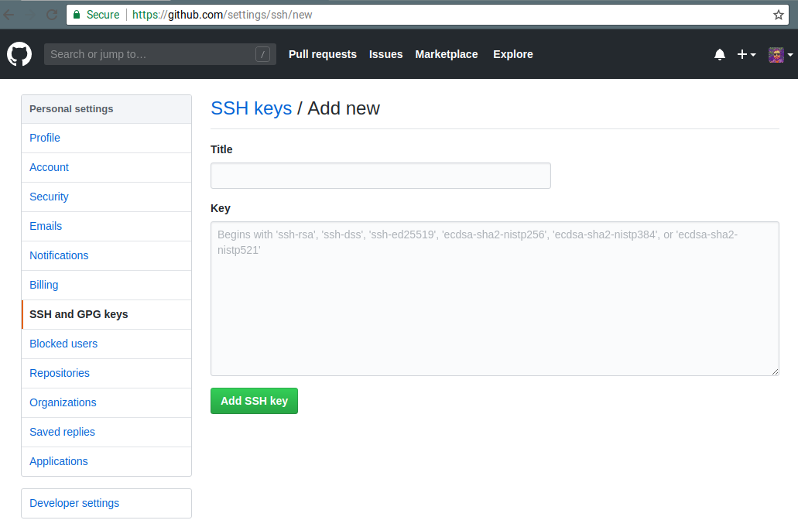

# Package development

## Why you need to write your own package

One of the reasons you might have tried R in the first place is the abundance of packages. As I'm
writing these lines (in August 2019) 14762 packages are available on CRAN (in August 2016, when 
I first wrote the number of packages down for my first ebook, it was 8922 packages).

This is a staggering amount of packages and to help you look for the right ones, you can check 
out [CRAN Task Views](https://cran.r-project.org/).

You might wonder why the heck should you write your own packages? After all, with 14762 packages 
you're sure to find something that suits your needs, right? Well, it depends. Of course, you will
not need to write you own function to perform non-linear regression, or to train a neural network.
But as time will go, you will start writing your own functions, functions that fit your needs, and 
that you use daily. It may be functions that prepare and shape data that you use at work for 
analysis. Or maybe you want to deliver an analysis to a client, with data and source code, so 
you decide to deliver a package that contains everything (something I've already done in the 
past).

Ok, but is it necessary to write a package? Why not just write functions inside some scripts and
then simply run or share these scripts? This seems like a valid solution at first. However, 
it quickly becomes tedious, especially if you have multiple scripts scattered around your computer
or inside different subfolders. You'll also have to write the documentation on separate files and 
these can easily get lost or become outdated. Relying on scripts does not scale well; even if you
are not sharing your code outside of your computer (maybe you're working on super secret projects
at NASA), you always have to think about future you. And in general, future you thinks that past you
is an asshole, exactly because you put 0 effort in documenting, testing and making your code
easy to use. Having everything inside a package takes care of these headaches for you, and will 
make future you proud of past you. And if you have to share your code, or deliver to a client,
believe me, it will make things a thousand times easier.

Code that is inside packages is very easy to document and test, especially if you're using Rstudio. 
It also makes it possible to use the wonderful `{covr}` package, which tells you which lines in 
which functions are called by your tests. If some lines are missing, write tests that invoke them and
increase the coverage of your tests! Documenting and testing your code is very important; it gives
you assurance that the code your writing works, but most importantly, it gives *others* assurance
that what you wrote works. And I include future you in these *others* too.

In order to share this package with these *others* we are going to use git. If you're familiar with
git, great, you'll be able to skip some sections. If not, then buckle up, you're in for a wild ride.

As I mentioned in the introduction, if you want to learn much more than I'll show about packages
read @wickham2014. I will only show you the basics, but it should be enough to get you productive.

## Starting easy: creating a package to share data

We will start a package from scratch, in order to share data with the world. For this, we are first
going to scrape a table off Wikipedia, prepare the data and then include it in a package. To make
distributing this package easy, we're going to put it up on Github, so you'll need a Github account.

Let's start by creating a Github account.

### Setting up a Github account

Setting up a Github account is very easy; just go over to [https://github.com/](https://github.com/)
and simply sign up!

Then you will need to generate a ssh key on your computer. This is a way for you to securely
interact with your Github account, and push your code to the repository without having to always
type your password. I will assume you never created any ssh
keys before, because if you already did, you could skip these steps. I will also assume that you are
on a GNU+Linux or macOS system; if you're using windows, the instructions are very similar, but 
you'll first need to install Git available [here](https://git-scm.com/downloads). Git is available
by default on any GNU+Linux system, and as far as I know also on macOS, but I might be wrong and
you might also need to install git on macOS (but then the instructions are the same whether 
you're using GNU+Linux or macOS). If you have trouble installing git, read the following section
from the [Pro Git book](https://git-scm.com/book/en/v2/Getting-Started-Installing-Git).

Then, open a terminal (or the git command line on Windows) and type the following:

```
ssh-keygen
```

This command will generate several files in the `.ssh` directory inside your `HOME` directory. Look
for the file that ends with the `.pub` extension, and copy its contents. You will need to paste
these contents on Github.

So now sign in to Github; once you are signed in, go to settings and then `SSH and GPG keys`:

```{r, echo=FALSE}
knitr::include_graphics("pics/github_ssh.png")
```

In the screenshot above, you see my ssh key associated with my account; this will be empty for you.
Click on the top right, *New SSH key*:

```{r, echo=FALSE}

```

Give your key a name, and paste the key you generated before. You're done! You can now configure
git a bit more by telling it who you are. Open a terminal, adapt and type the following commands:

```
git config --global user.name "Harold Zurcher"
git config --global user.email harold.zurcher@madisonbus.com
```

You're ready to go! You can now push code to github to share it with the world. Or if you do not want
to share you package (for confidentiality reasons for instance), you can still benefit from using
git, as it possible to have an internal git server that could be managed by your company's IT team.
There is also the possibility to set up corporate, and thus private git servers by buying the service 
from github, or other providers such as gitlab.

### Starting your package

```{r, echo=FALSE}
knitr::include_graphics("pics/new_package.gif")
```

To start writing a package, the easiest way is to load up Rstudio and start a new project, under the
*File* menu. If you're starting from scratch, just choose the first option, *New Directory* and then
*R package*. Give a new to your package, for example `arcade` (you'll see why in a bit) and you can
also choose to use git for version control. Now if you check the folder where you chose to save 
your package, you will see a folder with the same name as your package, and inside this folder a 
lot of new files and other folders. The most important folder for now is the `R` folder. This is 
the folder that will hold your `.R` source code files. You can also see these files and folders 
inside the *Files* panel from within Rstudio. Rstudio will also have `hello.R` opened, which is a 
single demo source file inside the `R` folder. You can get rid of this file, or keep it and edit it.

Now, to start working on your package, the best is to use a package called `{usethis}`. `{usethis}`
is a package that makes writing packages very easy; it includes functions that create the required
subfolders and necessary template files so that you do not need to constantly check how file so-and-so
should be placed or named.

Let's start by adding a readme file. This is easily achieved by using the following function from 
`{usethis}`:

```{r, eval=FALSE}
usethis::use_readme_md()
```

This creates a template README.md file in the root directory of your package. You can now edit this
file accordingly, and that's it.

The next step could be setting up your package to work with `{roxygen2}`, which will help write
the documentation of your package:


```{r, eval=FALSE}
usethis::use_roxygen_md()
```

The output tells you to run `devtools::document()`, we will do this later.

Since you have learned about the tidyverse by reading this book, I am willing to bet that you will
want to use the `%>%` operator inside the functions contained in your package. To do this without issues,
which wil become apparent later, use the following command:

```{r, eval=FALSE}
usethis::use_pipe()
```

This will make the `%>%` operator available internally to your package's functions, but also to the
user that will load the package.

We are almost done setting up the package. If you plan on distributing data with your package, 
you might want to also share the code that prepared the data. For instance, if you receive the 
data from your finance department, but this data needs some cleaning before being useful, you could
write a script to do so and then distribute this script also with the package, for reproducibility
purposes. These scripts, while not central to the package, could still be of interest to the users.
The directory to place them is called `data-raw`:

```{r, eval=FALSE}
usethis::use_data_raw()
```

One final folder is `inst`. You can add files to this folder, and they will be available to the users 
that install the package. Users can find the files in the folder where packages get installed. On
GNU+Linux systems, that would be somewhere like: `/home/user/R/amd64-linux-gnu-library/3.6`. There,
you will find the installation folders of all the packages. If the package you make is called `{spam}`,
you will find the files you put inside the `inst` folder on the root of the installation folder of 
`spam`. You can simply create the `inst` folder yourself, or use the following command:

```{r, eval=FALSE}
usethis::use_directory("inst")
```

Finally, the last step is to give your package a license; this again is only useful if you plan on
distributing it to the world. If you are writing your own package for yourself, or for purposes 
internal to your company, this is probably superfluous. I won't discuss the particularities of 
licenses, so let's just say that for the sake of this example package we are writing, we are going 
to use the MIT license:


```{r, eval=FALSE}
usethis::use_mit_license()
```

This again creates the right file at the right spot. There are other interesting functions inside
the `{usethis}` package, and we will come back to it later.

## Including data inside the package

Many packages include data and we are going to learn how to do it. I'll assume that we already
have a dataset on hand that we have to share. This is quite simple to do, first let's simply
load the data:

```{r, eval=FALSE}
arcade <- readr::read_csv("~/path/to/data/arcade.csv")
```

and then use, once again, `{usethis}` comes to our rescue:

```{r, eval=FALSE}
usethis::use_data(arcade, compress = "xz")
```

that's it! Well almost. We still need to write a little script that will allow users of your 
package to load the data. This script is simply called `data.R` and contains the following lines:

```{r, eval=FALSE}
#' List of highest-grossing games
#'
#' Source: https://en.wikipedia.org/wiki/Arcade_game#List_of_highest-grossing_games
#'
#' @format A data frame with 6 variables: \code{game}, \code{release_year},
#'   \code{hardware_units_sold}, \code{comment_hardware}, \code{estimated_gross_revenue}, 
#'   \code{comment_revenue}
#' \describe{
#' \item{game}{The name of the game}
#' \item{release_year}{The year the game was released}
#' \item{hardware_units_sold}{The amount of hardware units sold}
#' \item{comment_hardware}{Comment accompanying the amount of hardware units sold}
#' \item{estimated_gross_revenue}{Estimated gross revenue in US$ with 2019 inflation}
#' \item{comment_revenue}{Comment accompanying the amount of hardware units sold}
#' }
"arcade"
```

Basically this is a description of the data, and the name with which the user will invoke the data. To 
conclude this part, remember the `data-raw` folder? If you used a script to scrape/get the data
from somewhere, or if you had to write code to prepare the data to make it fit for sharing, this
is where you can put that script. I have written such a script, I will discuss it in the next 
chapter, where I'll show you how to scrape data from the internet.

## Adding functions to your package

Functions will be added inside the `R` package. In there, you will find the `hello.R` file. You can
edit this file if you kept it or you can create a new script. This script can hold one function, or 
several functions.
Let's start with the simplest case; one function inside one script.

### One function inside one script

Create a new R script, or edit the `hello.R` file, and add in the following code:

```{r, eval=FALSE}
#' Compute descriptive statistics for the numeric columns of a data frame.
#' @param df The data frame to summarise.
#' @param ... Optional. Columns in the data frame
#' @return A data frame with descriptive statistics. If you are only interested in certain columns
#' you can add these columns.
#' @import dplyr
#' @importFrom tidyr gather
#' @export
#' @examples
#' \dontrun{
#' describe(dataset)
#' describe(dataset, col1, col2)
#' }
describe_numeric <- function(df, ...){

  if (nargs() > 1) df <- select(df, ...)

  df %>%
    select_if(is.numeric) %>%
    gather(variable, value) %>%
    group_by(variable) %>%
    summarise_all(list(mean = ~mean(., na.rm = TRUE),
                       sd = ~sd(., na.rm = TRUE),
                       nobs = ~length(.),
                       min = ~min(., na.rm = TRUE),
                       max = ~max(., na.rm = TRUE),
                       q05 = ~quantile(., 0.05, na.rm = TRUE),
                       q25 = ~quantile(., 0.25, na.rm = TRUE),
                       mode = ~as.character(brotools::sample_mode(.), na.rm = TRUE),
                       median = ~quantile(., 0.5, na.rm = TRUE),
                       q75 = ~quantile(., 0.75, na.rm = TRUE),
                       q95 = ~quantile(., 0.95, na.rm = TRUE),
                       n_missing = ~sum(is.na(.)))) %>%
    mutate(type = "Numeric")
}
```

This function shows you pretty much you need to know when writing functions for packages. First,
there's the comment lines, that start with `#'` and not with `#`. These lines will be converted
into the function's documentation which you and your package's users will be able to read in 
Rstudio's *Help* pane. Notice the keywords that start with `@`. These are quite important:

- `@param`: used to define the function's parameters.
- `@return`: used to define the object returned by the functiong.
- `@import`: if the function needs functions from another package, in the present case `{dplyr}`, 
then this is where you would define these. Separate several package with a space.
- `@importFrom`: if the function only needs one function from a package, define it here. Read it as
*from tidyr import gather*, very similar to how it is done in Python.
- `@export`: makes the function available to the users. If you omit this, this function will not
be available to the users and only available internally to the other functions of the package. Not
making functions available to users can be useful if you need to write functions that are used by
other functions but never be used by anyone directly. It is still possible to access these internal,
private, functions by using `:::`, as in, `package:::private_function()`.
- `@examples`: lists examples in the documentation. The `\dontrun{}` tag is used for when you do
not want these examples to run when building the package.

Now comes the function itself. The function is written in pretty much the same way as usual, but
there are some particularities. First of all, the second argument of the function is the `...`, which
were already covered in Chapter 7. I want to give the option to my users to specify any columns to
summarise only these columns, instead of all of them, which is the default behaviour. But because 
I cannot know how many columns the user wants to summarize beforehand, and also because I do not
want to limit the user to 2 or 3 columns, I use the `...`.
But what if the user wants to summarize all the columns? This is taken care of in this line:

```{r, eval=FALSE}
  if (nargs() > 1) df <- select(df, ...)
```

`nargs()` counts the number of arguments of the function. If the user calls the function like so:

```{r, eval=FALSE}
describe_numeric(mtcars)
```

`nargs()` will return 1. If, instead, the user calls the function with one or more columns:

```{r, eval=FALSE}
describe_numeric(mtcars, hp, mpg)
```

then `nargs()` will return 2 (in this case). And does, this piece of code will be executed:

```{r, eval=FALSE}
df <- select(df, ...)
```


## Documenting your package

## Unit testing your package
