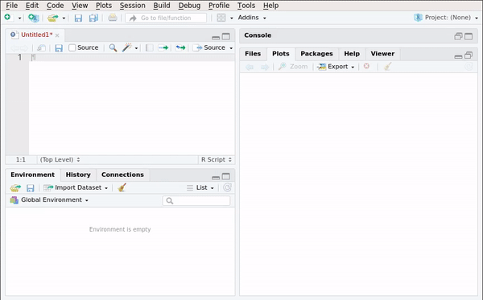

# Preface {-}

```{r, include=FALSE}
library(tidyverse)
library(broom)
library(ggthemes)
library(janitor)
```

## Note to the reader {-}

This book is still being written. Chapters 1 to 8 are almost ready, but more content is being added 
(especially to chapter 8). 9 and 10 are empty for now. Some exercises might be at the wrong place 
too and more are coming.

You can purchase an ebook version of this book on [leanpub](https://leanpub.com/modern_tidyverse).

If you already like what you read, you can support 
me by [buying me a coffee](https://www.buymeacoffee.com/brodriguesco)
or [paypal.me](https://www.paypal.me/brodriguesco).

## What is R? {-}

Read R's official answer to this question
[here](https://cran.r-project.org/doc/FAQ/R-FAQ.html#What-is-R_003f). To make it short: R is a
multi-paradigm (procedural, imperative, object-oriented and functional)^[In this book we are going
to focus on R's functional programming capabilities] programming language that
focuses on applications in *statistics*. By *statistics* I mean any field that uses statistics such
as official statistics, economics, finance, data science, machine learning, etc. For the sake of
simplicity, I will use the word "statistics" as a general term that encompasses all these fields and
disciplines for the remainder of this book.

## Who is this book for? {-}

This book can be useful to different audiences. If you have never used R in your life, and want
to start, start with Chapter 1 of this book. Chapter 1 to 3 are the very basics, and should be 
easy to follow up to Chapter 9.
Starting with Chapter 9, it gets more technical, and will be harder to follow. But I suggest
you keep on going, and do not hesitate to contact me for help if you struggle! Chapter 9
is also where you can start if you are already familiar with R **and** the `{tidyverse}`, but not 
functional programming. If you are familiar with R but not the `{tidyverse}` (or have no clue 
what the `{tidyverse}` is), then you can start with Chapter 4. If you are familiar with R, the 
`{tidyverse}` and functional programming, you might still be interested in this book, especially
Chapter 9 and 10, which deal with package development and further advanced topics respectively.

## Why this book? {-}

This book is first and foremost for myself. This book is the result of years of using and teaching
R at university and then at my jobs. During my university time, I wrote some notes to help me 
teach R and which I shared with my students. These are still the basis of Chapter 2. Then, once
I had left university, and continued using R at my first "real" job, I wrote another book that
dealt mostly with package development and functional programming. This book is now merged to this
one and is the basis of Chapters 9 and 10. During these years at my first
job, I was also tasked with teaching R. By that time, I was already quite familiar with the 
`{tidyverse}` so I wrote a lot of notes that were internal and adapted for the audience of my
first job. These are now the basis of Chapters 3 to 8.
Then, during all these years, I kept blogging about R, and reading blogs and further books. All 
this knowledge is condensed here, so if you are familiar with my blog, you'll definitely recognize
a lot of my blog posts in here. So this book is first and foremost for me, because I need to write
all of this down in a central place. So because my target audience is myself, this book is free. If 
you find it useful, and are in the mood of buying me a coffee, you can, but if this book is not 
useful to you, no harm done (unless you paid for it before reading it, in which case, I am sorry
to have wasted your time). But I am quite sure you'll find some of the things written here useful,
regardless of your current experience level with R.

## Why *modern* R? {-}

*Modern* R instead of "just" R because we are going to learn how to use modern packages (mostly
those from the [tidyverse](https://www.tidyverse.org/)) and concepts, such as functional
programming (which is quite an old concept actually, but one that came into fashion recently). R is
derived from S, which is a programming language that has roots in FORTRAN and other languages too.
If you learned R at university, you've probably learned to use it as you would have used FORTRAN;
very long scripts where data are represented as matrices and where row-wise (or column-wise)
operations are implemented with `for` loops. There's nothing wrong with that, mind you, but R
was also influenced by Scheme and Common Lisp, which are functional programming languages.
In my opinion, functional programming is a programming paradigm that works really well when dealing
with statistical problems. This is because programming in a functional style is just like
writing math. For instance, suppose you want to sum all the elements of a vector. In mathematical
notation, you would write something like:

\[
\sum_{i = 1}^{100} x_{i}
\]

where $x$ is a vector of length 100. Solving this using a loop would look something like this:

```{r, eval=FALSE}
res <- 0
for(i in 1:length(x)){
  res <- x[i] + res
}
```

This does not look like the math notation at all! You have to define a variable that will hold
the result outside of the loop, and then you have to define `res` as something plus `res` inside
the body of the loop. This is really unnatural. The functional programming approach is much
easier:

```{r, eval=FALSE}
Reduce(`+`, x)
```

We will learn about `Reduce()` later (to be more precise, we will learn about `purrr::reduce()`,
the "tidy" version of `Reduce()`), but already you see that the notation looks a lot more
like the mathematical notation.

At its core, functional programming uses functions, and functions are so-called *first
class*  objects in R, which means that there is nothing special about them... you can pass them to
other functions, create functions that return functions and do any kind of operation on them just as
with any other object. This means that functions in R are extremely powerful and flexible tools.
In the first part of the book, we are going to use functions that are already available in R, and
then use those available in packages, mostly those from the `tidyverse`. The `tidyverse` is a
collection of packages developed by [Hadley Wickham](http://hadley.nz/), and several of his colleagues
at RStudio, Inc. By using the packages from the `tidyverse` and R's built-in functional programming
capabilities, we can write code that is faster and easier to explain to colleagues, and also easier
to maintain. This also means that you might have to change your expectations and what you know
already from R, if you learned it at University but haven't touched it in a long time. For example
for and while loops, are relegated to chapter 8. This does not mean that you will have to wait for
8 chapter to know how to repeat instructions *N* times, but that *for* and *while* loops are tools that
are very useful for very specific situations that will be discussed at that point.

In the second part of the book, we are going to move from using R to solve statistical problems to
developing with R. We are going to learn about creating one's own package. If you do not know what
packages are, don't worry, this will be discussed just below.

## What is RStudio? {-}

RStudio is a modern IDE that makes writing R code easier. The first thing we are going to learn is
how to use it.
R and RStudio are both open source: this means that the source code is freely available on 
the internet and contributions by anyone are welcome and integrated; provided they are meaningful
and useful.

## What to expect from this book? {-}

The idea of Chapters 1 to 7 is to make you efficient with R as quickly as possible, especially if 
you already have prior programming knowledge. Starting with Chapter 8 you will learn more advanced
topics, especially programming with R. R is a programming language, and you can't write 
"programming language" without "language". And just as you wouldn't expect to learn
French, Portuguese or Icelandic by reading a single book, you shouldn't expect to become fluent in R
by reading a single book, not even by reading 10 books. Programming is an art which requires a lot of
practice. [Teach yourself programming in 10 years](http://www.norvig.com/21-days.html) is a blog
post written by Peter Norvig which explains that just as with any craft, mastering programming
takes time. And even if you don't need or want to become an expert in R, if you wish to use R
effectively and in a way that ultimately saves you time, you need to have some fluency in it, and
this only comes by continuing to learn about the language, and most importantly practicing. If you
keep using R every day, you'll definitely become very fluent. To stay informed about developments of
the language, and the latest news, I advise you read blogs, especially
[R-bloggers](https://www.r-bloggers.com/) which aggregates blog posts by more than 750 blogs
discussing R.

So what you can expect from this book is that this book is not the only one you should read.

## Prerequisites {-}

R and RStudio are the two main pieces of software that we are going to use. R is the programming
language and RStudio is a modern IDE for it. You can use R without RStudio; but you cannot use
RStudio without R.

If you wish to install R and RStudio at home to follow the examples in this book you can do it as
both pieces of software are available free of charge (paid options for RStudio exist, for companies
that need technical support). Installation is simple, but operating system dependent. To download
and install R for Windows, follow [this link](https://cloud.r-project.org/bin/windows/base/).
For macOS, follow [this one](https://cloud.r-project.org/bin/macosx/). If you run a GNU+Linux
distribution, you can install R using the system's package manager. On Ubuntu, install `r-base`.

For RStudio, look for your operating system [here](https://www.rstudio.com/products/rstudio/download/#download).

## What are packages? {-}

There is one more step; we are going to install some packages. Packages are additional pieces of
code that can be installed from within R with the following function: `install.packages()`. These
packages extend R's capabilities significantly, and are probably one of the main reasons R is so
popular. As of November 2018, R has over 13000 packages.

To install the packages we need, first open RStudio and then copy and paste this line in the console:

```{r, eval=FALSE}
install.packages(c("tidyverse", "rsample", "recipes", "blogdown" ,"yardstick", "parsnip", "plm", "pwt9", 
                   "checkpoint", "Ecdat", "ggthemes", "ggfortify", "margins", "janitor", "rio", 
                   "colourpicker", "glmnet", "lhs", "mrlMBO", "mlbench", "ranger"))
```

```{r, echo=FALSE}
knitr::include_graphics("pics/install_packages.png")
```

or go to the **Packages** pane and then click on *Install*:

```{r, echo=FALSE}
knitr::include_graphics("pics/rstudio_install_packages.gif")
```

## The author {-}

My name is Bruno Rodrigues and I program almost exclusively in R and have been teaching some R
courses for a few years now. I first started teaching for students at the University of Strasbourg 
while working on my PhD. I hold a PhD in economics, with a focus on quantitative methods.
I'm currently working as a manager in the data science team of PwC Luxembourg.

This book is an adaptation of notes I've used in the past during my time as a teacher, but also
a lot of things I've learned about R since I left academia.
In my free time I like cooking, working out and [blogging](https://www.brodrigues.co), while listening to
[Fip](http://www.fipradio.fr/player) or 
[Chillsky Radio](https://tunein.com/radio/Lofi-HipHop-Radio--Chillsky-s288329/). 
I also like to get my butt handed to me by playing roguelikes
such as [NetHack](http://nethack.wikia.com/wiki/NetHack), for which I wrote a 
[package](https://github.com/b-rodrigues/nethack) that contains functions to analyze the data that 
is saved on your computer after you win or lose (it will be lose 99% of the time) the game.

You can follow me on [twitter](https://www.twitter.com/brodriguesco),  I tweet mostly about R or 
what's happening in Luxembourg. 

<!--chapter:end:index.Rmd-->

# Getting to know RStudio

RStudio is a company that develops and maintains several products. Their best-known product is
an IDE (Integrated development environment) for the R programming language, also called RStudio.
You can install RStudio by visiting this [link](https://www.rstudio.com/products/rstudio/download/).
There is also a server version that can be used to have a centralized version of R within, say, a 
company. RStudio, the company, also develops [Shiny](https://shiny.rstudio.com/), a package to 
create full-fledged web-apps. I am not going to cover Shiny in this book, since there's already 
[a lot](http://shiny.rstudio.com/tutorial/) of material that you can learn from.

Once you have installed RStudio, launch it and let's go through the interface together.

## Panes

RStudio is divided into different panes. Each pane has a specific function. The gif below shows
some of these panes:

```{r, echo=FALSE}
knitr::include_graphics("pics/rstudio_panes.gif")
```

Take some time to look around what each pane shows you. Some panes are empty; for example the *Plots*
pane or the *Viewer* pane. *Plots* shows you the plots you make. You can browse the plots and save
them. We will see this in more detail in a later chapter. *Viewer* shows you previews of documents
that you generate with R. More on this later.

## Console

The *Console* pane is where you can execute R code. Write the following in the console:

```{r, eval=FALSE}
2 + 3
```

and you'll get the answer, `5`. However, do not write a lot of lines in the console. It is better
write your code inside a script. Output is also shown inside the console.

## Scripts

Look at the gif below:

```{r, echo=FALSE}
knitr::include_graphics("pics/rstudio_new_script.gif")
```

In this gif, we see the user creating a new R script. R scripts are simple text files that hold R
code. Think of `.do` files in STATA or `.c` files for C. R scripts have the extension `.r` or `.R`.

It is possible to create a lot of other files. We'll take a look at `R Markdown` files in Chapter 11.

### The help pane

The *Help* pane allows you to consult documentation for functions or packages. The gif below shows
how it works:

```{r, echo=FALSE}
knitr::include_graphics("pics/rstudio_help.gif")
```

you can also access help using the following syntax: `?lm`. This will bring up the documentation for
the function `lm()`. You can also type `??lm` which will look for the string `lm` in every package.

### The Environment pane

The *Environment* pane shows every object created in the current section. It is especially useful
if you have defined lists or have loaded data into R as it makes it easy to explore these more
complex objects.

## Options

It is also possible to customize RStudio's look and feel:

```{r, echo=FALSE}
knitr::include_graphics("pics/rstudio_options.gif")
```

Take some time to go through the options.

## Keyboard shortcuts

It is a good idea to familiarize yourself with at least some keyboard shortcuts. This is more
convenient than having to move the mouse around:

```{r, echo=FALSE}
knitr::include_graphics("pics/rstudio_shortcuts.gif")
```

If there is only one keyboard shortcut you need to know, it's `Ctrl-Enter` that executes a line of code
from your script. However, these other shortcuts are also worth knowing:

* `CTRL-ALT-R`: run entire script
* `CTRL-ALT-UP or DOWN`: make cursor taller or shorter, allowing you to edit multiple lines at the same time
* `CTRL-F`: Search and replace
* `ALT-UP or DOWN`: Move line up or down
* `CTRL-SHIFT-C`: Comment/uncomment line
* `ALT-SHIFT-K`: Bring up the list of keyboard shortcuts
* `CTRL-SHIFT-M`: Insert the pipe operator (`%>%`, more on this later)
* `CTRL-S`: Save script

This is just a few keyboard shortcuts that I personally find useful. However, I strongly advise you
to learn and use whatever shortcuts are useful and feel natural to you!

## Projects

One of the best features of RStudio are projects. Creating a project is simple; the gif below
shows how you can create a project and how you can switch between projects.

```{r, echo=FALSE}
knitr::include_graphics("pics/rstudio_projects.gif")
```

Projects make a lot of things easier, such as managing paths. More on this in the chapter about
reading data. Another useful feature of projects is that the scripts you open in project A will
stay open even if you switch to another project B, and then switch back to the project A again.

You can also use version control (with git) inside a project. Version control is very useful, but
I won't discuss it here. You can find a lot of resources online to get you started with git.

## History

The *History* pane saves all the previous lines you executed. You can then select these lines and
send them back to the console or the script.

```{r, echo=FALSE}
knitr::include_graphics("pics/rstudio_history.gif")
```

## Plots

All the plots you make during a session are visible in the *Plots* pane. From there, you can
export them in different formats.

```{r, echo=FALSE}
knitr::include_graphics("pics/rstudio_plots.gif")
```

The plots shown in the gif are made using basic R functions. Later, we will learn how to make nicer
looking plots using the package `ggplot2`.

## Addins

Some packages install addins, which are accessible through the addins button:

```{r, echo=FALSE}
knitr::include_graphics("pics/rstudio_addins.png")
```

These addins make it easier to use some functions and you can read more about them [here](https://rstudio.github.io/rstudioaddins/#overview).

My favorite addins are the ones you get when installing the `{datapasta}` package. Read more about
it [here](https://github.com/MilesMcBain/datapasta).

There are other panes that I will not discuss here, but you will naturally discover their use as you
go. For example, we will discuss the *Build* pane in Chapter 11.

## Packages

You can think of packages as addons that extend R's core functionality. You can browse all available
packages on [CRAN](https://cloud.r-project.org/). To make it easier to find what you might be
interested in, you can also browse the [CRAN Task Views](https://cloud.r-project.org/web/views/).
Each package has a landing page that summarises its dependencies, version number etc. For example,
for the `dplyr` package: [https://cran.r-project.org/web/packages/dplyr/index.html](https://cran.r-project.org/web/packages/dplyr/index.html).
Take a look at the *Downloads* section, and especially at the Reference Manual and Vignettes:

```{r, echo=FALSE}
knitr::include_graphics("pics/packages_vignette.png")
```

Vignettes are valuable documents; inside vignettes, the purpose of the package is explained in
plain English, usually with accompanying examples. The reference manuals list the available functions
inside the packages. You can also find vignettes from within Rstudio:

```{r, echo=FALSE}

```

Go to the *Packages* pane and click on the package you're interested in. Then you can consult the
help for the functions that come with the package as well as the package's vignettes.

Once you installed a package, you have to load it before you can use it. To load packages you use the
`library()` function:

```{r, eval=FALSE}
library(dplyr)
library(janitor)
# and so on...
```

If you only need to use one single function once, you don't need to load an entire package. You can
write the following:

```{r, eval=FALSE}
dplyr::full_join(A, B)
```

using the `::` operator, you can access functions from packages without having to load the whole
package beforehand.

It is possible and easy to create your own packages. This is useful if you have to write a lot of
functions that you use daily. We will lean about that, in Chapter 10.


## Exercises

### Exercise 1 {-}

Change the look and feel of RStudio to suit your tastes! I personally like to move the console
to the right and use a dark theme. Take some 5 minutes to customize it and browse through all the options.

<!--chapter:end:01-rstudio.Rmd-->

# Objects, types and useful R functions to get started

All objects in R have a given *type*. You already know most of them, as these types are also used
in mathematics. Integers, floating point numbers, or floats, matrices, etc, are all objects you
are already familiar with. But R has other, maybe lesser known data types (that you can find in a
lot of other programming languages) that you need to become familiar with. But first, we need to
learn how to assign a value to a variable. This can be done in two ways:

```{r}
a <- 3
```

or

```{r}
a = 3
```

in very practical terms, there is no difference between the two. I prefer using `<-` for assigning
values to variables and reserve `=` for passing arguments to functions, for example:

```{r}
spam <- mean(x = c(1,2,3))
```

I think this is less confusing than:

```{r}
spam = mean(x = c(1,2,3))
```

but as I explained above you can use whatever you feel most comfortable with.

## The `numeric` class

To define single numbers, you can do the following:

```{r}
a <- 3
```

The `class()` function allows you to check the class of an object:

```{r}
class(a)
```

Decimals are defined with the character `.`:

```{r}
a <- 3.14
```

R also supports integers. If you find yourself in a situation where you explicitly need an integer
and not a floating point number, you can use the following:

```{r}
a  <- as.integer(3)
class(a)
```

The `as.integer()` function is very useful, because it converts its argument into an integer. There
is a whole family of `as.*()` functions. To convert `a` into a floating point number again:

```{r}
class(as.numeric(a))
```

There is also `is.numeric()` which tests whether a number is of the `numeric` class:

```{r}
is.numeric(a)
```

These functions are very useful, there is one for any of the supported types in R. Later, we are going
to learn about the `{purrr}` package, which is a very powerful package for functional programming. This
package includes further such functions.

## The `character` class

Use `" "` to define characters (called strings in other programming languages):

```{r}
a <- "this is a string"
```

```{r}
class(a)
```

To convert something to a character you can use the `as.character()` function:

```{r}
a <- 4.392

class(a)

class(as.character(a))
```

It is also possible to convert a character to a numeric:

```{r}
a <- "4.392"

class(a)

class(as.numeric(a))
```

But this only works if it makes sense:

```{r}
a <- "this won't work, chief"

class(a)

as.numeric(a)
```

A very nice package to work with characters is `{stringr}`, which is also part of the `{tidyverse}`.

## The `factor` class

Factors look like characters, but are very different. They are the representation of categorical
variables. A `{tidyverse}` package to work with factors is `{forcats}`. You would rarely use
factor variables outside of datasets, so for now, it is enough to know that this class exists.
We are going to learn more about factor variables in Chapter 4, by using the `{forcats}` package.

## The `Date` class

Dates also look like characters, but are very different too:

```{r}
as.Date("2019/03/19")

class(as.Date("2019/03/19"))
```

Manipulating dates and time can be tricky, but thankfully there's a `{tidyverse}` package for that,
called `{lubridate}`. We are going to go over this package in Chapter 4.

## The `logical` class

This class is the result of logical comparisons, for example, if you type:

```{r}
4 > 3
```

R returns `TRUE`, which is an object of class `logical`:

```{r}
k <- 4 > 3
class(k)
```

In other programming languages, `logical`s are often called `bool`s. A `logical` variable can only have
two values, either `TRUE` or `FALSE`. You can test the truthiness of a variable with `isTRUE()`:

```{r}
k <- 4 > 3
isTRUE(k)
```

How can you test if a variable is false? There is not a `isFALSE()` function (at least not without having
to load a package containing this function), but there is way to do it:

```{r}
k <- 4 > 3
!isTRUE(k)
```

The `!` operator indicates negation, so the above expression could be translated as *is k not TRUE?*.
There are other such operators, namely `&, &&, |, ||`. `&` means *and* and `|` stands for *or*.
You might be wondering what the difference between `&` and `&&` is? Or between `|` and `||`? `&` and
`|` work on vectors, doing pairwise comparisons:

```{r}
one <- c(TRUE, FALSE, TRUE, FALSE)
two <- c(FALSE, TRUE, TRUE, TRUE)
one & two
```

Compare this to the `&&` operator:

```{r}
one <- c(TRUE, FALSE, TRUE, FALSE)
two <- c(FALSE, TRUE, TRUE, TRUE)
one && two
```

The `&&` and `||` operators only compare the first element of the vectors and stop as soon as a the return
value can be safely determined. This is called short-circuiting. Consider the following:

```{r}
one <- c(TRUE, FALSE, TRUE, FALSE)
two <- c(FALSE, TRUE, TRUE, TRUE)
three <- c(TRUE, TRUE, FALSE, FALSE)
one && two && three
one || two || three
```

The `||` operator stops as soon it evaluates to `TRUE` whereas the `&&` stops as soon as it evaluates to `FALSE`.
Personally, I rarely use `||` or `&&` because I get confused. I find using `|` or `&` in combination with the
`all()` or `any()` functions much more useful:

```{r}
one <- c(TRUE, FALSE, TRUE, FALSE)
two <- c(FALSE, TRUE, TRUE, TRUE)
any(one & two)
all(one & two)
```

`any()` checks whether any of the vector's elements are `TRUE` and `all()` checks if all elements of the vector are
`TRUE`.

As a final note, you should know that is possible to use `T` for `TRUE` and `F` for `FALSE` but I 
would advise against doing this, because it is not very explicit.

## Vectors and matrices

You can create a vector in different ways. But first of all, it is important to understand that a
vector in most programming languages is nothing more than a list of things. These things can be
numbers (either integers or floats), strings, or even other vectors. A vector in R can only contain elements of one
single type. This is not the case for a list, which is much more flexible. We will talk about lists shortly, but
let's first focus on vectors and matrices.

### The `c()` function

A very important function that allows you to build a vector is `c()`:

```{r}
a <- c(1,2,3,4,5)
```

This creates a vector with elements 1, 2, 3, 4, 5. If you check its class:

```{r}
class(a)
```

This can be confusing: you where probably expecting a to be of class *vector* or
something similar. This is not the case if you use `c()` to create the vector, because `c()`
doesn't build a vector in the mathematical sense, but a so-called atomic vector.
Checking its dimension:

```{r}
dim(a)
```

returns `NULL` because an atomic vector doesn't have a dimension.
If you want to create a true vector, you need to use `cbind()` or `rbind()`.

But before continuing, be aware that atomic vectors can only contain elements of the same type:

```{r}
c(1, 2, "3")
```

because "3" is a character, all the other values get implicitly converted to characters. You have
to be very careful about this, and if you use atomic vectors in your programming, you have to make
absolutely sure that no characters or logicals or whatever else are going to convert your atomic
vector to something you were not expecting.

### `cbind()` and `rbind()`

You can create a *true* vector with `cbind()`:

```{r}
a <- cbind(1, 2, 3, 4, 5)
```

Check its class now:

```{r}
class(a)
```

This is exactly what we expected. Let's check its dimension:

```{r}
dim(a)
```

This returns the dimension of `a` using the LICO notation (number of LInes first, the number of COlumns).

It is also possible to bind vectors together to create a matrix.

```{r}
b <- cbind(6,7,8,9,10)
```

Now let's put vector `a` and `b` into a matrix called `matrix_c` using `rbind()`.
`rbind()` functions the same way as `cbind()` but glues the vectors together by rows and not by columns.

```{r}
matrix_c <- rbind(a,b)
print(matrix_c)
```

### The `matrix` class

R also has support for matrices. For example, you can create a matrix of dimension (5,5) filled
with 0's with the `matrix()` function:

```{r}
matrix_a <- matrix(0, nrow = 5, ncol = 5)
```

If you want to create the following matrix:

\[
B = \left(
\begin{array}{ccc}
 2 & 4 & 3 \\
 1 & 5 & 7
\end{array} \right)
\]

you would do it like this:

```{r}
B <- matrix(c(2, 4, 3, 1, 5, 7), nrow = 2, byrow = TRUE)
```

The option `byrow = TRUE` means that the rows of the matrix will be filled first.

You can access individual elements of `matrix_a` like so:


```{r}
matrix_a[2, 3]
```

and R returns its value, 0. We can assign a new value to this element if we want. Try:

```{r}
matrix_a[2, 3] <- 7
```

and now take a look at `matrix_a` again.

```{r}
print(matrix_a)
```

Recall our vector `b`:

```{r}
b <- cbind(6,7,8,9,10)
```

To access its third element, you can simply write:

```{r}
b[3]
```

I have heard many people praising R for being a matrix based language. Matrices are indeed useful,
and statisticians are used to working with them. However, I very rarely use matrices in my
day to day work, and prefer an approach based on data frames (which will be discussed below). This
is because working with data frames makes it easier to use R's advanced functional programming
language capabilities, and this is where R really shines in my opinion. Working with matrices
almost automatically implies using loops and all the iterative programming techniques, *à la Fortran*,
which I personally believe are ill-suited for interactive statistical programming (as discussed in
the introduction).

## The `list` class

The `list` class is a very flexible class, and thus, very useful. You can put anything inside a list,
such as numbers:

```{r}
list1 <- list(3, 2)
```

or other lists constructed with `c()`:

```{r}
list2 <- list(c(1, 2), c(3, 4))
```

you can also put objects of different classes in the same list:

```{r}
list3 <- list(3, c(1, 2), "lists are amazing!")
```

and of course create list of lists:

```{r}
my_lists <- list(list1, list2, list3)
```

To check the contents of a list, you can use the structure function `str()`:

```{r}
str(my_lists)
```

or you can use RStudio's *Environment* pane:

```{r, echo=FALSE}
knitr::include_graphics("pics/rstudio_environment_list.gif")
```

You can also create named lists:

```{r}
list4 <- list("a" = 2, "b" = 8, "c" = "this is a named list")
```

and you can access the elements in two ways:

```{r}
list4[[1]]
```

or, for named lists:

```{r}
list4$c
```

Lists are used extensively because they are so flexible. You can build lists of datasets and apply
functions to all the datasets at once, build lists of models, lists of plots, etc... In the later
chapters we are going to learn all about them. Lists are central objects in a functional programming
workflow for interactive statistical analysis.

## The `data.frame` and `tibble` classes

In the next chapter we are going to learn how to import datasets into R. Once you import data, the
resulting object is either a `data.frame` or a `tibble` depending on which package you used to
import the data. `tibble`s extend `data.frame`s so if you know about `data.frame` objects already,
working with `tibble`s will be very easy. `tibble`s have a better `print()` method, and some other
niceties.

However, I want to stress that these objects are central to R and are thus very important; they are
actually special cases of lists, discussed above. There are different ways to print a `data.frame` or
a `tibble` if you wish to inspect it. You can use `View(my_data)` to show the `my_data` `data.frame`
in the *View* pane of RStudio:

```{r, echo=FALSE}
knitr::include_graphics("pics/rstudio_view_data.gif")
```

You can also use the `str()` function:

```{r, eval=FALSE}
str(my_data)
```

And if you need to access an individual column, you can use the `$` sign, same as for a list:

```{r, eval=FALSE}
my_data$col1
```

## Formulas

We will learn more about formulas later, but because it is an important object, it is useful if you
already know about them early on. A formula is defined in the following way:

```{r}
my_formula <- ~x

class(my_formula)
```

Formula objects are defined using the `~` symbol. Formulas are useful to define statistical models,
for example for a linear regression:

```{r, eval=FALSE}
lm(y ~ x)
```

or also to define anonymous functions, but more on this later.

## Models

A statistical model is an object like any other in R:

```{r}
data(mtcars)

my_model <- lm(mpg ~ hp, mtcars)

class(my_model)
```

`my_model` is an object of class `lm`. You can apply different functions to a model object:

```{r}
summary(my_model)
```

This class will be explored in later chapters.

## NULL, NA and NaN

The `NULL`, `NA` and `NaN` classes are pretty special. `NULL` is returned when the result of function is undetermined.
For example, consider `list4`:

```{r}
list4
```

if you try to access an element that does not exist, such as `d`, you will get `NULL` back:

```{r}
list4$d
```

`NaN` means "Not a Number" and is returned when a function return something that is not a number:

```{r}
sqrt(-1)
```

or:

```{r}
0/0
```

Basically, numbers that cannot be represented as floating point numbers are `NaN`.

Finally, there's `NA` which is closely related to `NaN` but is used for missing values. `NA` stands for `Not Available`. There are
several types of `NA`s:

* `NA_integer_`
* `NA_real_`
* `NA_complex_`
* `NA_character_`

but these are in principle only used when you need to program your own functions and need to explicitly test for the missingness of, say,
a character value.

To test whether a value is `NA`, use the `is.na()` function.

## Useful functions to get you started

This section will list several basic R functions that are very useful and should be part of your toolbox.

### Sequences

There are several functions that create sequences, `seq()`, `seq_along()` and `rep()`. `rep()` is easy enough:

```{r}
rep(1, 10)
```

This simply repeats `1` 10 times. You can repeat other objects too:

```{r}
rep("HAHA", 10)
```

To create a sequence, things are not as straightforward. There is `seq()`:

```{r}
seq(1, 10)
seq(70, 80)
```

It is also possible to provide a `by` argument:

```{r}
seq(1, 10, by = 2)
```

`seq_along()` behaves similarly, but returns the length of the object passed to it. So if you pass `list4` to
`seq_along()`, it will return a sequence from 1 to 3:

```{r}
seq_along(list4)
```

which is also true for `seq()` actually:

```{r}
seq(list4)
```

but these two functions behave differently for arguments of length equal to 1:

```{r}
seq(10)

seq_along(10)
```

So be quite careful about that. I would advise you do not use `seq()`, but only `seq_along()` and `seq_len()`. `seq_len()`
only takes arguments of length 1:

```{r}
seq_len(10)

seq_along(10)
```

The problem with `seq()` is that it is unpredictable; depending on its input, the output will either be an integer or a sequence.
When programming, it is better to have function that are stricter and fail when confronted to special cases, instead of returning
some result. This is a bit of a recurrent issue with R, and the functions from the `{tidyverse}` mitigate this issue by being
stricter than their base R counterparts. For example, consider the `ifelse()` function from base R:

```{r}
ifelse(3 > 5, 1, "this is false")
```

and compare it to `{dplyr}`'s implementation, `if_else()`:

```{r, eval=FALSE}
if_else(3 > 5, 1, "this is false")
Error: `false` must be type double, not character
Call `rlang::last_error()` to see a backtrace
```

`if_else()` fails because the return value when `FALSE` is not a double (a real number) but a character. This might seem unnecessarily
strict, but at least it is predictable. This makes debugging easier when used inside functions. In Chapter 8 we are going to learn how
to write our own functions, and being strict makes programming easier.

### Basic string manipulation

For now, we have not closely studied `character` objects, we only learned how to define them. Later, in Chapter 5 we will learn about the
`{stringr}` package which provides useful function to work with strings. However, there are several base R functions that are very
useful that you might want to know nonetheless, such as `paste()` and `paste0()`:

```{r}
paste("Hello", "amigo")
```

but you can also change the separator if needed:

```{r}
paste("Hello", "amigo", sep = "--")
```

`paste0()` is the same as `paste()` but does not have any `sep` argument:

```{r}
paste0("Hello", "amigo")
```

If you provide a vector of characters, you can also use the `collapse` argument, which places whatever you provide for `collapse` between the
characters of the vector:

```{r}
paste0(c("Joseph", "Mary", "Jesus"), collapse = ", and ")
```

To change the case of characters, you can use `toupper()` and `tolower()`:

```{r}
tolower("HAHAHAHAH")
```

```{r}
toupper("hueuehuehuheuhe")
```

Finally, there are the classical mathematical functions that you know and love:

* `sqrt()`
* `exp()`
* `log()`
* `abs()`
* `sin()`, `cos()`, `tan()`, and others
* `sum()`, `cumsum()`, `prod()`, `cumprod()`
* `max()`, `min()`

and many others...

## Exercises

### Exercise 1 {-}

Try to create the following vector:

\[a = (6,3,8,9)\]

and add it this other vector:

\[b = (9,1,3,5)\]

and save the result to a new variable called `result`.

### Exercise 2 {-}

Using `a` and `b` from before, try to get their dot product.

Try with `a * b` in the R console. What happened?
Try to find the right function to get the dot product. Don't hesitate to google the answer!

### Exercise 3 {-}

How can you create a matrix of dimension (30,30) filled with 2's by only using the function `matrix()`?

### Exercise 4 {-}

Save your first name in a variable `a` and your surname in a variable `b`. What does the function:

```{r, eval=FALSE}
paste(a, b)
```

do? Look at the help for `paste()` with `?paste` or using the *Help* pane in RStudio. What does the
optional argument `sep` do?

### Exercise 5 {-}

Define the following variables: `a <- 8`, `b <- 3`, `c <- 19`. What do the following lines check?
What do they return?

```{r, eval=FALSE}
a > b
a == b
a != b
a < b
(a > b) && (a < c)
(a > b) && (a > c)
(a > b) || (a < b)
```

### Exercise 6 {-}

Define the following matrix:

\[
\text{matrix_a} = \left(
\begin{array}{ccc}
 9 & 4 & 12 \\
 5 & 0 & 7 \\
 2 & 6 & 8 \\
 9 & 2 & 9
\end{array} \right)
\]

```{r, include=FALSE}
matrix_a <- matrix(c(9, 4, 12, 5, 0, 7, 2, 6, 8, 9, 2, 9), nrow = 4, byrow = TRUE)
```

* What does `matrix_a >= 5` do?
* What does `matrix_a[ , 2]` do?
* Can you find which function gives you the transpose of this matrix?

### Exercise 7 {-}

Solve the following system of equations using the `solve()` function:

\[
\left(
\begin{array}{cccc}
 9 & 4 & 12 & 2 \\
 5 & 0 & 7 & 9\\
 2 & 6 & 8 & 0\\
 9 & 2 & 9 & 11
\end{array} \right) \times \left(
\begin{array}{ccc}
 x \\
 y \\
 z \\
 t \\
\end{array}\right) =
\left(
\begin{array}{ccc}
7\\
18\\
1\\
0
\end{array}
\right)
\]


```{r, include=FALSE}
matrix_a <- matrix(c(9, 4, 12, 2, 5, 0, 7, 9, 2, 6, 8, 0, 9, 2, 9, 11), nrow = 4, byrow = TRUE)

result <- c(7, 18, 1, 0)

solution <- solve(matrix_a, result)
```

### Exercise 8 {-}

Load the `mtcars` data (`mtcars` is include in R, so you only need to use the `data()` function to
load the data):

```{r}
data(mtcars)
```

if you run `class(mtcars)`, you get "data.frame". Try now with `typeof(mtcars)`. The answer is now
"list"! This is because the class of an object is an attribute of that object, which can even
be assigned by the user:

```{r}
class(mtcars) <- "don't do this"

class(mtcars)
```

The type of an object is R's internal type of that object, which cannot be manipulated by the user.
It is always useful to know the type of an object (not just its class). For example, in the particular
case of data frames, because the type of a data frame is a list, you can use all that you learned
about lists to manipulate data frames! Recall that `$` allowed you to select the element of a list
for instance:

```{r}
my_list <- list("one" = 1, "two" = 2, "three" = 3)

my_list$one
```

Because data frames are nothing but fancy lists, this is why you can access columns the same way:

```{r}
mtcars$mpg
```

```{r, include=FALSE}
rm(mtcars)
```

<!--chapter:end:02-data_types.Rmd-->

# Reading and writing data

In this chapter, we are going to import example datasets that are available in R, `mtcars` and
`iris`. I have converted these datasets into several formats. Download those datasets
[here](https://github.com/b-rodrigues/modern_R/tree/master/datasets) if you want to follow the
examples below. R can import some formats without the need of external packages, such as the `.csv`
format. However, for other formats, you will need to use different packages. Because there are a
lot of different formats available I suggest you use the `{rio}` package. 
`{rio}` is a wrapper around different packages that import/export data in different formats. 
This package is nice because you don't need to remember which package to use to import, say, 
STATA datasets and then you need to remember which one for SAS datasets, and so on. Read `{rio}`'s
[vignette](https://cran.r-project.org/web/packages/rio/vignettes/rio.html) for more details. Below
I show some of `{rio}`'s functions presented in the vignette. It is also possible to import data from
other, less "traditional" sources, such as your clipboard. Also note that it is possible to import
more than one dataset at once. There are two ways of doing that, either by importing all the 
datasets, binding their rows together and add a new variable with the name of the data, or import
all the datasets into a list, where each element of that list is a data frame. We are going to 
explore this second option later.

## The swiss army knife of data import and export: `{rio}`

To import data with `{rio}`, `import()` is all you need:

```{r}
library(rio)

mtcars <- import("datasets/mtcars.csv")
```

```{r}
head(mtcars)
```

`import()` needs the path to the data, and you can specify additional options if needed. On a
Windows computer, you have to pay attention to the path; you cannot simply copy and paste it, because
paths in Windows use the `\` symbol whereas R uses `/` (just like on Linux or macOS).
Importing a STATA or a SAS file is done just the same:

```{r}
mtcars_stata <- import("datasets/mtcars.dta")
head(mtcars_stata)

mtcars_sas <- import("datasets/mtcars.sas7bdat")
head(mtcars_sas)
```

It is also possible to import Excel files where each sheet is a single table, but you will need
`import_list()` for that. The file `multi.xlsx` has two sheets, each with a table in it:

```{r}
multi <- import_list("datasets/multi.xlsx")
str(multi)
```

As you can see `multi` is a list of datasets. Told you lists were very flexible! It is also possible
to import all the datasets in a single directory at once. For this, you first need a vector of paths:

```{r}
paths <- Sys.glob("datasets/unemployment/*.csv")
```

`Sys.glob()` allows you to find files using a regular expression. "datasets/unemployment/*.csv"
matches all the `.csv` files inside the "datasets/unemployment/" folder.

```{r}
all_data <- import_list(paths)

str(all_data)
```

in a subsequent chapter we will learn how to actually use these lists of datasets.

If you know that each dataset in each file has the same columns, you can also import them directly
into a single dataset by binding each dataset together using `rbind = TRUE`:

```{r}
bind_data <- import_list(paths, rbind = TRUE)
str(bind_data)
```

This also add a further column called `_file` indicating the name of the file that contained the
original data.

If something goes wrong, you might need to take a look at the underlying function `{rio}` is
actually using to import the file. Let's look at the following example:

```{r}
testdata <- import("datasets/problems/mtcars.csv")

head(testdata)
```

as you can see, the import didn't work quite well! This is because the separator is the `&` for
some reason. Because we are trying to read a `.csv` file, `rio::import()` is using
`data.table::fread()` under the hood (you can read this in `import()`'s help). If you then read
`data.table::fread()`'s help, you see that the `fread()` function has an optional `sep = ` argument
that you can use to specify the separator. You can use this argument in `import()` too, and it will
be passed down to `data.table::fread()`:

```{r}
testdata <- import("datasets/problems/mtcars.csv", sep = "&")

head(testdata)
```

`export()` allows you to write data to disk, by simply providing the path and name of the file you
wish to save.

```{r, eval=FALSE}
export(testdata, "path/where/to/save/testdata.csv")
```

If you end the name with `.csv` the file is exported to the csv format, if instead you write `.dta`
the data will be exported to the STATA format, and so on.

If you wish to export to Excel, this is possible, but it may require that you change a file on your
computer (you only have to do this once). Try running:

```{r, eval=FALSE}
export(testdata, "path/where/to/save/testdata.xlsx")
```

if this results in an error, try the following:

* Run the following lines in Rstudio:

```{r, eval=FALSE}
if(!file.exists("~/.Rprofile")) # only create if not already there
    file.create("~/.Rprofile")    # (don't overwrite it)
file.edit("~/.Rprofile")
```

These lines, taken shamelessly from [Efficient R
programming](https://csgillespie.github.io/efficientR/3-3-r-startup.html#rprofile) (go read it,
it's a very great resource) look for and open the `.Rprofile` file which is a file that is run
every time you open Rstudio. This means that you can put any line of code there that will always be
executed whenever you launch Rstudio. 

* Add this line to the file:

```{r, eval=FALSE}
Sys.setenv("R_ZIPCMD" = "C:/Program Files (x86)/Rtools/zip.exe")
```

This tells Rstudio to use `zip.exe` as the default zip tool, which is needed to export files to the
Excel format. Try it out by restarting Rstudio, and then running the following lines:

```{r, eval=FALSE}
library(rio)

data(mtcars)

export(mtcars, "mtcars.xlsx")
```

You should find the `mtcars.xlsx` inside your working directory. You can check what is your working
directory with `getwd()`.

`{rio}` should cover all your needs, but if not, there is very likely a package out there that will
import the data you need.

## Writing any object to disk

`{rio}` is an amazing package, but is only able to write tabular representations of data. What if you
would like to save, say, a list containing any arbitrary object? This is possible with the
`saveRDS()` function. Literally anything can be saved with `saveRDS()`:

```{r}
my_list <- list("this is a list", list("which contains a list", 12), c(1, 2, 3, 4), matrix(c(2, 4,
3, 1, 5, 7), nrow = 2))

str(my_list)
```

`my_list` is a list containing a string, a list which contains a string and a number, a vector and
a matrix... Now suppose that computing this list takes a very long time. For example, imagine that
each element of the list is the result of estimating a very complex model on a simulated
dataset, which takes hours to simulate. Because this takes so long to compute, you'd want to save
it to disk. This is possible with `saveRDS()`:

```{r}
saveRDS(my_list, "my_list.RDS")
```

The next day, after having freshly started your computer and launched RStudio, it is possible to
retrieve the object exactly like it was using `readRDS()`:

```{r}
my_list <- readRDS("my_list.RDS")

str(my_list)
```

Even if you want to save a regular dataset, using `saveRDS()` might be a good idea because the data
gets compressed if you add the option `compress = TRUE` to `saveRDS()`. However keep in mind that
this will only be readable by R, so if you need to share this data with colleagues that use another
tool, save it in another format.

## Using RStudio projects to manage paths

Managing paths can be painful, especially if you're collaborating with a colleague and both of you
saved the data in paths that are different. Whenever one of you wants to work on the script, the
path will need to be adapted first. The best way to avoid that is to use projects with RStudio.

```{r, echo=FALSE}
knitr::include_graphics("pics/rstudio_projects.gif")
```

Imagine that you are working on a project entitled "housing". You will create a folder called
"housing" somewhere on your computer and inside this folder have another folder called "data", then
a bunch of other folders containing different files or the outputs of your analysis. What matters
here is that you have a folder called "data" which contains the datasets you will ananlyze. When
you are inside an RStudio project, granted that you chose your "housing" folder as the folder to
host the project, you can read the data by simply specifying the path like so:

```{r, eval=FALSE}
my_data <- import("/data/data.csv")
```

Constrast this to what you would need to write if you were not using a project:

```{r, eval=FALSE}
my_data <- import("C:/My Documents/Castor/Work/Projects/Housing/data/data.csv")
```

Not only is that longer, but if Castor is working on this project with Pollux, Pollux would need
to change the above line to this:

```{r, eval=FALSE}
my_data <- import("C:/My Documents/Pollux/Work/Projects/Housing/data/data.csv")
```

whenever Pollux needs to work on it. Another, similar issue, is that if you need to write something
to disk, such as a dataset or a plot, you would also need to specify the whole path:

```{r, eval=FALSE}
export(my_data, "C:/My Documents/Pollux/Work/Projects/Housing/data/data.csv")
```

If you forget to write the whole path, then the dataset will be saved in the standard working
directory, which is your "My Documents" folder on Windows, and "Home" on GNU+Linux or macOS. You
can check what is the working directory with the `getwd()` function:

```{r, eval=FALSE}
getwd()
```

On a fresh session on my computer this returns:

```
"/home/bruno"
```

or, on Windows:

```
"C:/Users/Bruno/Documents"
```

but if you call this function inside a project, it will return the path to your project. It is also
possible to set the working directory with `setwd()`, so you don't need to always write the full
path, meaning that you can this:

```{r, eval=FALSE}
setwd("the/path/I/want/")

import("data/my_data.csv")

export(processed_data, "processed_data.xlsx")
```

instead of:

```{r, eval=FALSE}
import("the/path/I/want/data/my_data.csv")

export(processed_data, "the/path/I/want/processed_data.xlsx")
```

However, I really, really, really urge you never to use `setwd()`. Use projects instead!
Using projects saves a lot of pain in the long run.

<!--chapter:end:03-reading_writing_data.Rmd-->

# Descriptive statistics and data manipulation

Now that we are familiar with some R objects and know how to import data, it is time to write some
code. In this chapter, we are going to compute descriptive statistics for a single dataset, but
also for a list of datasets. However, I will not give a list of functions to compute descriptive
statistics; if you need a specific function you can find easily in the *Help* pane in Rstudio or
using any modern internet search engine. What I will do is show you a workflow that allows you to
compute the descripitive statisics you need fast.
R has a lot of built-in functions for descriptive statistics; however, if you want to compute
statistics by, say, gender, some more complex manipulations are needed. At least this was true in
the past. Nowadays, thanks to the packages from the `tidyverse`, it is very easy and fast to
compute descriptive statistics by any stratifying variable(s). The package we are going to use for
this is called `dplyr`. `dplyr` contains a lot of functions that make manipulating
data and computing descriptive statistics very easy. To make things easier for now, we are going to
use example data included with `dplyr`. So no need to import an external dataset; this does not
change anything to the example that we are going to study here; the source of the data does not
matter for this. Using `dplyr` is possible only if the data you are working with is already in
a useful shape. When data is more messy, you will need to first manipulate it to bring it a *tidy*
format. For this, we will use `tidyr`, which is very useful package to reshape data and to do
advanced cleaning of your data.
All these tidyverse functions are also called *verbs*. However, before getting to know these verbs,
let's do an analysis using standard, or *base* R functions. This will be the benchmark against
which we are going to measure a `{tidyverse}` workflow.

## A data exploration exercice using *base* R

Let's first load the `starwars` data set, included in the `{dplyr}` package:

```{r}
library(dplyr)
data(starwars)
```

Let's first take a look at the data:

```{r}
head(starwars)
```

This data contains information on Star Wars characters. The first question you have to answer is
to find the average height of the characters:

```{r}
mean(starwars$height)
```

Because there are `NA` values in the data, the result is also `NA`. To get the result, you need to
add an option to `mean()`:

```{r}
mean(starwars$height, na.rm = TRUE)
```

Let's also take a look at the standard deviation:

```{r}
sd(starwars$height, na.rm = TRUE)
```

It might be more informative to compute these two statistics by species, so for this, we are going
to use `aggregate()`:

```{r}
aggregate(starwars$height,
          by = list(Species = starwars$species),
          mean)
```

Even if you are not familiar with `aggregate()`, I believe the above lines are quite self-explanatory.
You need to provide `aggregate()` with 3 things; the variable you want to summarize (or only the
data frame, if you want to summarize all variables), a list of grouping variables and then the
function that will be applied to each subset. You can easily add another grouping variable:

```{r}
aggregate(starwars$height,
          by = list(Species = starwars$species,
                    Homeworld = starwars$homeworld),
          mean)
```

or use another function:

```{r}
aggregate(starwars$height,
          by = list(Species = starwars$species),
          sd)
```

`aggregate()` returns a `data.frame` object:

```{r}
class(aggregate(starwars$height, by = list(Species = starwars$species), mean))
```

`tapply()` is another *base* R alternative:

```{r}
tapply(starwars$height, list(starwars$species), mean)
```

which returns an `array` object, which is similar to a vector.

However, `tapply()` does not work if you want the mean by species for all the variables in the
data frame:

```{r, eval=FALSE}
tapply(starwars, list(starwars$species), mean)
```

```
Error in tapply(starwars, list(starwars$species), mean) :
  arguments must have same length
```

In both cases, you can only specify one function. So if you need the average and the standard
deviation you have to do it in two steps.

Let's continue now, by only computing the average height by species, but for masculines:

```{r}
starwars_masculines <- subset(starwars, gender == "masculine")

aggregate(starwars_masculines$height,
          by = list(Species = starwars_masculines$species),
          mean)
```

I first use `subset()` to create a subset of the data in which I only kept masculines. Then, I rerun
the analysis from before again. `subset()` can also be used to select columns. So if you want
the average of the height and mass for masculines, you could do something like this:

```{r}
starwars_masculines_height_mass <- subset(starwars, gender == "masculine", select = c(height, mass, species))

aggregate(starwars_masculines_height_mass,
          by = list(Species = starwars_masculines_height_mass$species),
          mean)
```

This is starting to get a bit verbose, but it is quite easy to follow and very powerful. It certainly
beats having to write loops to achieve the same thing.

Let's now consider this new dataset:

```{r, include=FALSE}
survey_data_base <- as.data.frame(
    tibble::tribble(
        ~id, ~var1, ~var2, ~var3,
        1, 1, 0.2, 0.3,
        2, 1.4, 1.9, 4.1,
        3, 0.1, 2.8, 8.9,
        4, 1.7, 1.9, 7.6
        )
)
```

```{r}
survey_data_base
```

I will explain later where this comes from. Depending on what you want to do with this data, it is
not in the right shape. So let's reshape it, using the aptly-called `reshape()` command:

```{r}
survey_data_long <- reshape(survey_data_base,
        varying = list(2:4), v.names = "variable", direction = "long")
```

We can now easily compute the average of `variable` for each `id`:

```{r}
aggregate(survey_data_long$variable,
          by = list(Id = survey_data_long$id),
          mean)
```

There is also the possiblity to merge two datasets with `merge()`. I won't go into that however.
As you can see, R comes with very powerful functions right out of the box, ready to use. When I was
studying, unfortunately, my professors had been brought up on FORTRAN loops, so we had to do to all
this using loops (not reshaping, thankfully), which was not so easy.
Now that we have seen how *base* R works, let's redo the analysis using `{tidyverse}` verbs.
But before deep diving into the `{tidyverse}`, let's take a moment to discuss about our lord and
saviour, `%>%`.

## Smoking is bad for you, but pipes are your friend

The title of this section might sound weird at first, but by the end of it, you'll get this
(terrible) pun.

You probably know the following painting by René Magritte, *La trahison des images*:

```{r, echo=FALSE}
knitr::include_graphics("assets/pas_une_pipe.png")
```

It turns out there's an R package from the `tidyverse` that is called `magrittr`. What does this
package do? It brings *pipes* to R. Pipes are a concept from the Unix operating system; if you're
using a GNU+Linux distribution or macOS, you're basically using a *modern* unix (that's an
oversimplification, but I'm an economist by training, and outrageously oversimplifying things is
what we do, deal with it).

The idea of pipes is to take the output of a command, and *feed* it as the input of another
command. The `magrittr` package brings pipes to R, by using the weird looking `%>%`. Try the
following:

```{r, include = FALSE}
library(magrittr)
```

```{r, eval = FALSE}
library(magrittr)
```

```{r}
16 %>% sqrt
```

This looks quite weird, but you probably understand what happened; `16` got *fed* as the first
argument of the function `sqrt()`. You can chain multiple functions:

```{r}
16 %>% sqrt %>% `+`(18)
```

The output of `16` (`16`) got fed to `sqrt()`, and the output of `sqrt(16)` (4) got fed to `+(18)`
(22). Without `%>%` you'd write the line just above like this:

```{r}
sqrt(16) + 18
```

It might not be very clear right now why this is useful, but the `%>%` is probably one of the
most useful infix operators, because when using packages from the `tidyverse`, you will
naturally want to chain a lot of functions together. Without the `%>%` it would become messy very fast.

`%>%` is not the only pipe operator in `magrittr`. There's `%T%`, `%<>%` and `%$%`. All have their
uses, but are basically shortcuts to some common tasks with `%>%` plus another function. Which
means that you can live without them, and because of this, I will not discuss them.

## The `{tidyverse}`'s *enfant prodige*: `{dplyr}`

The best way to get started with the tidyverse packages is to get to know `{dplyr}`. `{dplyr}` provides
a lot of very useful functions that makes it very easy to get discriptive statistics or add new columns
to your data.

### A first taste of data manipulation with `{dplyr}`

This section will walk you through a typical analysis using `{dplyr}` funcitons. Just go with it; I
will give more details in the next sections.

First, let's load `dplyr` and the included `starwars` dataset. Let's also take a look at the first 5
lines of the dataset:

```{r}
library(dplyr)

data(starwars)

head(starwars)
```

`data(starwars)` loads the example dataset called `starwars` that is included in the package `dplyr`.
As I said earlier, this is just an example; you could have loaded an external dataset, from a
`.csv` file for instance. This does not matter for what comes next.

R includes a lot of functions for descriptive statistics, such as `mean()`, `sd()`, `cov()`, and many
more. What `dplyr` brings to the table (among other niceties) is the possibility to apply these
functions to the dataset easily. For example, imagine you want the average height of everyone in
the dataset. Using the basic R functions, you could write this:

```{r}
mean(starwars$height)
```

`starwars$height` means that the user wants to access the column called `height` from the dataset
`starwars`. Remember that the `$` symbol is how you access elements of a named list. This is the
same for columns of datasets as you can see. This is then given as an argument to the function
`mean()`. But what if the user wants the average height by species? Before `dplyr`, a solution to
this simple problem would have required more than a single command. Now this is as easy as:

```{r}
starwars %>%
  group_by(species) %>%
  summarise(mean(height))
```

The usefulness of the `%>%` (pipe operator) becomes apparent now. Without it, one would write
instead:

```{r}
summarise(group_by(starwars, species), mean(height))
```

as you can clearly see, it is much more difficult to read. Imagine now that I want the average height
by species, but only for masculines. Again, this is very easy using `%>%`:

```{r}
starwars %>%
  filter(gender == "masculine") %>%
  group_by(species) %>%
  summarise(mean(height))
```

Again, the `%>%` makes the above lines of code very easy to read. Without it, one would need to write:

```{r}
summarise(group_by(filter(starwars, gender == "masculine"), species), mean(height))
```

I think you agree with me that this is not very readable. One way to make it more readable would
be to save intermediary variables:

```{r}
filtered_data <- filter(starwars, gender == "masculine")

grouped_data <- group_by(filter(starwars, gender == "masculine"), species)

summarise(grouped_data, mean(height))
```

But this can get very tedious. Once you're used to `%>%`, you won't go back to not use it.

Before continuing and to make things clearer; `filter()`, `group_by()` and `summarise()` are
functions that are included in `dplyr`. `%>%` is actually a function from `magrittr`, but this
package gets loaded on the fly when you load `dplyr`, so you do not need to worry about it.
`mean()` is a function *native* to R.

The result of all these operations that use `dplyr` functions are actually other datasets, or
`tibbles`. This means that you can save them in variable, and then work with these as any other
datasets.

```{r}
mean_height <- starwars %>%
  group_by(species) %>%
  summarise(mean(height))

class(mean_height)

head(mean_height)
```

You could then write this data to disk using `rio::export()` for instance. If you need more than the
mean of the height, you can keep adding as many functions as needed:

```{r}
summary_table <- starwars %>%
  group_by(species) %>%
  summarise(ave_height = mean(height), var_height = var(height), n_obs = n())

print(summary_table)
```

I've added more functions, namely `var()`, to get the variance of height, and `n()`, which
is a function from `dplyr`, not base R, to get the number of observations. This is quite useful,
because we see that for a lot of species we only have one single individual! Let's focus on the
species for which we have more than 1 individual. Since we save all the previous operations (which
produce a `tibble`) in a variable, we can keep going from there:

```{r}
summary_table2 <- summary_table %>%
  filter(n_obs > 1)

print(summary_table2)
```

There's a lot of `NA`s; this is because by default, `mean()` and `var()` return `NA` if even one
single observation is `NA`. This is good, because it forces you to look at the data
to see what is going on. If you would get a number, even if there were `NA`s you could very easily
miss these missing values. It is better for functions to fail early and often than the opposite.
`mean()` and `var()` have a `na.rm` option that the user can set to `TRUE` to get the result by
ignoring the `NA`s:

```{r}
starwars %>%
  group_by(species) %>%
  summarise(ave_height = mean(height, na.rm = TRUE), var_height = var(height, na.rm = TRUE), n_obs = n()) %>%
  filter(n_obs > 1)
```

In the code above, I have combined the two previous steps to get the result I'm interested in. There's
a line in the final output that says `NA` for the species. Let's go back to the raw data and find
these lines:

```{r}
starwars %>%
  filter(is.na(species))
```

To test for `NA`, one uses the function `is.na()` not something like `species == "NA"` or anything
like that. `!is.na()` does the opposite:

```{r}
starwars %>%
  filter(!is.na(species))
```

The `!` function negates a predicate function (a predicate function is a function that returns
`TRUE` or `FALSE`). We can then rerun our analysis from before:

```{r}
starwars %>%
  filter(!is.na(species)) %>%
  group_by(species) %>%
  summarise(ave_height = mean(height, na.rm = TRUE), var_height = var(height, na.rm = TRUE), n_obs = n()) %>%
  filter(n_obs > 1)
```

And why not compute the same table, but first add another stratifying variable?

```{r}
starwars %>%
  filter(!is.na(species)) %>%
  group_by(species, gender) %>%
  summarise(ave_height = mean(height, na.rm = TRUE), var_height = var(height, na.rm = TRUE), n_obs = n()) %>%
  filter(n_obs > 1)
```

Ok, that's it for a first taste. We have already discovered some very useful `{dplyr}` functions,
`filter()`, `group_by()` and summarise `summarise()`.

Now, we are going to learn more about these functions in more detail.

### Filter the rows of a dataset with `filter()`

We're going to use the `Gasoline` dataset from the `plm` package, so install that first:

```{r, eval = FALSE}
install.packages("plm")
```

Then load the required data:

```{r}
data(Gasoline, package = "plm")
```

and load dplyr:

```{r}
library(dplyr)
```

This dataset gives the consumption of gasoline for 18 countries from 1960 to 1978. When you load
the data like this, it is a standard `data.frame`. `dplyr` functions can be used on standard
`data.frame` objects, but also on `tibble`s. `tibble`s are just like data frame, but with a better
print method (and other niceties). I'll discuss the `{tibble}` package later, but for now, let's
convert the data to a `tibble` and change its name:

```{r}
gasoline <- as_tibble(Gasoline)
```

`filter()` is pretty straightforward. What if you would like to subset the data to focus on the
year 1969? Simple:

```{r}
filter(gasoline, year == 1969)
```

Let's use `%>%`, since we're familiar with it now:

```{r}
gasoline %>% filter(year == 1969)
```

You can also filter more than just one year, by using the `%in%` operator:

```{r}
gasoline %>% filter(year %in% seq(1969, 1973))
```

It is also possible use `between()`, a helper function:

```{r}
gasoline %>% filter(between(year, 1969, 1973))
```

To select non-consecutive years:

```{r}
gasoline %>% filter(year %in% c(1969, 1973, 1977))
```

`%in%` tests if an object is part of a set.


### Select columns with `select()`

While `filter()` allows you to keep or discard rows of data, `select()`
allows you to keep or discard entire columns. To keep columns:

```{r}
gasoline %>% select(country, year, lrpmg)
```

To discard them:

```{r}
gasoline %>% select(-country, -year, -lrpmg)
```

To rename them:

```{r}
gasoline %>% select(country, date = year, lrpmg)
```

There's also `rename()`:

```{r}
gasoline %>%
  rename(date = year)
```

`rename()` does not do any kind of selection, but just renames.

You can also use `select()` to re-order columns:

```{r}
gasoline %>% select(year, country, lrpmg, everything())
```

`everything()` is a helper function, and there's also `starts_with()`,
and `ends_with()`. For example, what if we are only interested
in columns whose name start with "l"?

```{r}
gasoline %>% select(starts_with("l"))
```

`ends_with()` works in a similar fashion. There is also `contains()`:

```{r}
gasoline %>% select(country, year, contains("car"))
```

Another verb, similar to `select()`, is `pull()`. Let's compare the two:

```{r}
gasoline %>% select(lrpmg)
```

```{r}
gasoline %>% pull(lrpmg)
```

`pull()`, unlike `select()`, does not return a `tibble`, but only the column you want.

### Group the observations of your dataset with `group_by()`

`group_by()` is a very useful verb; as the name implies, it allows you to create groups and then,
for example, compute descriptive statistics by groups. For example, let's group our data by
country:

```{r}
gasoline %>% group_by(country)
```

It looks like nothing much happened, but if you look at the second line of the output you can read
the following:

```{r}
## # Groups:   country [18]
```

this means that the data is grouped, and every computation you will do now will take these groups
into account. It is also possible to group by more than one variable:

```{r}
gasoline %>% group_by(country, year)
```

and so on. You can then also ungroup:

```{r}
gasoline %>% group_by(country, year) %>% ungroup()
```

Once your data is grouped, the operations that will follow will be executed inside each group.

### Get summary statistics with `summarise()`

Ok, now that we have learned the basic verbs, we can start to do more interesting stuff. For
example, one might want to compute the average gasoline consumption in each country, for
the whole period:

```{r}
gasoline %>%
  group_by(country) %>%
  summarise(mean(lgaspcar))
```

`mean()` was given as an argument to `summarise()`, which is a `dplyr` verb. What we get is another
tibble, that contains the variable we used to group, as well as the average per country. We can
also rename this column:

```{r}
gasoline %>%
  group_by(country) %>%
  summarise(mean_gaspcar = mean(lgaspcar))
```

and because the output is a `tibble`, we can continue to use `dplyr` verbs on it:

```{r}
gasoline %>%
  group_by(country) %>%
  summarise(mean_gaspcar = mean(lgaspcar)) %>%
  filter(country == "france")
```

`summarise()` is a very useful verb. For example, we can compute several descriptive statistics at once:

```{r}
gasoline %>%
  group_by(country) %>%
  summarise(mean_gaspcar = mean(lgaspcar),
            sd_gaspcar = sd(lgaspcar),
            max_gaspcar = max(lgaspcar),
            min_gaspcar = min(lgaspcar))
```

Because the output is a `tibble`, you can save it in a variable of course:

```{r}
desc_gasoline <- gasoline %>%
  group_by(country) %>%
  summarise(mean_gaspcar = mean(lgaspcar),
            sd_gaspcar = sd(lgaspcar),
            max_gaspcar = max(lgaspcar),
            min_gaspcar = min(lgaspcar))
```

And then you can answer questions such as, *which country has the maximum average gasoline
consumption?*:

```{r}
desc_gasoline %>%
  filter(max(mean_gaspcar) == mean_gaspcar)
```

Turns out it's Turkey. What about the minimum consumption?

```{r}
desc_gasoline %>%
  filter(min(mean_gaspcar) == mean_gaspcar)
```

Because the output of `dplyr` verbs is a tibble, it is possible to continue working with it. This
is one shortcoming of using the base `summary()` function. The object returned by that function
is not very easy to manipulate.


### Adding columns with `mutate()` and `transmute()`

`mutate()` adds a column to the `tibble`, which can contain any transformation of any other
variable:

```{r}
gasoline %>%
  group_by(country) %>%
  mutate(n())
```

Using `mutate()` I've added a column that counts how many times the country appears in the `tibble`,
using `n()`, another `dplyr` function. There's also `count()` and `tally()`, which we are going to
see further down. It is also possible to rename the column on the fly:

```{r}
gasoline %>%
  group_by(country) %>%
  mutate(count = n())
```

It is possible to do any arbitrary operation:

```{r}
gasoline %>%
  group_by(country) %>%
  mutate(spam = exp(lgaspcar + lincomep))
```

`transmute()` is the same as `mutate()`, but only returns the created variable:

````{r}
gasoline %>%
  group_by(country) %>%
  transmute(spam = exp(lgaspcar + lincomep))
```

### Joining `tibble`s with `full_join()`, `left_join()`, `right_join()` and all the others

I will end this section on `dplyr` with the very useful verbs: the `*_join()` verbs. Let's first
start by loading another dataset from the `plm` package. `SumHes` and let's convert it to `tibble`
and rename it:

```{r}
data(SumHes, package = "plm")

pwt <- SumHes %>%
  as_tibble() %>%
  mutate(country = tolower(country))
```

Let's take a quick look at the data:

```{r}
glimpse(pwt)
```

We can merge both `gasoline` and `pwt` by country and year, as these two variables are common to
both datasets. There are more countries and years in the `pwt` dataset, so when merging both, and
depending on which function you use, you will either have `NA`'s for the variables where there is
no match, or rows that will be dropped. Let's start with `full_join`:

```{r}
gas_pwt_full <- gasoline %>%
  full_join(pwt, by = c("country", "year"))
```

Let's see which countries and years are included:

```{r}
gas_pwt_full %>%
  count(country, year)
```

As you see, every country and year was included, but what happened for, say, the U.S.S.R? This country
is in `pwt` but not in `gasoline` at all:

```{r}
gas_pwt_full %>%
  filter(country == "u.s.s.r.")
```

As you probably guessed, the variables from `gasoline` that are not included in `pwt` are filled with
`NA`s. One could remove all these lines and only keep countries for which these variables are not
`NA` everywhere with `filter()`, but there is a simpler solution:

```{r}
gas_pwt_inner <- gasoline %>%
  inner_join(pwt, by = c("country", "year"))
```
Let's use the `tabyl()` from the `janitor` packages which is a very nice alternative to the `table()`
function from base R:

```{r}
library(janitor)

gas_pwt_inner %>%
  tabyl(country)
```

Only countries with values in both datasets were returned. It's almost every country from `gasoline`,
apart from Germany (called "germany west" in `pwt` and "germany" in `gasoline`. I left it as is to
provide an example of a country not in `pwt`). Let's also look at the variables:

```{r}
glimpse(gas_pwt_inner)
```

The variables from both datasets are in the joined data.

Contrast this to `semi_join()`:


```{r}
gas_pwt_semi <- gasoline %>%
  semi_join(pwt, by = c("country", "year"))

glimpse(gas_pwt_semi)

gas_pwt_semi %>%
  tabyl(country)
```

Only columns of `gasoline` are returned, and only rows of `gasoline` that were matched with rows
from `pwt`. `semi_join()` is not a commutative operation:


```{r}
pwt_gas_semi <- pwt %>%
  semi_join(gasoline, by = c("country", "year"))

glimpse(pwt_gas_semi)

gas_pwt_semi %>%
  tabyl(country)
```

The rows are the same, but not the columns.

`left_join()` and `right_join()` return all the rows from either the dataset that is on the
"left" (the first argument of the fonction) or on the "right" (the second argument of the
function) but all columns from both datasets. So depending on which countries you're interested in,
you're going to use either one of these functions:

```{r}
gas_pwt_left <- gasoline %>%
  left_join(pwt, by = c("country", "year"))

gas_pwt_left %>%
  tabyl(country)
```

```{r}
gas_pwt_right <- gasoline %>%
  right_join(pwt, by = c("country", "year"))

gas_pwt_right %>%
  tabyl(country)
```

The last merge function is `anti_join()`:

```{r}
gas_pwt_anti <- gasoline %>%
  anti_join(pwt, by = c("country", "year"))

glimpse(gas_pwt_anti)

gas_pwt_anti %>%
  tabyl(country)
```

`gas_pwt_anti` has the columns the `gasoline` dataset as well as the only country from `gasoline`
that is not in `pwt`: "germany".

That was it for the basic `{dplyr}` verbs. Next, we're going to learn about `{tidyr}`.

## Reshaping data with `tidyr`

Another important package from the `tidyverse` that goes hand in hand with `dplyr` is `tidyr`. `tidyr`
is the package you need when it's time to reshape data. As of March 2019, the development version 
of `tidyr` introduced two new functions that make reshaping data easier, `pivot_longer()` and `pivot_wider()`.
To install the development version of `tidyr`, use the following line:

```{r, eval=FALSE}
devtools::install_github("tidyverse/tidyr")
```

The legacy functions, `spread()` and `gather()` will remain in the package but their use will be 
discouraged.

I will start by presenting `pivot_wider()` and `pivot_longer()`, and then, for reference, will show
how to solve the similar problems using `gather()` and `spread()`.

### `pivot_wider()` and `pivot_longer()`

Let's first create a fake dataset:

```{r}
library(tidyr)
```

```{r}
survey_data <- tribble(
  ~id, ~variable, ~value,
  1, "var1", 1,
  1, "var2", 0.2,
  NA, "var3", 0.3,
  2, "var1", 1.4,
  2, "var2", 1.9,
  2, "var3", 4.1,
  3, "var1", 0.1,
  3, "var2", 2.8,
  3, "var3", 8.9,
  4, "var1", 1.7,
  NA, "var2", 1.9,
  4, "var3", 7.6
)

head(survey_data)
```

I used the `tribble()` function from the `{tibble}` package to create this fake dataset.
I'll discuss this package later, for now, let's focus on `{tidyr}.`

Let's suppose that we need the data to be in the wide format which means `var1`, `var2` and `var3`
need to be their own columns. To do this, we need to use the `pivot_wider()` function. Why *wide*?
Because the data set will be wide, meaning, having more columns than rows.

```{r}
survey_data %>% 
  pivot_wider(id_cols = id, names_from = variable, values_from = value)
```

Let's go through `pivot_wider()`'s arguments: the first is `id_cols = ` which requires the variable
that uniquely identifies the rows to be supplied. `names_from = ` is where you input the variable that will 
generate the names of the new columns. In our case, the `variable` colmuns has three values; `var1`,
`var2` and `var3`, and these are now the names of the new columns. Finally, `values_from = ` is where
you can specify the column containing the values that will fill the data frame.
I find the argument names `names_from = ` and `values_from = ` quite explicit. 

As you can see, there are some missing values. Let's suppose that we know that these missing values
are true 0's. `pivot_wider()` has an argument called `values_fill = ` that makes it easy to replace
the missing values:

```{r}
survey_data %>% 
  pivot_wider(id_cols = id, names_from = variable, values_from = value, values_fill = list(value = 0))
```

A list of variables and their respective values to replace NA's with must be supplied to `values_fill`. 

Let's now use another dataset, which you can get from
[here](https://github.com/b-rodrigues/modern_R/tree/master/datasets/unemployment/all) 
(downloaded from: http://www.statistiques.public.lu/stat/TableViewer/tableView.aspx?ReportId=12950&IF_Language=eng&MainTheme=2&FldrName=3&RFPath=91). This data set gives the unemployment rate for each Luxembourguish
canton from 2001 to 2015. We will come back to this data later on to learn how to plot it. For now, 
let's use it to learn more about `{tidyr}`.

```{r}
unemp_lux_data <- rio::import("datasets/unemployment/all/unemployment_lux_all.csv")

head(unemp_lux_data)
```

Now, let's suppose that for our purposes, it would make more sense to have the data in a wide format,
where columns are "divison times year" and the value is the unemployment rate. This can be easily done
with providing more columns to `names_from = `. 

```{r}
unemp_lux_data2 <- unemp_lux_data %>% 
  filter(year %in% seq(2013, 2017), str_detect(division, ".*ange$"), !str_detect(division, ".*Canton.*")) %>% 
  select(division, year, unemployment_rate_in_percent) %>% 
  rowid_to_column()

unemp_lux_data2 %>% 
  pivot_wider(names_from = c(division, year), values_from = unemployment_rate_in_percent)
```

In the `filter()` statement, I only kept data from 2013 to 2017, "division"s ending with the string "ange"
("division" can be a canton or a commune, for example "Canton Redange", a canton, or "Hesperange" a commune),
and removed the cantons as I'm only interested in communes. 
I then only kept the columns I'm interested in and pivoted the data to a wide format.
Also, I needed to add a unique identifier to the data frame. For this, I used `rowid_to_column()` function, 
from the `{tibble}` package, which adds a new column to the data frame with an id, going from 1 to
the number of rows in the data frame. If I did not add this identifier, the statement would work still:

```{r}
unemp_lux_data3 <- unemp_lux_data %>% 
  filter(year %in% seq(2013, 2017), str_detect(division, ".*ange$"), !str_detect(division, ".*Canton.*")) %>% 
  select(division, year, unemployment_rate_in_percent)

unemp_lux_data3 %>% 
  pivot_wider(names_from = c(division, year), values_from = unemployment_rate_in_percent)
```

and actually look even better, but only because there are no repeated values; there is only one
unemployment rate for each "commune times year". I will come back to this later on, with another
example that might be clearer.


You might have noticed that because there is no data for 
the years 2016 and 2017, these columns do not appear in the data. But suppose that we need to have 
these columns, so that a colleague from another department can fill in the values. This is possible
by providing a data frame with the detailed specifications of the result data frame. This optional 
data frame must have at least two columns, `.name`, which are the column names you want, and 
`.value` which contains the values. Also, the function that uses this spec is a `pivot_wider_spect()`,
and not `pivot_wider()`.

```{r, include=FALSE}
unemp_spec <- unemp_lux_data %>% 
  tidyr::expand(division, year = c(year, 2016, 2017), .value = "unemployment_rate_in_percent") %>%
  unite(".name", division, year, remove = FALSE)

unemp_spec
```

```{r, eval=FALSE}
unemp_spec <- unemp_lux_data %>% 
  expand(division, year = c(year, 2016, 2017), .value = "unemployment_rate_in_percent") %>%
  unite(".name", division, year, remove = FALSE)

unemp_spec
```

To make it work, we still need to create a column that uniquely identifies each row in the data:

```{r}
unemp_lux_data4 <- unemp_lux_data %>% 
  select(division, year, unemployment_rate_in_percent) %>% 
  rowid_to_column() %>% 
  pivot_wider_spec(spec = unemp_spec) 

unemp_lux_data4
```

You can notice that now we have columns for 2016 and 2017 too. Let's clean the data a little bit more:

```{r}
unemp_lux_data4 %>% 
  select(-rowid) %>% 
  fill(matches(".*"), .direction = "down") %>% 
  slice(n())
```

We will learn about `fill()`, anoher `{tidyr}` function a bit later in this chapter, but its basic
purpose is to fill rows with whatever value comes before or after the missing values. `slice(n())`
then only keeps the last row of the data frame, which is the row that contains all the values (expect
for 2016 and 2017, which has missing values, as we wanted).

Here is another example of the importance of having an identifier column when using a spec:

```{r, include=FALSE}
data(mtcars)
mtcars_spec <- mtcars %>% 
    tidyr::expand(am, cyl, .value = "mpg") %>%
    unite(".name", am, cyl, remove = FALSE)

mtcars_spec
```

```{r, eval=FALSE}
data(mtcars)
mtcars_spec <- mtcars %>% 
    tidyr::expand(am, cyl, .value = "mpg") %>%
    unite(".name", am, cyl, remove = FALSE)

mtcars_spec
```

We can now transform the data:

```{r}
mtcars %>% 
    pivot_wider_spec(spec = mtcars_spec)
```

As you can see, there are several values of "mpg" for some combinations of "am" times "cyl". If 
we remove the other columns, each row will not be uniquely identified anymore. This results in a 
warning message, and a tibble that contains list-columns:

```{r}
mtcars %>% 
  select(am, cyl, mpg) %>% 
  pivot_wider_spec(spec = mtcars_spec)
```

So you have to be careful with this.

`pivot_longer()` is used when you need to go from a wide to a long dataset, meaning, a dataset where 
there are some columns that should not be columns, but rather, the levels of a factor variable. 
Let's suppose that the "am" column is split into two columns, `1` for 
automatic and `0` for manual transmissions, and that the values filling these colums are miles per
gallon, "mpg":

```{r}
mtcars_wide_am <- mtcars %>% 
  pivot_wider(names_from = am, values_from = mpg)

mtcars_wide_am %>% 
  select(`0`, `1`, everything())
```

As you can see, the "0" and "1" columns should not be their own columns, unless there is a very
specific and good reason they should... but rather, they should be the levels of another column (in
our case, "am").

We can go back to a long dataset like so:

```{r}
mtcars_wide_am %>% 
  pivot_longer(cols = c(`1`, `0`), names_to = "am", values_to = "mpg") %>% 
  select(am, mpg, everything())
```

In the cols argument, you need to list all the variables that need to be transformed. Only `1` and 
`0` must be pivoted, so I list them. Just for illustration purposes, imagine that we would need
to pivot 50 columns. It would be faster to list the columns that do not need to be pivoted. This 
can be achieved by listing the columns that must be excluded with `-` in front, and maybe using 
`match()` with a regular expression:

```{r}
mtcars_wide_am %>% 
  pivot_longer(cols = -matches("^[[:alpha:]]"), names_to = "am", values_to = "mpg") %>% 
  select(am, mpg, everything())
```

Every column that starts with a letter is ok, so there is no need to pivot them. I use the `match()` 
function with a regular expression so that I don't have to type the names of all the columns. `select()`
is used to re-order the columns, only for viewing purposes

`names_to = ` takes a string as argument, which will be the name of the name column containing the 
levels `0` and `1`, and `values_to = ` also takes a string as argument, which will be the name of 
the column containing the values. Finally, you can see that there are a lot of `NA`s in the 
output. These can be removed easily:

```{r}
mtcars_wide_am %>% 
  pivot_longer(cols = c(`1`, `0`), names_to = "am", values_to = "mpg", values_drop_na = TRUE) %>% 
  select(am, mpg, everything())
```

Now for a more advanced example, let's suppose that we are dealing with the following wide dataset:

```{r}
mtcars_wide <- mtcars %>% 
    pivot_wider_spec(spec = mtcars_spec)

mtcars_wide
```

The difficulty here is that we have columns with two levels of information. For instance, the 
column "0_4" contains the miles per gallon values for manual cars (`0`) with `4` cylinders.
The first step is to first pivot the columns:

```{r}
mtcars_wide %>% 
  pivot_longer(cols = matches("0|1"), names_to = "am_cyl", values_to = "mpg", values_drop_na = TRUE) %>% 
  select(am_cyl, mpg, everything())
```

Now we only need to separate the "am_cyl" column into two new columns, "am" and "cyl":

```{r}
mtcars_wide %>% 
  pivot_longer(cols = matches("0|1"), names_to = "am_cyl", values_to = "mpg", values_drop_na = TRUE) %>% 
  separate(am_cyl, into = c("am", "cyl"), sep = "_") %>% 
  select(am, cyl, mpg, everything())
```

It is also possible to construct a specification data frame, just like for `pivot_wider_spec()`. 
This time, I'm using the `build_longer_spec()` function that makes it easy to build specifications:

```{r}
mtcars_spec_long <- mtcars_wide %>% 
  build_longer_spec(matches("0|1"), values_to = "mpg") %>% 
  separate(name, c("am", "cyl"), sep = "_")

mtcars_spec_long
```

This spec can now be specified to `pivot_longer()`:

```{r}
mtcars_wide %>% 
  pivot_longer_spec(spec = mtcars_spec_long, values_drop_na = TRUE) %>% 
  select(am, cyl, mpg, everything())
```

Defining specifications give a lot of flexibility and in some complicated cases are the way to go.

### `spread()` and `gather()`

`spread()` and `gather()` are the original reshaping functions from the `{tidyr}` package. As I am
writing these lines, in May 2019, there still the only ones in the released version of `{tidyr}` on
CRAN. However, they will very likely become deprecated and superseded by `pivot_longer()` and 
`pivot_wider()` in future releases of `{tidyr}`. But for now, unless you install the development
version of `{tidyr}` you will need to use these functions to reshape your data.

`survey_data` is a long dataset. We can reshape it to be wide using the `spread()` function:

```{r}
wide_data <- survey_data %>%
  spread(variable, value)

head(wide_data)
```

This means that we spread the column called "variable", which will produce one column per category
of "variable". Then we fill in the rows with the data contained in the column "value".

To go from a wide dataset to a long one, we use `gather()`:

```{r}
long_data <- wide_data %>%
  gather(variable, value, var1, var2)

print(long_data)
```

`long_data` and `survey_data` are the same datasets, but in a different order.

In the `wide_data` `tibble`, we had 3 columns: `id`, `var1` and `var2`. We want to stack 'var1' and
'var2' in a new column, that we choose to call "variable". This is the "key". For the value, we are
using the values contained in `var1` and `var2`. Sometimes using `spread()` or `gather()` requires
some trial and error. I have been using these functions literally for years and never get it right
the first time I need to use them.

### `fill()` and `full_seq()`

`fill()` is pretty useful to... fill in missing values. For instance, in `survey_data`, some "id"s
are missing:

```{r}
survey_data
```

It seems pretty obvious that the first `NA` is supposed to be `1` and the second missing is supposed
to be `4`. With `fill()`, this is pretty easy to achieve:


```{r, include=FALSE}
survey_data %>%
    fill(.direction = "down", id)
```

```{r, eval=FALSE}
survey_data %>%
    fill(.direction = "down", id)
```

`full_seq()` is similar:

```{r}
full_seq(c(as.Date("2018-08-01"), as.Date("2018-08-03")), 1)
```

We can add this as the date column to our survey data:

```{r}
survey_data %>%
    mutate(date = rep(full_seq(c(as.Date("2018-08-01"), as.Date("2018-08-03")), 1), 4))
```

I use the base `rep()` function to repeat the date 4 times and then using `mutate()` I have added
it the data frame.

Putting all these operations together:

```{r, include=FALSE}
survey_data %>%
    tidyr::fill(.direction = "down", id) %>%
    mutate(date = rep(full_seq(c(as.Date("2018-08-01"), as.Date("2018-08-03")), 1), 4)) %>%
    spread(variable, value)
```


```{r, eval=FALSE}
survey_data %>%
    fill(.direction = "down", id) %>%
    mutate(date = rep(full_seq(c(as.Date("2018-08-01"), as.Date("2018-08-03")), 1), 4)) %>%
    spread(variable, value)
```

As you can see, this creates a lot of explicit `NA` values. The best would be to fill in the missing
values and add the date column, and then work with that format. For example, to get the average
of the values by date:

```{r, include=FALSE}
survey_data %>%
    tidyr::fill(.direction = "down", id) %>%
    mutate(date = rep(full_seq(c(as.Date("2018-08-01"), as.Date("2018-08-03")), 1), 4)) %>%
    group_by(date) %>%
    summarise(mean(value))
```


```{r, eval=FALSE}
survey_data %>%
    fill(.direction = "down", id) %>%
    mutate(date = rep(full_seq(c(as.Date("2018-08-01"), as.Date("2018-08-03")), 1), 4)) %>%
    group_by(date) %>%
    summarise(mean(value))
```

Or by `date` and `variable`:


```{r, include=FALSE}
survey_data %>%
    tidyr::fill(.direction = "down", id) %>%
    mutate(date = rep(full_seq(c(as.Date("2018-08-01"), as.Date("2018-08-03")), 1), 4)) %>%
    group_by(date, variable) %>%
    summarise(mean(value))
```

```{r, eval=FALSE}
survey_data %>%
    fill(.direction = "down", id) %>%
    mutate(date = rep(full_seq(c(as.Date("2018-08-01"), as.Date("2018-08-03")), 1), 4)) %>%
    group_by(date, variable) %>%
    summarise(mean(value))
```

As you can see, you can chain any `{tidyverse}` verbs, wether they come from `{dplyr}` or `{tidyr}`.

### Put order in your columns with `separate()`, `unite()`, and in your rows with `separate_rows()`

```{r, include=FALSE}
survey_data_not_tidy <- survey_data %>%
    tidyr::fill(.direction = "down", id) %>%
    mutate(date = rep(full_seq(c(as.Date("2018-08-01"), as.Date("2018-08-03")), 1), 4)) %>%
    mutate(variable_date = paste(variable, date, sep = "/")) %>% select(id, variable_date, value)
```

Sometimes, data can be in a format that makes working with it needlessly painful. For example, you
get this:

```{r}
survey_data_not_tidy
```

Dealing with this is simple, thanks to `separate()`:

```{r}
survey_data_not_tidy %>%
    separate(variable_date, into = c("variable", "date"), sep = "/")
```

The `variable_date` column gets separated into two columns, `variable` and `date`. One also needs
to specify the separator, in this case "/".

`unite()` is the reverse operation, which can be useful when you are confronted to this situation:

```{r, include=FALSE}
survey_data2 <- survey_data_not_tidy %>%
    separate(variable_date, into = c("variable", "date"), sep = "/") %>%
    separate(date, into = c("year", "month", "day"), sep = "-")
```

```{r}
survey_data2
```

In some situation, it is better to have the date as a single column:

```{r}
survey_data2 %>%
    unite(date, year, month, day, sep = "-")
```

Another awful situation is the following:

```{r, include=FALSE}
survey_data_from_hell <- data.frame(
  id = c(1, 1, NA, 2, 3, 3, 4, NA, 4),
  variable = c("var1", "var2", "var3", "var1, var2, var3", "var1, var2", "var3", "var1", "var2", "var3"),
  value = c("1", "0.2", "0.3", "1.4, 1.9, 4.1", "0.1, 2.8", "8.9", "1.7", "1.9", "7.6"),
  stringsAsFactors = FALSE
)
```

```{r}
survey_data_from_hell
```

`separate_rows()` saves the day:

```{r}
survey_data_from_hell %>%
    separate_rows(variable, value)
```

So to summarise... you can go from this:

```{r}
survey_data_from_hell
```

```{r, include=FALSE}
survey_data_clean <- survey_data2 %>%
    unite(date, year, month, day, sep = "-")
```

to this:

```{r}
survey_data_clean
```

quite easily:

```{r, include=FALSE}
survey_data_from_hell %>%
    separate_rows(variable, value, convert = TRUE) %>%
    tidyr::fill(.direction = "down", id) %>%
    mutate(date = rep(full_seq(c(as.Date("2018-08-01"), as.Date("2018-08-03")), 1), 4))
```


```{r, eval=FALSE}
survey_data_from_hell %>%
    separate_rows(variable, value, convert = TRUE) %>%
    fill(.direction = "down", id) %>%
    mutate(date = rep(full_seq(c(as.Date("2018-08-01"), as.Date("2018-08-03")), 1), 4))
```


### A sneak peek to Chapter 8; `nest()`

Let's take a look at our clean survey data:

```{r}
survey_data_clean
```

`{tidyr}` has another very useful function, called `nest()`:

```{r}
survey_data_clean %>%
    nest(-id)
```

You can achieve the same result by using `group_by()` first:

```{r}
survey_data_clean %>%
    group_by(id) %>%
    nest()
```

This cerates a new tibble object, whith two columns, one with the `id` column, and a new one called
`data`. Let's take a look at the first element of this column:

```{r}
nested_survey_data <- survey_data_clean %>%
    group_by(id) %>%
    nest()

nested_survey_data$data[1]
```

As you can see, the first element of the `data` is also a tibble! You may wonder why this is useful;
I will give you a small taste of what's waiting in chapter 9. Imagine that you want to create a
barplot for each `id`. For instance, for the first `id` (we are going to learn about making plots
with `{ggplot2}` in the next chapter. For now, just follow along, even if you don't understand
everything I write):

```{r}
survey_data_id1 <- survey_data_clean %>%
    filter(id == 1)
```

Now, let's create the plot:

```{r}
ggplot(data = survey_data_id1) +
    geom_bar(aes(y = value, x = date, fill = variable), stat = "identity") +
    ggtitle("id 1")
```

Ok great. But now I want to create this plot for each `id`... so I have to copy paste this 3 times.
But copy-pasting is error prone. So there are two alternatives; I either write a function that
takes as argument the data and the `id` I want to plot and run it for each `id` (we will learn to
do this in Chapter 8), or I can use `tidyr::nest()`, combined with `purrr::map()`. `{purrr}` is
another very useful `{tidevyrse}` package, and we are going to learn about it in Chapter 9. Again,
just follow along for now:

```{r}
my_plots <- nested_survey_data %>%
    mutate(plot = map2(.x = id,
                       .y = data,
                       ~ggplot(data = .y) +
                           geom_bar(aes(y = value, x = date, fill = variable), stat = "identity") +
                           ggtitle(paste0("id", .x))))
```

This is some very advanced stuff, and again, do not worry if you don't understand everything now.
We are going to learn about this in detail in Chapter 9. Let's go through each line.
In the first line, I have started from my clean data `nested_survey_data` and then, using the `%>%`
and `mutate()` I create a new column called `plot`. Inside the `mutate()` function, I called `map2`.
`map2` is a `{purrr}` function that takes three inputs: `.x`, `.y` and a function. `.x` is the `id`
column from my data, and `.y` is the `data` column from `nested_survey_data`. The function is the
ggplot I created before. Think of `map2()` has a loop over two lists, all while applying a function.

The following illustration, taken from @vaudor_purrr_2018 by
[Lise Vaudor](https://twitter.com/LVaudor), illustrates this perfectly:

```{r, echo=FALSE}
knitr::include_graphics("assets/purrr3.png")
```

Two inputs go in at the same type, the factory, your function, does what it has to do, and an
output comes out. Forget about the factory's chimney, which represents `walk2()` for now. We'll
learn about it in due time. By the way, you really should read Lise's blog, her posts are really
great and informative. It's in French, but that's not a problem, you know how to read R code, right?
Here's a link to [her blog](http://perso.ens-lyon.fr/lise.vaudor/).

Now, let's take a look at the result:

```{r}
my_plots
```

`my_plots` is a tibble with three columns: `id`, `data` and.. `plot`! `plot` is a very interesting
column. It is a list, where each element is of type `S3: gg`. Yes, you guessed it, each element of
that list-column is a ggplot! If you now want to take a look at the plots, it is enough to do this:

```{r}
my_plots$plot
```

Ok, that was quite complicated, but again, this was only to introduce `nest()` and give you a taste
of the power of the `{tidyverse}`. By the end of Chapter 9, you'll be used to this.

That was it for a first introduction to `{tidyr}`. In the next section, we will be learning
how to apply these verbs to several columns at once. 

## Working on many columns with `across()`

Let's start with the most complicated cases, using `across()` with `filter()`.

### `filter()` and `across()`

Let's go back to the `gasoline` data from the `{Ecdat}` package.

`filter()` is not the only *filtering* verb there is. Suppose that we have a condition that we want
to use to filter out a lot of columns at once. For example, for every column that is of type
`numeric`, keep only the lines where the condition *value > -8* is satisfied. The next line does
that:

```{r}
gasoline %>%
  filter(across(is.numeric, ~`>`(., -8)))
```

The above code is using the `across()` function, which is included since `{dplyr}` version 1.0. You
can think of `across()` as a function that helps you select the columns to which to apply the 
verb. You can read the code above like this:

*Start with the gasoline data, then filter rows that are greater than -8 across the columns 
which are numeric*

or similar. `across()` makes operations like these very easy to achieve. 

Sometimes, you'd want to filter rows from columns that end their labels with a letter, for instance
`"p"`. This can again be achieved using `across()`:

```{r}
gasoline %>%
  filter(across(ends_with("p"), ~`>`(., -8)))
```

We already know about `ends_with()` and `starts_with()`. So the above line means "for the columns
whose name end with a 'p' only keep the lines where, for all the selected columns, the values are
strictly superior to `-8`". You can use any of these helper functions inside `across()`:

```{r}
gasoline %>%
  select(is.numeric) %>%  
  filter(across(everything(), ~`!=`(., 0)))
```

This would get you every row where the values are different from 0 for all columns at the
same time (but first I need to select only columns of type `numeric`; this will be discussed 
in the next section). 

That's basically all there is to it. I think that `across()` is quite intuitive, and by trying out
a few examples, I feel confident that you will think the same.

### Selecting and renaming with `across()`

In the previous section, the very last example used the following bit of code `select(is.numeric)`.
Unlike `filter()`, `select()` does not need the help of `across()`:

```{r}
gasoline %>%
  select(is.numeric)
```

Selecting by column position is also possible:

```{r}
gasoline %>%
  select(c(1, 2, 5))
```

As is selecting columns starting or ending with a certain string of characters:

```{r}
gasoline %>%
  select(starts_with("l"))
```

Bulk-renaming can be achieved using `rename_with()`

```{r}
gasoline %>%
  rename_with(toupper, is.numeric)
```

you can also pass formulas to `rename_with()`:

```{r}
gasoline %>%  
  rename_with(~paste0("new_", .))
```

In the above formula I did not select any columns, so every columns gets renamed.

### group_by_*()

To illustrate `group_by_*()` I have to first modify the `gasoline` data a little bit. As you can
see below, the `year` column is of type integer:

```{r}
gasoline
```

Let's change that to character:

```{r}
gasoline <- gasoline %>%
  mutate(year = as.character(year),
         country = as.character(country))
```

This now allows me to group by type of columns for instance:

```{r}
gasoline %>%
  group_by(across(is.character)) %>%
  summarise(mean(lincomep))
```

This is faster than having to write:

```{r}
gasoline %>%
    group_by(country, year) %>%
    summarise(mean(lincomep))
```

You may think that having two write the name of two variables is not a huge hassle, which is true.
But imagine that you have dozens of character columns that you want to group by. Using `across()`
makes this very quick. It is also possible to `group_by()` position:

```{r}
gasoline %>%
    group_by(across(c(1, 2))) %>%
    summarise(mean(lincomep))
```

Using a sequence is also possible:

```{r}
gasoline %>%
  group_by(across(seq(1:2))) %>%
  summarise(mean(lincomep))
```

it is especially useful if you need to group by the first `N` columns for instance. 

### summarise_()

Just like for `filter()`, `select()`, and `group_by()`, summarise()` comes with scoped versions:

```{r}
gasoline %>%
  group_by(country) %>%
  summarise_at(vars(starts_with("l")), mean)
```

See how I managed to summarise every variable in one simple call to `summarise_at()`? Simply by
using `vars()` and specifying that I was interested in the ones that started with "l" and then I
specified the function I wanted. But what if I wanted to use more than one function to summarise
the data? Very easy:

```{r}
gasoline %>%
  group_by(country) %>%
  summarise_at(vars(starts_with("l")), funs(mean, sd, max, min))
```

Just use `vars()` to specify the variables you want to summarise, and then `funs()` to list all the
functions you want to use on each of the columns.

But maybe you're just interested in descriptive statistics for some variables, but not all those
that start with "l"? What if you want to use another pattern? Easy to do with the `contains()`
helper:

```{r}
gasoline %>%
  group_by(country) %>%
  summarise_at(vars(dplyr::contains("car")), funs(mean, sd, max, min))
```

I used `dplyr::contains()` instead of simply `contains()` because there's also a
`purrr::contains()`. If you load `purrr` after `dplyr`, `contains()` will actually be
`purrr::contains()` and not `dplyr::contains()` which causes the above code to fail.

There's also `summarise_if()`:

```{r}
gasoline %>%
  group_by(country) %>%
  summarise_if(is.double, funs(mean, sd, min, max))
```

This allows you to summarise every column that contain real numbers. The difference between
`is.double()` and `is.numeric()` is that `is.numeric()` returns `TRUE` for integers too, whereas
`is.double()` returns `TRUE` for real numbers only (integers are real numbers too, but you know
what I mean). To go faster, you can also use `summarise_all()`:

```{r}
gasoline %>%
  select(-year) %>%
  group_by(country) %>%
  summarise_all(funs(mean, sd, min, max))
```

I removed the `year` variable because it's not a variable for which we want to have descriptive
statistics.

### mutate_*()

Of course, `mutate()` and `transmute()` also come with scoped versions:

```{r}
gasoline %>%
  mutate_if(is.double, exp)
```

```{r}
gasoline %>%
  mutate_at(vars(starts_with("l")), exp)
```

```{r}
gasoline %>%
  mutate_all(as.character)
```

I think that by now, you are able to understand the above lines quite easily. If not, try some other
functions, or mutating other variables and you'll see that it is not that complicated!

## Other useful `{tidyverse}` functions

```{r, include=FALSE}
gasoline %<>%
    mutate(year = as.numeric(year))
```

### `if_else()`, `case_when()` and `recode()`

Some other very useful `{tidyverse}` functions are `if_else()` and `case_when`. These two
functions, combined with `mutate()` make it easy to create a new variable whose values must
respect certain conditions. For instance, we might want to have a dummy that equals `1` if a country
in the European Union (to simplify, say as of 2017) and `0` if not. First let's create a list of
countries that are in the EU:

```{r}
eu_countries <- c("austria", "belgium", "bulgaria", "croatia", "republic of cyprus",
                  "czech republic", "denmark", "estonia", "finland", "france", "germany",
                  "greece", "hungary", "ireland", "italy", "latvia", "lithuania", "luxembourg",
                  "malta", "netherla", "poland", "portugal", "romania", "slovakia", "slovenia",
                  "spain", "sweden", "u.k.")
```

I've had to change "netherlands" to "netherla" because that's how the country is called in the
`gasoline` data. Now let's create a dummy variable that equals `1` for EU countries, and `0` for the others:

```{r}
gasoline %>%
  mutate(country = tolower(country)) %>%
  mutate(in_eu = if_else(country %in% eu_countries, 1, 0))
```

Instead of `1` and `0`, we can of course use strings (I add `filter(year == 1960)` at the end to
have a better view of what happened):

```{r}
gasoline %>%
  mutate(country = tolower(country)) %>%
  mutate(in_eu = if_else(country %in% eu_countries, "yes", "no")) %>%
  filter(year == 1960)
```

I think that `if_else()` is fairly straightforward, especially if you know `ifelse()` already. You
might be wondering what is the difference between these two. `if_else()` is stricter than
`ifelse()` and does not do type conversion. Compare the two next lines:

```{r}
ifelse(1 == 1, "0", 1)
```

```{r, eval = FALSE}
if_else(1 == 1, "0", 1)
```

```{r, eval = FALSE}
Error: `false` must be type string, not double
```

Type conversion, especially without a warning is very dangerous. `if_else()`'s behaviour which
consists in failing as soon as possble avoids a lot of pain and suffering, especially when
programming non-interactively.

`if_else()` also accepts an optional argument, that allows you to specify what should be returned
in case of `NA`:

```{r}
if_else(1 <= NA, 0, 1, 999)

# Or
if_else(1 <= NA, 0, 1, NA_real_)
```

`case_when()` can be seen as a generalization of `if_else()`. Whenever you want to use multiple
`if_else()`s, that's when you know you should use `case_when()` (I'm adding the filter at the end
for the same reason as before, to see the output better):

```{r}
gasoline %>%
  mutate(country = tolower(country)) %>%
  mutate(region = case_when(
           country %in% c("france", "italy", "turkey", "greece", "spain") ~ "mediterranean",
           country %in% c("germany", "austria", "switzerl", "belgium", "netherla") ~ "central europe",
           country %in% c("canada", "u.s.a.", "u.k.", "ireland") ~ "anglosphere",
           country %in% c("denmark", "norway", "sweden") ~ "nordic",
           country %in% c("japan") ~ "asia")) %>%
  filter(year == 1960)
```

If all you want is to recode values, you can use `recode()`. For example, the Netherlands is
written as "NETHERLA" in the `gasoline` data, which is quite ugly. Same for Switzerland:

```{r}
gasoline <- gasoline %>%
  mutate(country = tolower(country)) %>%
  mutate(country = recode(country, "netherla" = "netherlands", "switzerl" = "switzerland"))
```

I saved the data with these changes as they will become useful in the future. Let's take a look at
the data:

```{r}
gasoline %>%
  filter(country %in% c("netherlands", "switzerland"), year == 1960)
```

### `lead()` and `lag()`

`lead()` and `lag()` are especially useful in econometrics. When I was doing my masters, in 4 B.d.
(*Before dplyr*) lagging variables in panel data was quite tricky. Now, with `dplyr` it's really
very easy:

```{r}
gasoline %>%
  group_by(country) %>%
  mutate(lag_lgaspcar = lag(lgaspcar)) %>%
  mutate(lead_lgaspcar = lead(lgaspcar)) %>%
  filter(year %in% seq(1960, 1963))
```

To lag every variable, remember that you can use `mutate_if()`:

```{r}
gasoline %>%
  group_by(country) %>%
  mutate_if(is.double, lag) %>%
  filter(year %in% seq(1960, 1963))
```

you can replace `lag()` with `lead()`, but just keep in mind that the columns get transformed in
place.

### `ntile()`

The last helper function I will discuss is `ntile()`. There are some other, so do read `mutate()`'s
documentation with `help(mutate)`!

If you need quantiles, you need `ntile()`. Let's see how it works:

```{r}
gasoline %>%
  mutate(quintile = ntile(lgaspcar, 5)) %>%
  mutate(decile = ntile(lgaspcar, 10)) %>%
  select(country, year, lgaspcar, quintile, decile)
```

`quintile` and `decile` do not hold the values but the quantile the value lies in. If you want to
have a column that contains the median for instance, you can use good ol' `quantile()`:

```{r}
gasoline %>%
  group_by(country) %>%
  mutate(median = quantile(lgaspcar, 0.5)) %>% # quantile(x, 0.5) is equivalent to median(x)
  filter(year == 1960) %>%
  select(country, year, median)
```

### `arrange()`

`arrange()` re-orders the whole `tibble` according to values of the supplied variable:

```{r}
gasoline %>%
  arrange(lgaspcar)
```

If you want to re-order the `tibble` in descending order of the variable:

```{r}
gasoline %>%
  arrange(desc(lgaspcar))
```

`arrange`'s documentation alerts the user that re-ording by group is only possible by explicitely
specifying an option:

```{r}
gasoline %>%
  filter(year %in% seq(1960, 1963)) %>%
  group_by(country) %>%
  arrange(desc(lgaspcar), .by_group = TRUE)
```

This is especially useful for plotting. We'll see this in Chapter 6.

### `tally()` and `count()`

`tally()` and `count()` count the number of observations in your data. I believe `count()` is the
more useful of the two, as it counts the number of observations within a group that you can provide:

```{r}
gasoline %>%
  count(country)
```
There's also `add_count()` which adds the column to the data:

```{r}
gasoline %>%
  add_count(country)
```

`add_count()` is a shortcut for the following code:

```{r}
gasoline %>%
  group_by(country) %>%
  mutate(n = n())
```

where `n()` is a `dplyr` function that can only be used within `summarise()`, `mutate()` and
`filter()`.


## Special packages for special kinds of data: `{forcats}`, `{lubridate}`, and `{stringr}`

### 🐈🐈🐈🐈

Factor variables are very useful but not very easy to manipulate. `forcats` contains very useful
functions that make working on factor variables painless. In my opinion, the four following functions, `fct_recode()`, `fct_relevel()`, `fct_reorder()` and `fct_relabel()`, are the ones you must
know, so that's what I'll be showing.

Remember in chapter 3 when I very quickly explained what were `factor` variables? In this section,
we are going to work a little bit with these type of variable. `factor`s are very useful, and the
`forcats` package includes some handy functions to work with them. First, let's load the `forcats` package:

```{r}
library(forcats)
```

as an example, we are going to work with the `gss_cat` dataset that is included in `forcats`. Let's
load the data:

```{r}
data(gss_cat)

head(gss_cat)
```

as you can see, `marital`, `race`, `rincome` and `partyid` are all factor variables. Let's take a closer
look at `marital`:

```{r}
str(gss_cat$marital)
```

and let's see `rincome`:

```{r}
str(gss_cat$rincome)
```

`factor` variables have different levels and the `forcats` package includes functions that allow
you to recode, collapse and do all sorts of things on these levels. For example , using
`forcats::fct_recode()` you can recode levels:

```{r}
gss_cat <- gss_cat %>%
  mutate(marital = fct_recode(marital,
                              refuse = "No answer",
                              never_married = "Never married",
                              divorced = "Separated",
                              divorced = "Divorced",
                              widowed = "Widowed",
                              married = "Married"))

gss_cat %>%
  tabyl(marital)
```

Using `fct_recode()`, I was able to recode the levels and collapse `Separated` and `Divorced` to
a single category called `divorced`. As you can see, `refuse` and `widowed` are less than 10%, so
maybe you'd want to lump these categories together:

```{r}
gss_cat <- gss_cat %>%
  mutate(marital = fct_lump(marital, prop = 0.10, other_level = "other"))

gss_cat %>%
  tabyl(marital)
```

`fct_reorder()` is especially useful for plotting. We will explore plotting in the next chapter,
but to show you why `fct_reorder()` is so useful, I will create a barplot, first without
using `fct_reorder()` to re-order the factors, then with reordering. Do not worry if you don't
understand all the code for now:

```{r}
gss_cat %>%
    tabyl(marital) %>%
    ggplot() +
    geom_col(aes(y = n, x = marital)) +
    coord_flip()
```

It would be much better if the categories were ordered by frequency. This is easy to do with
`fct_reorder()`:

```{r}
gss_cat %>%
    tabyl(marital) %>%
    mutate(marital = fct_reorder(marital, n, .desc = FALSE)) %>%
    ggplot() +
    geom_col(aes(y = n, x = marital)) +
    coord_flip()
```

Much better! In Chapter 6, we are going to learn about `{ggplot2}`.

`{forcats}` contains other very useful functions, so I urge you to go through the documentation.

### Get your dates right with `{lubridate}`

`{lubridate}` is yet another tidyverse package, that makes dealing with dates or durations (and intervals) as
painless as possible. I do not use every function contained in the package daily, and as such will
only focus on some of the functions. However, if you have to deal with dates often,
you might want to explore the package thouroughly.

#### Defining dates, the tidy way

```{r, eval=FALSE, echo=FALSE}
page <- read_html("https://en.wikipedia.org/wiki/Decolonisation_of_Africa")

independence <- page %>%
    html_node(".wikitable") %>%
    html_table(fill = TRUE)

independence <- independence %>%
    select(-Rank) %>%
    map_df(~str_remove_all(., "\\[.*\\]")) %>%
    rename(country = `Country[a]`,
           colonial_name = `Colonial name`,
           colonial_power = `Colonial power[b]`,
           independence_date = `Independence date[c]`,
           first_head_of_state = `First head of state[d]`,
           independence_won_through = `Independence won through`)

saveRDS(independence, "independence.rds")
```

Let's load new dataset, called *independence* from the datasets folder:

```{r}
independence <- readRDS("datasets/independence.rds")
```

This dataset was scraped from the following Wikipedia [page](https://en.wikipedia.org/wiki/Decolonisation_of_Africa#Timeline).
It shows when African countries gained independence from which colonial powers. In Chapter 11, I
will show you how to scrape Wikipedia pages using R. For now, let's take a look at the contents
of the dataset:

```{r}
independence
```

as you can see, the date of independence is in a format that might make it difficult to answer questions
such as *Which African countries gained independence before 1960 ?* for two reasons. First of all,
the date uses the name of the month instead of the number of the month, and second of all the type of
the independence day column is *character* and not "date". So our first task is to correctly define the column
as being of type date, while making sure that R understands that *January* is supposed to be "01", and so
on. There are several helpful functions included in `{lubridate}` to convert columns to dates. For instance
if the column you want to convert is of the form "2012-11-21", then you would use the function `ymd()`,
for "year-month-day". If, however the column is "2012-21-11", then you would use `ydm()`. There's
a few of these helper functions, and they can handle a lot of different formats for dates. In our case,
having the name of the month instead of the number might seem quite problematic, but it turns out
that this is a case that `{lubridate}` handles painfully:

```{r}
library(lubridate)

independence <- independence %>%
  mutate(independence_date = dmy(independence_date))
```

Some dates failed to parse, for instance for Morocco. This is because these countries have several
independence dates; this means that the string to convert looks like:

```
"2 March 1956
7 April 1956
10 April 1958
4 January 1969"
```

which obviously cannot be converted by `{lubridate}` without further manipulation. I ignore these cases for
simplicity's sake.

#### Data manipulation with dates

Let's take a look at the data now:

```{r}
independence
```

As you can see, we now have a date column in the right format. We can now answer questions such as
*Which countries gained independence before 1960?* quite easily, by using the functions `year()`,
`month()` and `day()`. Let's see which countries gained independence before 1960:

```{r}
independence %>%
  filter(year(independence_date) <= 1960) %>%
  pull(country)
```

You guessed it, `year()` extracts the year of the date column and converts it as a *numeric* so that we can work
on it. This is the same for `month()` or `day()`. Let's try to see if countries gained their independence on
Christmas Eve:

```{r}
independence %>%
  filter(month(independence_date) == 12,
         day(independence_date) == 24) %>%
  pull(country)
```

Seems like Libya was the only one! You can also operate on dates. For instance, let's compute the difference between
two dates, using the `interval()` column:

```{r}
independence %>%
  mutate(today = lubridate::today()) %>%
  mutate(independent_since = interval(independence_date, today)) %>%
  select(country, independent_since)
```

The `independent_since` column now contains an *interval* object that we can convert to years:

```{r}
independence %>%
  mutate(today = lubridate::today()) %>%
  mutate(independent_since = interval(independence_date, today)) %>%
  select(country, independent_since) %>%
  mutate(years_independent = as.numeric(independent_since, "years"))
```

We can now see for how long the last country to gain independence has been independent.
Because the data is not tidy (in some cases, an African country was colonized by two powers,
see Libya), I will only focus on 4 European colonial powers: Belgium, France, Portugal and the United Kingdom:

```{r}
independence %>%
  filter(colonial_power %in% c("Belgium", "France", "Portugal", "United Kingdom")) %>%
  mutate(today = lubridate::today()) %>%
  mutate(independent_since = interval(independence_date, today)) %>%
  mutate(years_independent = as.numeric(independent_since, "years")) %>%
  group_by(colonial_power) %>%
  summarise(last_colony_independent_for = min(years_independent, na.rm = TRUE))
```

#### Arithmetic with dates

Adding or substracting days to dates is quite easy:

```{r}
ymd("2018-12-31") + 16
```

It is also possible to be more explicit and use `days()`:

```{r}
ymd("2018-12-31") + days(16)
```

To add years, you can use `years()`:

```{r}
ymd("2018-12-31") + years(1)
```

But you have to be careful with leap years:

```{r}
ymd("2016-02-29") + years(1)
```

Because 2017 is not a leap year, the above computation returns `NA`. The same goes for months with
a different number of days:

```{r}
ymd("2018-12-31") + months(2)
```

The way to solve these issues is to use the special `%m+%` infix operator:

```{r}
ymd("2016-02-29") %m+% years(1)
```

and for months:

```{r}
ymd("2018-12-31") %m+% months(2)
```

`{lubridate}` contains many more functions. If you often work with dates, duration or interval
data, `{lubridate}` is a package that you have to add to your toolbox.

### Manipulate strings with `{stringr}`

`{stringr}` contains functions to manipulate strings. In Chapter 10, I will teach you about regular
expressions, but the functions contained in `{stringr}` allow you to already do a lot of work on
strings, without needing to be a regular expression expert.

I will discuss the most common string operations: detecting, locating, matching, searching and
replacing, and exctracting/removing strings.

To introduce these operations, let us use an ALTO file of an issue of *The Winchester News* from
October 31, 1910, which you can find on this
[link](https://gist.githubusercontent.com/b-rodrigues/5139560e7d0f2ecebe5da1df3629e015/raw/e3031d894ffb97217ddbad1ade1b307c9937d2c8/gistfile1.txt) (to see
how the newspaper looked like,
[click here](https://chroniclingamerica.loc.gov/lccn/sn86069133/1910-10-31/ed-1/seq-1/)). I re-hosted
the file on a public gist for archiving purposes. While working on the book, the original site went
down several times...

ALTO is an XML schema for the description of text OCR and layout information of pages for digitzed
material, such as newspapers (source: [ALTO Wikipedia page](https://en.wikipedia.org/wiki/ALTO_(XML))).
For more details, you can read my
[blogpost](https://www.brodrigues.co/blog/2019-01-13-newspapers_mets_alto/)
on the matter, but for our current purposes, it is enough to know that the file contains the text
of newspaper articles. The file looks like this:

```
<TextLine HEIGHT="138.0" WIDTH="2434.0" HPOS="4056.0" VPOS="5814.0">
<String STYLEREFS="ID7" HEIGHT="108.0" WIDTH="393.0" HPOS="4056.0" VPOS="5838.0" CONTENT="timore" WC="0.82539684">
<ALTERNATIVE>timole</ALTERNATIVE>
<ALTERNATIVE>tlnldre</ALTERNATIVE>
<ALTERNATIVE>timor</ALTERNATIVE>
<ALTERNATIVE>insole</ALTERNATIVE>
<ALTERNATIVE>landed</ALTERNATIVE>
</String>
<SP WIDTH="74.0" HPOS="4449.0" VPOS="5838.0"/>
<String STYLEREFS="ID7" HEIGHT="105.0" WIDTH="432.0" HPOS="4524.0" VPOS="5847.0" CONTENT="market" WC="0.95238096"/>
<SP WIDTH="116.0" HPOS="4956.0" VPOS="5847.0"/>
<String STYLEREFS="ID7" HEIGHT="69.0" WIDTH="138.0" HPOS="5073.0" VPOS="5883.0" CONTENT="as" WC="0.96825397"/>
<SP WIDTH="74.0" HPOS="5211.0" VPOS="5883.0"/>
<String STYLEREFS="ID7" HEIGHT="69.0" WIDTH="285.0" HPOS="5286.0" VPOS="5877.0" CONTENT="were" WC="1.0">
<ALTERNATIVE>verc</ALTERNATIVE>
<ALTERNATIVE>veer</ALTERNATIVE>
</String>
<SP WIDTH="68.0" HPOS="5571.0" VPOS="5877.0"/>
<String STYLEREFS="ID7" HEIGHT="111.0" WIDTH="147.0" HPOS="5640.0" VPOS="5838.0" CONTENT="all" WC="1.0"/>
<SP WIDTH="83.0" HPOS="5787.0" VPOS="5838.0"/>
<String STYLEREFS="ID7" HEIGHT="111.0" WIDTH="183.0" HPOS="5871.0" VPOS="5835.0" CONTENT="the" WC="0.95238096">
<ALTERNATIVE>tll</ALTERNATIVE>
<ALTERNATIVE>Cu</ALTERNATIVE>
<ALTERNATIVE>tall</ALTERNATIVE>
</String>
<SP WIDTH="75.0" HPOS="6054.0" VPOS="5835.0"/>
<String STYLEREFS="ID3" HEIGHT="132.0" WIDTH="351.0" HPOS="6129.0" VPOS="5814.0" CONTENT="cattle" WC="0.95238096"/>
</TextLine>
```

We are interested in the strings after `CONTENT=`. We are going to use functions from the `{stringr}`
package to get the strings after `CONTENT=`. In Chapter 10, we are going to explore this file
again, but using complex regular expressions to get all the content in one go.

#### Getting text data into Rstudio

First of all, let us read in the file:

```{r}
winchester <- read_lines("https://gist.githubusercontent.com/b-rodrigues/5139560e7d0f2ecebe5da1df3629e015/raw/e3031d894ffb97217ddbad1ade1b307c9937d2c8/gistfile1.txt")
```

Even though the file is an XML file, I still read it in using `read_lines()` and not `read_xml()`
from the `{xml2}` package. This is for the purposes of the current exercise, and also because I
always have trouble with XML files, and prefer to treat them as simple text files, and use regular
expressions to get what I need.

Now that the ALTO file is read in and saved in the `winchester` variable, you might want to print
the whole thing in the console. Before that, take a look at the structure:

```{r}
str(winchester)
```

So the `winchester` variable is a character atomic vector with 43 elements. So first, we need to
understand what these elements are. Let's start with the first one:

```{r}
winchester[1]
```

Ok, so it seems like the first element is part of the header of the file. What about the second one?

```{r}
winchester[2]
```

Same. So where is the content? The file is very large, so if you print it in the console, it will
take quite some time to print, and you will not really be able to make out anything. The best
way would be to try to detect the string `CONTENT` and work from there.

#### Detecting, getting the position and locating strings

When confronted to an atomic vector of strings, you might want to know inside which elements you
can find certain strings. For example, to know which elements of `winchester` contain the string
`CONTENT`, use `str_detect()`:

```{r}
winchester %>%
  str_detect("CONTENT")
```

This returns a boolean atomic vector of the same length as `winchester`. If the string `CONTENT` is
nowhere to be found, the result will equal `FALSE`, if not it will equal `TRUE`. Here it is easy to
see that the last element contains the string `CONTENT`. But what if instead of having 43 elements,
the vector had 24192 elements? And hundreds would contain the string `CONTENT`? It would be easier
to instead have the indices of the vector where one can find the word `CONTENT`. This is possible
with `str_which()`:

```{r}
winchester %>%
  str_which("CONTENT")
```

Here, the result is 43, meaning that the 43rd element of `winchester` contains the string `CONTENT`
somewhere. If we need more precision, we can use `str_locate()` and `str_locate_all()`. To explain
how both these functions work, let's create a very small example:

```{r}
ancient_philosophers <- c("aristotle", "plato", "epictetus", "seneca the younger", "epicurus", "marcus aurelius")
```

Now suppose I am interested in philosophers whose name ends in `us`. Let us use `str_locate()` first:

```{r}
ancient_philosophers %>%
  str_locate("us")
```

You can interpret the result as follows: in the rows, the index of the vector where the
string `us` is found. So the 3rd, 5th and 6th philosopher have `us` somewhere in their name.
The result also has two columns: `start` and `end`. These give the position of the string. So the
string `us` can be found starting at position 8 of the 3rd element of the vector, and ends at position
9. Same goes for the other philisophers. However, consider Marcus Aurelius. He has two names, both
ending with `us`. However, `str_locate()` only shows the position of the `us` in `Marcus`.

To get both `us` strings, you need to use `str_locate_all()`:

```{r}
ancient_philosophers %>%
  str_locate_all("us")
```

Now we get the position of the two `us` in Marcus Aurelius. Doing this on the `winchester` vector
will give use the position of the `CONTENT` string, but this is not really important right now. What
matters is that you know how `str_locate()` and `str_locate_all()` work.

So now that we know what interests us in the 43nd element of `winchester`, let's take a closer
look at it:

```{r, eval=FALSE}
winchester[43]
```

As you can see, it's a mess:

```
<TextLine HEIGHT=\"126.0\" WIDTH=\"1731.0\" HPOS=\"17160.0\" VPOS=\"21252.0\"><String HEIGHT=\"114.0\" WIDTH=\"354.0\" HPOS=\"17160.0\" VPOS=\"21264.0\" CONTENT=\"0tV\" WC=\"0.8095238\"/><SP WIDTH=\"131.0\" HPOS=\"17514.0\" VPOS=\"21264.0\"/><String STYLEREFS=\"ID7\" HEIGHT=\"111.0\" WIDTH=\"474.0\" HPOS=\"17646.0\" VPOS=\"21258.0\" CONTENT=\"BATES\" WC=\"1.0\"/><SP WIDTH=\"140.0\" HPOS=\"18120.0\" VPOS=\"21258.0\"/><String STYLEREFS=\"ID7\" HEIGHT=\"114.0\" WIDTH=\"630.0\" HPOS=\"18261.0\" VPOS=\"21252.0\" CONTENT=\"President\" WC=\"1.0\"><ALTERNATIVE>Prcideht</ALTERNATIVE><ALTERNATIVE>Pride</ALTERNATIVE></String></TextLine><TextLine HEIGHT=\"153.0\" WIDTH=\"1689.0\" HPOS=\"17145.0\" VPOS=\"21417.0\"><String STYLEREFS=\"ID7\" HEIGHT=\"105.0\" WIDTH=\"258.0\" HPOS=\"17145.0\" VPOS=\"21439.0\" CONTENT=\"WM\" WC=\"0.82539684\"><TextLine HEIGHT=\"120.0\" WIDTH=\"2211.0\" HPOS=\"16788.0\" VPOS=\"21870.0\"><String STYLEREFS=\"ID7\" HEIGHT=\"96.0\" WIDTH=\"102.0\" HPOS=\"16788.0\" VPOS=\"21894.0\" CONTENT=\"It\" WC=\"1.0\"/><SP WIDTH=\"72.0\" HPOS=\"16890.0\" VPOS=\"21894.0\"/><String STYLEREFS=\"ID7\" HEIGHT=\"96.0\" WIDTH=\"93.0\" HPOS=\"16962.0\" VPOS=\"21885.0\" CONTENT=\"is\" WC=\"1.0\"/><SP WIDTH=\"80.0\" HPOS=\"17055.0\" VPOS=\"21885.0\"/><String STYLEREFS=\"ID7\" HEIGHT=\"102.0\" WIDTH=\"417.0\" HPOS=\"17136.0\" VPOS=\"21879.0\" CONTENT=\"seldom\" WC=\"1.0\"/><SP WIDTH=\"80.0\" HPOS=\"17553.0\" VPOS=\"21879.0\"/><String STYLEREFS=\"ID7\" HEIGHT=\"96.0\" WIDTH=\"267.0\" HPOS=\"17634.0\" VPOS=\"21873.0\" CONTENT=\"hard\" WC=\"1.0\"/><SP WIDTH=\"81.0\" HPOS=\"17901.0\" VPOS=\"21873.0\"/><String STYLEREFS=\"ID7\" HEIGHT=\"87.0\" WIDTH=\"111.0\" HPOS=\"17982.0\" VPOS=\"21879.0\" CONTENT=\"to\" WC=\"1.0\"/><SP WIDTH=\"81.0\" HPOS=\"18093.0\" VPOS=\"21879.0\"/><String STYLEREFS=\"ID7\" HEIGHT=\"96.0\" WIDTH=\"219.0\" HPOS=\"18174.0\" VPOS=\"21870.0\" CONTENT=\"find\" WC=\"1.0\"/><SP WIDTH=\"77.0\" HPOS=\"18393.0\" VPOS=\"21870.0\"/><String STYLEREFS=\"ID7\" HEIGHT=\"69.0\" WIDTH=\"66.0\" HPOS=\"18471.0\" VPOS=\"21894.0\" CONTENT=\"a\" WC=\"1.0\"/><SP WIDTH=\"77.0\" HPOS=\"18537.0\" VPOS=\"21894.0\"/><String STYLEREFS=\"ID7\" HEIGHT=\"78.0\" WIDTH=\"384.0\" HPOS=\"18615.0\" VPOS=\"21888.0\" CONTENT=\"succes\" WC=\"0.82539684\"><ALTERNATIVE>success</ALTERNATIVE></String></TextLine><TextLine HEIGHT=\"126.0\" WIDTH=\"2316.0\" HPOS=\"16662.0\" VPOS=\"22008.0\"><String STYLEREFS=\"ID7\" HEIGHT=\"75.0\" WIDTH=\"183.0\" HPOS=\"16662.0\" VPOS=\"22059.0\" CONTENT=\"sor\" WC=\"1.0\"><ALTERNATIVE>soar</ALTERNATIVE></String><SP WIDTH=\"72.0\" HPOS=\"16845.0\" VPOS=\"22059.0\"/><String STYLEREFS=\"ID7\" HEIGHT=\"90.0\" WIDTH=\"168.0\" HPOS=\"16917.0\" VPOS=\"22035.0\" CONTENT=\"for\" WC=\"1.0\"/><SP WIDTH=\"72.0\" HPOS=\"17085.0\" VPOS=\"22035.0\"/><String STYLEREFS=\"ID7\" HEIGHT=\"69.0\" WIDTH=\"267.0\" HPOS=\"17157.0\" VPOS=\"22050.0\" CONTENT=\"even\" WC=\"1.0\"><ALTERNATIVE>cen</ALTERNATIVE><ALTERNATIVE>cent</ALTERNATIVE></String><SP WIDTH=\"77.0\" HPOS=\"17434.0\" VPOS=\"22050.0\"/><String STYLEREFS=\"ID7\" HEIGHT=\"66.0\" WIDTH=\"63.0\" HPOS=\"17502.0\" VPOS=\"22044.0\"
```

The file was imported without any newlines. So we need to insert them ourselves, by splitting the
string in a clever way.

#### Splitting strings

There are two functions included in `{stringr}` to split strings, `str_split()` and `str_split_fixed()`.
Let's go back to our ancient philosophers. Two of them, Seneca the Younger and Marcus Aurelius have
something else in common than both being Roman Stoic philosophers. Their names are composed of several
words. If we want to split their names at the space character, we can use `str_split()` like this:

```{r}
ancient_philosophers %>%
  str_split(" ")
```

`str_split()` also has a `simplify = TRUE` option:

```{r}
ancient_philosophers %>%
  str_split(" ", simplify = TRUE)
```

This time, the returned object is a matrix.

What about `str_split_fixed()`? The difference is that here you can specify the number of pieces
to return. For example, you could consider the name "Aurelius" to be the middle name of Marcus Aurelius,
and the "the younger" to be the middle name of Seneca the younger. This means that you would want
to split the name only at the first space character, and not at all of them. This is easily achieved
with `str_split_fixed()`:

```{r}
ancient_philosophers %>%
  str_split_fixed(" ", 2)
```

This gives the expected result.

So how does this help in our case? Well, if you look at how the ALTO file looks like, at the beginning
of this section, you will notice that every line ends with the ">" character. So let's split at
that character!

```{r}
winchester_text <- winchester[43] %>%
  str_split(">")
```

Let's take a closer look at `winchester_text`:

```{r}
str(winchester_text)
```

So this is a list of length one, and the first, and only, element of that list is an atomic vector
with 19706 elements. Since this is a list of only one element, we can simplify it by saving the
atomic vector in a variable:

```{r}
winchester_text <- winchester_text[[1]]
```

Let's now look at some lines:

```{r}
winchester_text[1232:1245]
```

This now looks easier to handle. We can narrow it down to the lines that only contain the string
we are interested in, "CONTENT". First, let's get the indices:

```{r}
content_winchester_index <- winchester_text %>%
  str_which("CONTENT")
```

How many lines contain the string "CONTENT"?

```{r}
length(content_winchester_index)
```

As you can see, this reduces the amount of data we have to work with. Let us save this is a new
variable:

```{r}
content_winchester <- winchester_text[content_winchester_index]
```

#### Matching strings

Matching strings is useful, but only in combination with regular expressions. As stated at the
beginning of this section, we are going to learn about regular expressions in Chapter 10, but in
order to make this section useful, we are going to learn the easiest, but perhaps the most useful
regular expression: `.*`.

Let's go back to our ancient philosophers, and use `str_match()` and see what happens. Let's match
the "us" string:

```{r}
ancient_philosophers %>%
  str_match("us")
```

Not very useful, but what about the regular expression `.*`? How could it help?

```{r}
ancient_philosophers %>%
  str_match(".*us")
```

That's already very interesting! So how does `.*` work? To understand, let's first start by using
`.` alone:

```{r}
ancient_philosophers %>%
  str_match(".us")
```

This also matched whatever symbol comes just before the "u" from "us". What if we use two `.` instead?

```{r}
ancient_philosophers %>%
  str_match("..us")
```

This time, we get the two symbols that immediately precede "us". Instead of continuing like this
we now use the `*`, which matches zero or more of `.`. So by combining `*` and `.`, we can match
any symbol repeatedly, until there is nothing more to match. Note that there is also `+`, which works
similarly to `*`, but it matches one or more symbols.

There is also a `str_match_all()`:

```{r}
ancient_philosophers %>%
  str_match_all(".*us")
```

In this particular case it does not change the end result, but keep it in mind for cases like this one:

```{r}
c("haha", "huhu") %>%
  str_match("ha")
```

and:

```{r}
c("haha", "huhu") %>%
  str_match_all("ha")
```

What if we want to match names containing the letter "t"? Easy:

```{r}
ancient_philosophers %>%
  str_match(".*t.*")
```

So how does this help us with our historical newspaper? Let's try to get the strings that come
after "CONTENT":

```{r}
winchester_content <- winchester_text %>%
  str_match("CONTENT.*")
```

Let's use our faithful `str()` function to take a look:

```{r}
winchester_content %>%
  str
```

Hum, there's a lot of `NA` values! This is because a lot of the lines from the file did not have the
string "CONTENT", so there is no match possible. Let's us remove all these `NA`s. Because the
result is a matrix, we cannot use the `filter()` function from `{dplyr}`. So we need to convert it
to a tibble first:

```{r}
winchester_content <- winchester_content %>%
  as.tibble() %>%
  filter(!is.na(V1))
```

Because matrix columns do not have names, when a matrix gets converted into a tibble, the firt column
gets automatically called `V1`. This is why I filter on this column. Let's take a look at the data:

```{r}
head(winchester_content)
```

#### Searching and replacing strings

We are getting close to the final result. We still need to do some cleaning however. Since our data
is inside a nice tibble, we might as well stick with it. So let's first rename the column and 
change all the strings to lowercase:

```{r}
winchester_content <- winchester_content %>% 
  mutate(content = tolower(V1)) %>% 
  select(-V1)
```

Let's take a look at the result:

```{r}
head(winchester_content)
```

The second part of the string, "wc=...." is not really interesting. Let's search and replace this
with an empty string, using `str_replace()`:

```{r}
winchester_content <- winchester_content %>% 
  mutate(content = str_replace(content, "wc.*", ""))

head(winchester_content)
```

We need to use the regular expression from before to replace "wc" and every character that follows.
The same can be use to remove "content=":

```{r}
winchester_content <- winchester_content %>% 
  mutate(content = str_replace(content, "content=", ""))

head(winchester_content)
```

We are almost done, but some cleaning is still necessary:

#### Exctracting or removing strings

Now, because I now the ALTO spec, I know how to find words that are split between two sentences: 

```{r}
winchester_content %>% 
  filter(str_detect(content, "hyppart"))
```

For instance, the word "average" was split over two lines, the first part of the word, "aver" on the
first line, and the second part of the word, "age", on the second line. We want to keep what comes
after "subs_content". Let's extract the word "average" using `str_extract()`. However, because only
some words were split between two lines, we first need to detect where the string "hyppart1" is 
located, and only then can we extract what comes after "subs_content". Thus, we need to combine
`str_detect()` to first detect the string, and then `str_extract()` to extract what comes after 
"subs_content":

```{r}
winchester_content <- winchester_content %>% 
  mutate(content = if_else(str_detect(content, "hyppart1"), 
                           str_extract_all(content, "content=.*", simplify = TRUE), 
                           content))
```

Let's take a look at the result:

```{r}
winchester_content %>% 
  filter(str_detect(content, "content"))
```

We still need to get rid of the string "content=" and then of all the strings that contain "hyppart2",
which are not needed now:

```{r}
winchester_content <- winchester_content %>% 
  mutate(content = str_replace(content, "content=", "")) %>% 
  mutate(content = if_else(str_detect(content, "hyppart2"), NA_character_, content))

head(winchester_content)
```

Almost done! We only need to remove the `"` characters:

```{r}
winchester_content <- winchester_content %>% 
  mutate(content = str_replace_all(content, "\"", "")) 

head(winchester_content)
```

Let's remove space characters with `str_trim()`:

```{r}
winchester_content <- winchester_content %>% 
  mutate(content = str_trim(content)) 

head(winchester_content)
```

To finish off this section, let's remove stop words (words that do not add any meaning to a sentence,
such as "as", "and"...) and words that are composed of less than 3 characters. You can find a dataset
with stopwords inside the `{stopwords}` package:

```{r}
library(stopwords)

data(data_stopwords_stopwordsiso)

eng_stopwords <- tibble("content" = data_stopwords_stopwordsiso$en)

winchester_content <- winchester_content %>% 
  anti_join(eng_stopwords) %>% 
  filter(nchar(content) > 3)

head(winchester_content)
```

That's it for this section! You now know how to work with strings, but in Chapter 10 we are going
one step further by learning about regular expressions, which offer much more power.

### Tidy data frames with `{tibble}`

We have already seen and used several functions from the `{tibble}` package. Let's now go through
some more useful functions. 

#### Creating tibbles

`tribble()` makes it easy to create tibble row by row, manually:

```{r, include=FALSE}
cars <- tribble(
  ~combustion, ~doors,
  "oil", 3,
  "diesel", 5,
  "oil", 5,
  "electric", 5
)
```

It is also possible to create a tibble from a named list:

```{r}
as_tibble(list("combustion" = c("oil", "diesel", "oil", "electric"),
               "doors" = c(3, 5, 5, 5)))
```

```{r}
enframe(list("combustion" = c(1,2), "doors" = c(1,2,4), "cylinders" = c(1,8,9,10)))
```


## List-columns

To learn about list-columns, let's first focus on a single character of the `starwars` dataset:

```{r}
data(starwars)
```

```{r}
starwars %>%
  filter(name == "Luke Skywalker") %>%
  glimpse()
```

We see that the columns `films`, `vehicles` and `starships` are all lists, and in the case of
`films`, it lists all the films where Luke Skywalker has appeared. What if you want to take a closer look at this list?

```{r}
starwars %>%
  filter(name == "Luke Skywalker") %>%
  pull(films)
```

`pull()` is a `dplyr` function that extract (pulls) the column you're interested in. It is quite
useful when you want to inspect a column.

Suppose we want to create a categorical variable which counts the number of movies in which the
characters have appeared. For this we need to compute the length of the list, or count the number
of elements this list has. Let's try with `length()` a base R function:

```{r}
starwars %>%
  filter(name == "Luke Skywalker") %>%
  pull(films) %>%
  length()
```

This might be surprising at first, because we know that Luke Skywalker has appeared in more than 1
movie... the problem here is that for each individual, `films` is a list, whose single element is
a vector of characters. This means that `length(films)` computes the length of the list, which is
one, and not the length of the vector contained in the list! How can we get the length of the
vector of characters contained in the list and for each character? For this we need to use
`dplyr::rowwise()` and remove the `filter()` function and use `mutate()` to add this column to the
dataset:


```{r}
starwars <- starwars %>%
  rowwise() %>%
  mutate(n_films = length(films))
```

`dplyr::rowwise()` is useful when working with list-columns: columns that have lists as elements.

Let's take a look at the characters and the number of films they have appeared in:

```{r}
starwars %>%
  select(name, n_films)
```

Now we can create a factor variable that groups characters by asking whether they appeared only in
1 movie, or more:

```{r}
starwars <- starwars %>%
  mutate(more_1 = case_when(n_films == 1 ~ "Exactly one movie",
                            n_films != 1 ~ "More than 1 movie"))
```

`case_when()` is a `dplyr` function that works similarly to the standard `if..else..` construct of
many programming languages (R also has this, we are going to learn about it in later chapters).

You can also create list columns with your own datasets, by using `tidyr::nest()`. Remember the
fake `survey_data` I created to illustrate `spread()` and `gather()`? Let's go back to that dataset
again:

```{r}
print(survey_data)

nested_data = survey_data %>%
  nest(variable, value)

print(nested_data)
```

This creates a new tibble, with columns `id` and `data`. `data` is a list-column that contains
tibbles; each tibble is the `variable` and `value` for each individual:

```{r}
nested_data %>%
  filter(id == "1") %>%
  pull(data)
```

As you can see, for individual 1, the column data contains a 2x2 tibble with columns `variable` and
`value`. You might be wondering why this is useful, because this seems to introduce an unnecessary
layer of complexity. The usefulness of list-columns will become apparent in the next chapters,
where we are going to learn how to repeat actions over, say, individuals.

## Going beyond descriptive statistics and data manipulation

The `{tidyverse}` collection of packages can do much more than simply data manipulation and
descriptive statisics. You can use the principles we have covered and the functions you now know
to do much more. For instance, you can use a few `{tidyverse}` functions to do Monte Carlo simulations,
for example to estimate $\pi$.

Draw the unit circle inside the unit square, the ratio of the area of the circle to the area of the
square will be $\pi/4$. Then shot K arrows at the square; roughly $K*\pi/4$ should have fallen
inside the circle. So if now you shoot N arrows at the square, and M fall inside the circle, you have
the following relationship $M = N*\pi/4$. You can thus compute $\pi$ like so: $\pi = 4*M/N$.

The more arrows N you throw at the square, the better approximation of $\pi$ you'll have. Let's
try to do this with a tidy Monte Carlo simulation. First, let's randomly pick some points inside
the unit square:

```{r}
library(tidyverse)

n <- 5000

set.seed(2019)
points <- tibble("x" = runif(n), "y" = runif(n))
```

Now, to know if a point is inside the unit circle, we need to check wether $x^2 + y^2 < 1$. Let's
add a new column to the `points` tibble, called `inside` equal to 1 if the point is inside the
unit circle and 0 if not:

```{r}
points <- points %>%
    mutate(inside = map2_dbl(.x = x, .y = y, ~ifelse(.x**2 + .y**2 < 1, 1, 0))) %>%
    rowid_to_column("N")
```

Let's take a look at `points`:

```{r}
points
```

Now, I can compute the estimation
of $\pi$ at each row, by computing the cumulative sum of the 1's in the `inside` column and dividing
that by the current value of `N` column:

```{r}
points <- points %>%
    mutate(estimate = 4*cumsum(inside)/N)
```

`cumsum(inside)` is the `M` from the formula. Now, we can finish by plotting the result:

```{r}
ggplot(points) +
    geom_line(aes(y = estimate, x = N)) +
    geom_hline(yintercept = pi)
```

In the next chapter, we are going to learn all about `{ggplot2}`, the package I used in the lines
above to create this plot.

As the number of tries grows, the estimation of $\pi$ gets better.

Using a data frame as a structure to hold our simulated points and the results makes it very easy
to avoid loops, and thus write code that is more concise and easier to follow.
If you studied a quantitative field in university, you might have done a similar exercise at the
time, very likely by defining a matrix to hold your points, and an empty vector to hold whether a
particular point was inside the unit circle. Then you wrote a loop to compute whether
a point was inside the unit circle, save this result in the before-defined empty vector and then
compute the estimation of $\pi$. Again, I take this opportunity here to stress that there is nothing
wrong with this approach per se, but R is better suited for a workflow where lists or data frames
are the central objects and where the analyst operates over them with functional programming techniques.

## Exercises

### Exercise 1 {-}

Load the `LaborSupply` dataset from the `Ecdat` package and answer the following questions:

* Compute the average annual hours worked by year (plus standard deviation)
* What age group worked the most hours in the year 1982?
* Create a variable, `n_years` that equals the number of years an  individual stays in the panel. Is the panel balanced?
* Which are the individuals that do not have any kids during the whole period? Create a variable, `no_kids`, that flags these individuals (1 = no kids, 0 = kids)
* Using the `no_kids` variable from before compute the average wage, standard deviation and number of observations in each group for the year 1980 (no kids group vs kids group).
* Create the lagged logarithm of hours worked and wages. Remember that this is a panel.

```{r, eval=FALSE, include=FALSE}
library(Ecdat)
library(dplyr)

data("LaborSupply")

# Compute the average annual hours worked by year (plus standard deviation)

LaborSupply %>%
  group_by(year) %>%
  summarise(mean(lnhr), sd(lnhr))

# What age group worked the most hours in the year 1982?

LaborSupply %>%
  filter(year == 1982) %>%
  group_by(age) %>%
  mutate(total_lnhr_age = sum(lnhr)) %>%
  ungroup() %>%
  filter(total_lnhr_age == max(total_lnhr_age))

# Create a variable, `n_years` that equals the number of years an
# individual stays in the panel. Is the panel balanced?

LaborSupply %>%
  group_by(id) %>%
  mutate(n_years = n()) %>%
  ungroup() %>%
  summarise(mean(10))

# Which are the individuals that do not have any kids during the whole period?
# Create a variable, `no_kids`, that flags these individuals (1 = no kids, 0 = kids)

LaborSupply = LaborSupply %>%
  group_by(id) %>%
  mutate(n_kids = max(kids)) %>%
  mutate(no_kids = ifelse(n_kids == 0, 1, 0))

# Using the `no_kids` variable from before compute the average wage in 1980 for these two groups (no kids group vs kids group).
LaborSupply %>%
  filter(year == 1980) %>%
  group_by(no_kids) %>%
  summarise(mean(lnwg), sd(lnwg), n())

```

### Exercise 2 {-}

* What does the following code do? Copy and paste it in an R interpreter to find out!

```{r, eval=FALSE}
LaborSupply %>%
  group_by(id) %>%
  mutate_at(vars(starts_with("l")), funs(lag, lead))
```

`mutate_at()` is a scoped version of `mutate()` which allows you to specify a number of columns and
functions in one go. This also exists for `summarise()`.

* Using `summarise_at()`, compute the mean, standard deviation and number of individuals of `lnhr` and `lnwg` for each individual.

```{r, eval=FALSE, include = FALSE}
LaborSupply %>%
  group_by(id) %>%
  summarise_at(vars(starts_with("l"), funs(mean, sd)))
```

### Exercise 3 {-}

* In the dataset folder you downloaded at the beginning of the chapter, there is a folder called
"unemployment". I used the data in the section about working with lists of datasets. Using
`rio::import_list()`, read the 4 datasets into R.

```{r, eval=FALSE, echo=FALSE}
paths = Sys.glob("datasets/unemployment/*.csv")

all_datasets = import_list(paths)
```

* Using `map()`, map the `janitor::clean_names()` function to each dataset (just like in the example
in the section on working with lists of datasets). Then, still with `map()` and `mutate()` convert
all commune names in the `commune` column with the function `tolower()`, in a new column called `lcommune`.
This is not an easy exercise; so here are some hints:

    * Remember that `all_datasets` is a list of datasets. Which function do you use when you want to map a function to each element of a list?
    * Each element of `all_datasets` are `data.frame` objects. Which function do you use to add a column to a `data.frame`?
    * What symbol can you use to access a column of a `data.frame`?

```{r, eval=FALSE, echo=FALSE}
all_datasets %>%
  map(~mutate(., lcommune = tolower(.$commune)))
```

<!--chapter:end:04-descriptives.Rmd-->

# Graphs

By default, it is possible to make a lot of graphs with R without the need of any external
packages. However, in this chapter, we are going to learn how to make graphs using `{ggplot2}` which
is a very powerful package that produces amazing graphs. There is an entry cost to `{ggplot2}` as it
works in a very different way than what you would expect, especially if you know how to make plots
with the basic R functions already. But the resulting graphs are well worth the effort and once
you will know more about `{ggplot2}` you will see that in a lot of situations it is actually faster
and easier. Another advantage is that making plots with `{ggplot2}` is consistent, so you do not need
to learn anything specific to make, say, density plots. There are a lot of extensions to `{ggplot2}`,
such as `{ggridges}` to create so-called ridge plots and `{gganimate}` to create animated plots. By
the end of this chapter you will know how to do basic plots with `{ggplot2}` and also how to use these
two extensions.

## Resources

Before showing some examples and the general functionality of `{ggplot2}`, I list here some online
resources that I keep coming back to:

* [Data Visualization for Social Science](http://socviz.co/)

* [R Graphics Cookbook](http://www.cookbook-r.com/Graphs/)

* [R graph gallery](http://www.r-graph-gallery.com/portfolio/ggplot2-package/)

* [Tufte in R](http://motioninsocial.com/tufte/)

* [ggplot2 extensions](http://www.ggplot2-exts.org/gallery/)

* [ggthemes Vignette](https://cran.r-project.org/web/packages/ggthemes/vignettes/ggthemes.html)

* [ggplot2 cheatsheet](https://www.rstudio.com/wp-content/uploads/2015/03/ggplot2-cheatsheet.pdf)

When I first started using `{ggplot2}`, I had a cookbook approach to it; I tried findinge examples
online that looked like what I needed, copy and paste the code and then adapted it to my case. The above resources
are the ones I consulted and keep consulting in these situations (I also go back to past code I've written, of
course). Don't hesitate to skim these resources for inspiration and to learn more about some
extensions to `{ggplot2}`. In the next subsections I am going to show you how to draw the most common
plots, as well as show you how to customize your plots with `{ggthemes}`, a package that contains pre-defined
themes for `{ggplot2}`.

## Examples

I think that the best way to learn how to use `{ggplot2}` is to jump right into it. Let's first start with
barplots.

### Barplots

To follow the examples below, load the following libraries:

```{r}
library(ggplot2)
library(ggthemes)
```

`{ggplot2}` is an implementation of the *Grammar of Graphics* by @wilkinson2006, but you don't need
to read the books to start using it. If we go back to the Star Wars data (contained in `dplyr`),
and wish to draw a barplot of the gender, the following lines are enough:


```{r}
ggplot(starwars, aes(gender)) +
  geom_bar()
```

The first argument of the function is the data (called `starwars` in this example), and then the
function `aes()`. This function is where you list the variables that you want to map to the aesthetics
of the *geoms* functions. On the second line, you see that we use the `geom_bar()` function. This
function creates a barplot of `gender` variable.
You can get different kind of plots by using different `geom_` functions. You can also provide the
`aes()` argument to the `geom_*()` function:

```{r}
ggplot(starwars) +
  geom_bar(aes(gender))
```

The difference between these two approaches is that when you specify the aesthetics in the `ggplot()` function,
all the `geom_*()` functions that follow will inherited these aesthetics. This is useful if you want to avoid
writing the same code over and over again, but can be problematic if you need to specify different aesthetics
to different `geom_*()` functions. This will become clear in a later example.

You can add options to your plots, for instance, you can change the coordinate system in your barplot:

```{r}
ggplot(starwars, aes(gender)) +
  geom_bar() +
  coord_flip()
```

This is the basic recipe to create plots using `{ggplot2}`: start with a call to `ggplot()` where you specify
the data you want to plot, and optionally the aesthetics. Then, use the `geom_*()` function you need; if you
did not specify the aesthetics in the call to the `ggplot()` function, do it here. Then, you can add different
options, such as changing the coordinate system, changing the theme, the colour palette used, changing the
position of the legend and much, much more. This chapter will only give you an overview of the capabilities
of `{ggplot2}`.

### Scatter plots

Scatter plots are very useful, especially if you are trying to figure out the relationship between two variables.
For instance, let's make a scatter plot of height vs weight of Star Wars characters:

```{r, warning = FALSE}
ggplot(starwars) +
  geom_point(aes(height, mass))
```

As you can see there is an outlier; a very heavy character! Star Wars fans already guessed it, it's Jabba the Hut.
To make the plot easier to read, let's remove this outlier:

```{r, warning = FALSE}
starwars %>%
  filter(!str_detect(name, "Jabba")) %>%
  ggplot() +
    geom_point(aes(height, mass))
```

There is a positive correlation between height and mass. Later, we are going to see how we can also plot a regression
line that goes through the scatter plot, but first, let's discover some other `geom_*()` functions.

### Density

`geom_density()` is the *geom* that allows you to get density plots:

```{r}
ggplot(starwars, aes(height)) +
  geom_density()
```

Let's go into more detail now; what if you would like to plot the densities for females and males
only (removing the droids from the data first)? This can be done by first filtering the data using
`dplyr` and then separating the dataset by gender:


```{r, eval=FALSE}
starwars %>%
  filter(gender %in% c("female", "male"))
```

The above lines do the filtering; only keep gender if gender is in the vector `"female", "male"`.
This is much easier than having to write `gender == "female" | gender == "male"`. Then, we pipe
this dataset to `ggplot`:

```{r}
starwars %>%
  filter(gender %in% c("female", "male")) %>%
  ggplot(aes(height, fill = gender)) +
  geom_density()
```

Let's take a closer look to the `aes()` function: I've added `fill = gender`. This means that
there will be one density plot for each gender in the data, and each will be coloured accordingly.
This is where `{ggplot2}` might be confusing; there is no need to write explicitly (even if it is
possible) that you want the *female* density to be red and the *male* density to be blue. You just
map the variable `gender` to this particular aesthetic. You conclude the plot by adding
`geom_density()` which is this case is the plot you want. We will see later how to change the
colours of your plot.

An alternative way to write this code is first to save the filtered data in a variable, and define
the aesthetics inside the `geom_density()` function:


```{r}
filtered_data <- starwars %>%
  filter(gender %in% c("female", "male"))

ggplot(filtered_data) +
  geom_density(aes(height, fill = gender))
```

### Line plots

For the line plots, we are going to use official unemployment data (the same as in the previous
chapter, but with all the available years). Get it from
[here](https://github.com/b-rodrigues/modern_R/tree/master/datasets/unemployment/all)
(downloaded from:
http://www.statistiques.public.lu/stat/TableViewer/tableView.aspx?ReportId=12950&IF_Language=eng&MainTheme=2&FldrName=3&RFPath=91).

Let's plot the unemployment for the canton of Luxembourg only:

```{r}
unemp_lux_data <- import("datasets/unemployment/all/unemployment_lux_all.csv")

unemp_lux_data %>%
  filter(division == "Luxembourg") %>%
  ggplot(aes(x = year, y = unemployment_rate_in_percent, group = 1)) +
  geom_line()
```

Because line plots are 2D, you need to specify the y and x axes. There is also another option you
need to add, `group = 1`. This is to tell `aes()` that the dots have to be connected with a single
line. What if you want to plot more than one commune?

```{r}
unemp_lux_data %>%
  filter(division %in% c("Luxembourg", "Esch-sur-Alzette")) %>%
  ggplot(aes(x = year, y = unemployment_rate_in_percent, group = division, colour = division)) +
  geom_line()
```

This time, I've specified `group = division` which means that there has to be one line per as many
communes as in the variable `division`. I do the same for colours. I think the next example
illustrates how `{ggplot2}` is actually brilliant; if you need to add a third commune, there is no
need to specify anything else; no need to add anything to the legend, no need to specify a third
colour etc:

```{r}
unemp_lux_data %>%
  filter(division %in% c("Luxembourg", "Esch-sur-Alzette", "Wiltz")) %>%
  ggplot(aes(x = year, y = unemployment_rate_in_percent, group = division, colour = division)) +
  geom_line()
```

The three communes get mapped to the colour aesthetic so whatever the number of communes, as long
as there are enough colours, the communes will each get mapped to one of these colours.

### Facets

In some case you have a factor variable that separates the data you wish to plot into different
categories. If you want to have a plot per category you can use the `facet_grid()` function.
Careful though, this function does not take a variable as an argument, but a formula, hence the `~`
symbol in the code below:

```{r}
starwars %>%
  mutate(human = case_when(species == "Human" ~ "Human",
                           species != "Human" ~ "Not Human")) %>%
  filter(gender %in% c("female", "male"), !is.na(human)) %>%
  ggplot(aes(height, fill = gender)) +
  facet_grid(. ~ human) + #<--- this is a formula
  geom_density()
```

I first created a factor variable that specifies if a Star Wars character is human or not, and then
use it for facetting. By changing the formula, you change how the facetting is done:

```{r}
starwars %>%
  mutate(human = case_when(species == "Human" ~ "Human",
                           species != "Human" ~ "Not Human")) %>%
  filter(gender %in% c("female", "male"), !is.na(human)) %>%
  ggplot(aes(height, fill = gender)) +
  facet_grid(human ~ .) +
  geom_density()
```

Recall the categorical variable `more_1` that we computed in the previous chapter? Let's use it as
a faceting variable:

```{r}
starwars %>%
  rowwise() %>%
  mutate(n_films = length(films)) %>%
  mutate(more_1 = case_when(n_films == 1 ~ "Exactly one movie",
                            n_films != 1 ~ "More than 1 movie")) %>%
  mutate(human = case_when(species == "Human" ~ "Human",
                           species != "Human" ~ "Not Human")) %>%
  filter(gender %in% c("female", "male"), !is.na(human)) %>%
  ggplot(aes(height, fill = gender)) +
  facet_grid(human ~ more_1) +
  geom_density()
```

### Pie Charts

I am not a huge fan of pie charts, but sometimes this is what you have to do. So let's see how you
can create pie charts.
First, let's create a mock dataset with the function `tibble::tribble()` which allows you to create a
dataset line by line:

```{r}
test_data <- tribble(
  ~id, ~var1, ~var2,  ~var3, ~var4, ~var5,
  "a", 26.5, 38, 30, 32, 34,
  "b", 30, 30, 28, 32, 30,
  "c", 34, 32, 30, 28, 26.5
)
```

This data is not in the right format though, which is wide. We need to have it in the long format
for it to work with `{ggplot2}`. For this, let's use `tidyr::gather()` as seen in the previous chapter:

```{r}
test_data_long = test_data %>%
  gather(variable, value, starts_with("var"))
```

Now, let's plot this data, first by creating 3 bar plots:

```{r}
ggplot(test_data_long) +
  facet_wrap(~id) +
  geom_bar(aes(variable, value, fill = variable), stat = "identity")
```

In the code above, I introduce a new option, called `stat = "identity"`. By default, `geom_bar()` counts
the number of observations of each category that is plotted, which is a statistical transformation.
By adding `stat = "identity"`, I force the statistical transformation to be the identity function, and
thus plot the data as is.

To create the pie chart, first we need to compute the share of each `id` to `var1`, `var2`, etc…

To do this, we first group by `id`, then compute the total. Then we use a new function `ungroup()`.
After using `ungroup()` all the computations are done on the whole dataset instead of by group, which
is what we need to compute the share:

```{r}
test_data_long <- test_data_long %>%
  group_by(id) %>%
  mutate(total = sum(value)) %>%
  ungroup() %>%
  mutate(share = value/total)
```

Let's take a look to see if this is what we wanted:

```{r}
print(test_data_long)
```

If you didn't understand what `ungroup()` did, rerun the last few lines with it and inspect the
output.

To plot the pie chart, we create a barplot again, but specify polar coordinates:

```{r}
ggplot(test_data_long) +
  facet_wrap(~id) +
  geom_bar(aes(y = share, x = "", fill = variable), stat = "identity") +
  theme() +
  coord_polar("y", start = 0)
```

As you can see, this typical pie chart is not very easy to read; compared to the barplots above it
is not easy to distinguish if `a` has a higher share than `b` or `c`. You can change the look of the
pie chart, for example by specifying `variable` as the `x`:

```{r}
ggplot(test_data_long) +
  facet_wrap(~id) +
  geom_bar(aes(y = share, x = variable, fill = variable), stat = "identity") +
  theme() +
  coord_polar("x", start = 0)
```

But as a general rule, avoid pie charts if possible. I find that pie charts are only interesting if
you need to show proportions that are hugely unequal, to really emphasize the difference between
said proportions.

### Adding text to plots

Sometimes you might want to add some text to your plots. This is possible with `geom_text()`:

```{r}
ggplot(test_data_long) +
  facet_wrap(~id) +
  geom_bar(aes(variable, value, fill = variable), stat = "identity") +
  geom_text(aes(variable, value + 1.5, label = value))
```

You can put anything after `label = ` but in general what you want are the values, so that's what
I put there. But you can also refine it, imagine the values are actually in euros:

```{r}
ggplot(test_data_long) +
  facet_wrap(~id) +
  geom_bar(aes(variable, value, fill = variable), stat = "identity") +
  geom_text(aes(variable, value + 1.5, label = paste(value, "€")))
```

You can also achieve something similar with `geom_label()`:

```{r}
ggplot(test_data_long) +
  facet_wrap(~id) +
  geom_bar(aes(variable, value, fill = variable), stat = "identity") +
  geom_label(aes(variable, value + 1.5, label = paste(value, "€")))
```


## Customization

Every plot you've seen until now was made with the default look of `{ggplot2}`. If you want to change
the look, you can apply a theme, and a colour scheme. Let's take a look at themes first by using the
ones found in the package `ggthemes`. But first, let's learn how to change the names of the axes
and how to title a plot.

### Changing titles, axes labels, options, mixing geoms and changing themes

The name of this subsection is quite long, but this is because everything is kind of linked. Let's
start by learning what the `labs()` function does. To change the title of the plot, and of the axes,
you need to pass the names to the `labs()` function:

```{r}
unemp_lux_data %>%
  filter(division %in% c("Luxembourg", "Esch-sur-Alzette", "Wiltz")) %>%
  ggplot(aes(year, unemployment_rate_in_percent, group = division, colour = division)) +
  labs(title = "Unemployment in Luxembourg, Esch/Alzette and Wiltz", x = "Year", y = "Rate") +
  geom_line()
```

What if you want to make the lines thicker?

```{r}
unemp_lux_data %>%
  filter(division %in% c("Luxembourg", "Esch-sur-Alzette", "Wiltz")) %>%
  ggplot(aes(year, unemployment_rate_in_percent, group = division, colour = division)) +
  labs(title = "Unemployment in Luxembourg, Esch/Alzette and Wiltz", x = "Year", y = "Rate") +
  geom_line(size = 2)
```

Each `geom_*()` function has its own options. Notice that the `size=2` argument is not inside
an `aes()` function. This is because I do not want to map a variable of the data to the size
of the line, in other words, I do not want to make the size of the line proportional to a certain
variable in the data. Recall the scatter plot we did earlier, where we showed that height and mass of
star wars characters increased together? Let's take this plot again, but make the size of the dots proportional
to the birth year of the character:

```{r, warning = FALSE}
starwars %>%
  filter(!str_detect(name, "Jabba")) %>%
  ggplot() +
    geom_point(aes(height, mass, size = birth_year))
```

Making the size proportional to the birth year (the age would have been more informative) allows
us to see a third dimension. It is also possible to "see" a fourth dimension, the gender for instance,
by changing the colour of the dots:

```{r, warning = FALSE}
starwars %>%
  filter(!str_detect(name, "Jabba")) %>%
  ggplot() +
    geom_point(aes(height, mass, size = birth_year, colour = gender))
```

As I promised above, we are now going to learn how to add a regression line to this scatter plot:

```{r, warning = FALSE}
starwars %>%
  filter(!str_detect(name, "Jabba")) %>%
  ggplot() +
    geom_point(aes(height, mass, size = birth_year, colour = gender)) +
    geom_smooth(aes(height, mass), method  = "lm")
```

`geom_smooth()` adds a regression line, but only if you specify `method = "lm"` ("lm" stands for
"linear model"). What happens if you remove this option?

```{r, warning = FALSE}
starwars %>%
  filter(!str_detect(name, "Jabba")) %>%
  ggplot() +
    geom_point(aes(height, mass, size = birth_year, colour = gender)) +
    geom_smooth(aes(height, mass))
```

By default, `geom_smooth()` does a non-parametric regression called LOESS (locally estimated scatterplot smoothing),
which is more flexible. It is also possible to have one regression line by gender:

```{r, warning = FALSE}
starwars %>%
  filter(!str_detect(name, "Jabba")) %>%
  ggplot() +
    geom_point(aes(height, mass, size = birth_year, colour = gender)) +
    geom_smooth(aes(height, mass, colour = gender))
```

Because there are only a few observations for females and `NA`s the regression lines are not very informative,
but this was only an example to show you some options of `geom_smooth()`.

Let's go back to the unemployment line plots. For now, let's keep the base `{ggplot2}` theme, but
modify it a bit. For example, the legend placement is actually a feature of the theme. This means
that if you want to change where the legend is placed you need to modify this feature from the
theme. This is done with the function `theme()`:

```{r}
unemp_lux_data %>%
  filter(division %in% c("Luxembourg", "Esch-sur-Alzette", "Wiltz")) %>%
  ggplot(aes(year, unemployment_rate_in_percent, group = division, colour = division)) +
  theme(legend.position = "bottom") +
  labs(title = "Unemployment in Luxembourg, Esch/Alzette and Wiltz", x = "Year", y = "Rate") +
  geom_line()
```

What I also like to do is remove the title of the legend, because it is often superfluous:

```{r}
unemp_lux_data %>%
  filter(division %in% c("Luxembourg", "Esch-sur-Alzette", "Wiltz")) %>%
  ggplot(aes(year, unemployment_rate_in_percent, group = division, colour = division)) +
  theme(legend.position = "bottom", legend.title = element_blank()) +
  labs(title = "Unemployment in Luxembourg, Esch/Alzette and Wiltz", x = "Year", y = "Rate") +
  geom_line()
```

The legend title has to be an `element_text` object.`element_text` objects are used with `theme` to
specify how text should be displayed. `element_blank()` draws nothing and assigns no space (not
even blank space). If you want to keep the legend title but change it, you need to use `element_text()`:

```{r}
unemp_lux_data %>%
  filter(division %in% c("Luxembourg", "Esch-sur-Alzette", "Wiltz")) %>%
  ggplot(aes(year, unemployment_rate_in_percent, group = division, colour = division)) +
  theme(legend.position = "bottom", legend.title = element_text(colour = "red")) +
  labs(title = "Unemployment in Luxembourg, Esch/Alzette and Wiltz", x = "Year", y = "Rate") +
  geom_line()
```

If you want to change the word "division" to something else, you can do so by providing the `colour` argument
to the `labs()` function:

```{r}
unemp_lux_data %>%
  filter(division %in% c("Luxembourg", "Esch-sur-Alzette", "Wiltz")) %>%
  ggplot(aes(year, unemployment_rate_in_percent, group = division, colour = division)) +
  theme(legend.position = "bottom") +
  labs(title = "Unemployment in Luxembourg, Esch/Alzette and Wiltz", x = "Year", y = "Rate", colour = "Administrative division") +
  geom_line()
```


You could modify every feature of the theme like that, but there are built-in themes that you can use:

```{r}
unemp_lux_data %>%
  filter(division %in% c("Luxembourg", "Esch-sur-Alzette", "Wiltz")) %>%
  ggplot(aes(year, unemployment_rate_in_percent, group = division, colour = division)) +
  theme_minimal() +
  theme(legend.position = "bottom", legend.title = element_blank()) +
  labs(title = "Unemployment in Luxembourg, Esch/Alzette and Wiltz", x = "Year", y = "Rate") +
  geom_line()
```

For example in the code above, I have used `theme_minimal()` which I like quite a lot. You can also
use themes from the `ggthemes` package, which even contains a STATA theme, if you like it:

```{r}
unemp_lux_data %>%
  filter(division %in% c("Luxembourg", "Esch-sur-Alzette", "Wiltz")) %>%
  ggplot(aes(year, unemployment_rate_in_percent, group = division, colour = division)) +
  theme_stata() +
  labs(title = "Unemployment in Luxembourg, Esch/Alzette and Wiltz", x = "Year", y = "Rate") +
  geom_line()
```

As you can see, `theme_stata()` has the legend on the bottom by default, because this is how the
legend position is defined within the theme. However the legend title is still there. Let's remove
it:

```{r}
unemp_lux_data %>%
  filter(division %in% c("Luxembourg", "Esch-sur-Alzette", "Wiltz")) %>%
  ggplot(aes(year, unemployment_rate_in_percent, group = division, colour = division)) +
  theme_stata() +
  theme(legend.title = element_blank()) +
  labs(title = "Unemployment in Luxembourg, Esch/Alzette and Wiltz", x = "Year", y = "Rate") +
  geom_line()
```

`ggthemes` even features an Excel 2003 theme (don't use it though):

```{r}
unemp_lux_data %>%
  filter(division %in% c("Luxembourg", "Esch-sur-Alzette", "Wiltz")) %>%
  ggplot(aes(year, unemployment_rate_in_percent, group = division, colour = division)) +
  theme_excel() +
  labs(title = "Unemployment in Luxembourg, Esch/Alzette and Wiltz", x = "Year", y = "Rate") +
  geom_line()
```

You can create your own theme by using a simple theme, such as `theme_minimal()` as a base
and then add your options. We are going to create one theme after we learn how to create our
own functions, in Chapter 7. Then, we are going to create a package to share this theme with
the world, and we are going to learn how to make packages in Chapter 9.

### Colour schemes

You can also change colour schemes, by specifying either `scale_colour_*()` or `scale_fill_*()`
functions. `scale_colour_*()` functions are used for continuous variables, while `scale_fill_*()`
functions for discrete variables (so for barplots for example). A colour scheme I like is the
[Highcharts](https://www.highcharts.com/) colour scheme.

```{r}
unemp_lux_data %>%
  filter(division %in% c("Luxembourg", "Esch-sur-Alzette", "Wiltz")) %>%
  ggplot(aes(year, unemployment_rate_in_percent, group = division, colour = division)) +
  theme_minimal() +
  scale_colour_hc() +
  theme(legend.position = "bottom", legend.title = element_blank()) +
  labs(title = "Unemployment in Luxembourg, Esch/Alzette and Wiltz", x = "Year", y = "Rate") +
  geom_line()
```

An example with a barplot:

```{r}
ggplot(test_data_long) +
  facet_wrap(~id) +
  geom_bar(aes(variable, value, fill = variable), stat = "identity") +
  geom_text(aes(variable, value + 1.5, label = value)) +
  theme_minimal() +
  scale_fill_hc()
```

It is also possible to define and use your own palette.

To use your own colours you can use `scale_colour_manual()` and `scale_fill_manual()` and specify
the html codes of the colours you want to use.

```{r}
unemp_lux_data %>%
  filter(division %in% c("Luxembourg", "Esch-sur-Alzette", "Wiltz")) %>%
  ggplot(aes(year, unemployment_rate_in_percent, group = division, colour = division)) +
  theme_minimal() +
  scale_colour_manual(values = c("#FF336C", "#334BFF", "#2CAE00")) +
  theme(legend.position = "bottom", legend.title = element_blank()) +
  labs(title = "Unemployment in Luxembourg, Esch/Alzette and Wiltz", x = "Year", y = "Rate") +
  geom_line()
```

To get html codes of colours you can use [this online
tool](http://htmlcolorcodes.com/color-picker/).
There is also a very nice package, called `colourpicker` that allows you to
pick colours from with RStudio. Also, you do not even need to load it to use
it, since it comes with an Addin:


```{r, echo=FALSE}
knitr::include_graphics("pics/rstudio_colourpicker.gif")
```

For a barplot you would do the same:

```{r}
ggplot(test_data_long) +
  facet_wrap(~id) +
  geom_bar(aes(variable, value, fill = variable), stat = "identity") +
  geom_text(aes(variable, value + 1.5, label = value)) +
  theme_minimal() +
  theme(legend.position = "bottom", legend.title = element_blank()) +
  scale_fill_manual(values = c("#FF336C", "#334BFF", "#2CAE00", "#B3C9C6", "#765234"))
```

For countinuous variables, things are a bit different. Let's first create a plot where we map a continuous
variable to the colour argument of `aes()`:

```{r, warning = FALSE}
ggplot(diamonds) +
  geom_point(aes(carat, price, colour = depth))
```

To change the colour, we need to use `scale_color_gradient()` and specify a value for low values of the variable,
and a value for high values of the variable. For example, using the colours of the theme I made for my blog:

```{r, warning = FALSE}
ggplot(diamonds) +
  geom_point(aes(carat, price, colour = depth)) +
  scale_color_gradient(low = "#bec3b8", high = "#ad2c6c")
```


## Saving plots to disk

There are two ways to save plots on disk; one through the *Plots* plane in RStudio and another using the
`ggsave()` function. Using RStudio, navigate to the *Plots* pane and click on *Export*. You can
then choose where to save the plot and other various options:

```{r}
knitr::include_graphics("pics/rstudio_save_plots.gif")
```

This is fine if you only generate one or two plots but if you generate a large number of them, it
is less tedious to use the `ggsave()` function:

```{r, eval=FALSE}

my_plot1 <- ggplot(my_data) +
  geom_bar(aes(variable))

ggsave("path/you/want/to/save/the/plot/to/my_plot1.pdf", my_plot1)
```

There are other options that you can specify such as the width and height, resolution, units,
etc...

## Exercises

### Exercise 1 {-}

Load the `Bwages` dataset from the `Ecdat` package. Your first task is to create a new variable,
`educ_level`, which is a factor variable that equals:

* "Primary school" if `educ == 1`
* "High school" if `educ == 2`
* "Some university" if `educ == 3`
* "Master's degree" if `educ == 4`
* "Doctoral degree" if `educ == 5`

Use `case_when()` for this.

```{r, eval=FALSE, echo=FALSE}
bwages <- Bwages %>%
  mutate(educ_level = case_when(educ == 1 ~ "Primary School",
                                educ == 2 ~ "High School",
                                educ == 3 ~ "Some university",
                                educ == 4 ~ "Master's degree",
                                educ == 5 ~ "Doctoral degree"))
```

Then, plot a scatter plot of wages on experience, by education level. Add a theme that you like,
and remove the title of the legend.

  ```{r, eval=FALSE, echo=FALSE}
ggplot(bwages) +
  geom_point(aes(exper, wage, colour = educ_level)) +
  theme_minimal() +
  theme(legend.position = "bottom", legend.title = element_blank())
```

The scatter plot is not very useful, because you cannot make anything out. Instead, use another
geom that shows you a non-parametric fit with confidence bands.

```{r, eval=FALSE, echo=FALSE}
ggplot(bwages) +
  geom_smooth(aes(exper, wage, colour = educ_level)) +
  theme_minimal() +
  theme(legend.position = "bottom", legend.title = element_blank())
```

<!--chapter:end:05-graphs.Rmd-->

# Statistical models

In this chapter, we will not learn about all the models out there that you may or may not need.
Instead, I will show you how can use what you have learned until now and how you can apply these
concepts to modeling. Also, as you read in the beginning of the book, R has many many packages. So
the model you need is most probably already implemented in some package and you will very likely
not need to write your own from scratch. 

In the first section, I will discuss the terminology used in this book. Then I will discuss 
linear regression; showing how linear regression works illsutrates very well how other models
work too, without loss of generality. Then I will introduce the concepte of hyper-parameters
with ridge regression. This chapter will then finish with an introduction to cross-validation as 
a way to tune the hyper-parameters of models that features them.

## Terminology

Before continuing discussing about statistical models and model fitting it is worthwhile to discuss
terminology a little bit. Depending on your background, you might call an explanatory variable a 
feature or the dependent variable the target. These are the same objects. The matrix of features
is usually called a design matrix, and what statisticians call the intercept is what
machine learning engineers call the bias. Referring to the intercept by bias is unfortunate, as bias
also has a very different meaning; bias is also what we call the error in a model that may cause
*biased* estimates. To finish up, the estimated parameters of the model may be called coefficients
or weights. Here again, I don't like the using *weight* as weight as a very different meaning in
statistics. 
So, in the remainder of this chapter, and book, I will use the terminology from the statistical 
litterature, using dependent and explanatory variables (`y` and `x`), and calling the 
estimated parameters coefficients and the intercept... well the intercept (the $\beta$s of the model). 
However, I will talk of *training* a model, instead of *estimating* a model.

## Fitting a model to data

Suppose you have a variable `y` that you wish to explain using a set of other variables `x1`, `x2`,
`x3`, etc. Let's take a look at the `Housing` dataset from the `Ecdat` package:

```{r, include=FALSE}
library(Ecdat)

data(Housing)
```

```{r, eval=FALSE}
library(Ecdat)

data(Housing)
```

You can read a description of the dataset by running:

```{r, eval=FALSE}
?Housing
```


```
Housing                 package:Ecdat                  R Documentation

Sales Prices of Houses in the City of Windsor

Description:

     a cross-section from 1987

     _number of observations_ : 546

     _observation_ : goods

     _country_ : Canada

Usage:

     data(Housing)

Format:

     A dataframe containing :

     price: sale price of a house

     lotsize: the lot size of a property in square feet

     bedrooms: number of bedrooms

     bathrms: number of full bathrooms

     stories: number of stories excluding basement

     driveway: does the house has a driveway ?

     recroom: does the house has a recreational room ?

     fullbase: does the house has a full finished basement ?

     gashw: does the house uses gas for hot water heating ?

     airco: does the house has central air conditioning ?

     garagepl: number of garage places

     prefarea: is the house located in the preferred neighbourhood of the city ?

Source:

     Anglin, P.M.  and R.  Gencay (1996) “Semiparametric estimation of
     a hedonic price function”, _Journal of Applied Econometrics_,
     *11(6)*, 633-648.

References:

     Verbeek, Marno (2004) _A Guide to Modern Econometrics_, John Wiley
     and Sons, chapter 3.

     Journal of Applied Econometrics data archive : <URL:
     http://qed.econ.queensu.ca/jae/>.

See Also:

     ‘Index.Source’, ‘Index.Economics’, ‘Index.Econometrics’,
     ‘Index.Observations’
```

or by looking for `Housing` in the help pane of RStudio. Usually, you would take a look a the data
before doing any modeling:

```{r}
glimpse(Housing)
```

Housing prices depend on a set of variables such as the number of bedrooms, the area it is located
and so on. If you believe that housing prices depend linearly on a set of explanatory variables,
you will want to estimate a linear model. To estimate a *linear model*, you will need to use the
built-in `lm()` function:

```{r}
model1 <- lm(price ~ lotsize + bedrooms, data = Housing)
```

`lm()` takes a formula as an argument, which defines the model you want to estimate. In this case,
I ran the following regression:

\[
\text{price} = \beta_0 + \beta_1 * \text{lotsize} + \beta_2 * \text{bedrooms} + \varepsilon
\]

where \(\beta_0, \beta_1\) and \(\beta_2\) are three parameters to estimate. To take a look at the
results, you can use the `summary()` method (not to be confused with `dplyr::summarise()`):

```{r}
summary(model1)
```

if you wish to remove the intercept (\(\beta_0\) in the above equation) from your model, you can 
do so with `-1`:

```{r}
model2 <- lm(price ~ -1 + lotsize + bedrooms, data = Housing)

summary(model2)
```

or if you want to use all the columns inside `Housing`, replacing the column names by `.`:

```{r}
model3 <- lm(price ~ ., data = Housing)

summary(model3)
```

You can access different elements of `model3` with `$`, because the result of `lm()` is a list:

```{r}
print(model3$coefficients)
```

but I prefer to use the `{broom}` package, and more specifically the `tidy()` function, which
converts `model3` into a neat `data.frame`:

```{r}
results3 <- broom::tidy(model3)

glimpse(results3)
```

I explicitely write `broom::tidy()` because `tidy()` is a popular function name. For instance,
it is also a function from the `{yardstick}` package, which does not do the same thing at all. Since
I will also be using `{yardstick}` I prefer to explicitely write `broom::tidy()` to avoid conflicts.

Using `broom::tidy()` is useful, because you can then work on the results easily, for example if 
you wish to only keep results that are significant at the 5\% level:

```{r}
results3 %>%
  filter(p.value < 0.05)
```

You can even add new columns, such as the confidence intervals:

```{r}
results3 <- broom::tidy(model3, conf.int = TRUE, conf.level = 0.95)

print(results3)
```

Going back to model estimation, you can of course use `lm()` in a pipe workflow:

```{r}
Housing %>%
  select(-driveway, -stories) %>%
  lm(price ~ ., data = .) %>%
  broom::tidy()
```

The first `.` in the `lm()` function is used to indicate that we wish to use all the data from `Housing`
(minus `driveway` and `stories` which I removed using `select()` and the `-` sign), and the second `.` is
used to *place* the result from the two `dplyr` instructions that preceded is to be placed there.
The picture below should help you understand:

```{r}
knitr::include_graphics("pics/pipe_to_second_position.png")
```

You have to specify this, because by default, when using `%>%` the left hand side argument gets
passed as the first argument of the function on the right hand side.

## Diagnostics

Diagnostics are useful metrics to assess model fit. You can read some of these diagnostics, such as
the \(R^2\) at the bottom of the summary (when running `summary(my_model)`), but if you want to do
more than simply reading these diagnostics from RStudio, you can put those in a `data.frame` too,
using `broom::glance()`:

```{r}
glance(model3)
```

You can also plot the usual diagnostics plots using `ggfortify::autoplot()` which uses the
`{ggplot2}` package under the hood:

```{r}
library(ggfortify)

autoplot(model3, which = 1:6) + theme_minimal()
```

`which=1:6` is an additional option that shows you all the diagnostics plot. If you omit this
option, you will only get 4 of them.

You can also get the residuals of the regression in two ways; either you grab them directly from
the model fit:

```{r}
resi3 <- residuals(model3)
```

or you can augment the original data with a residuals column, using `broom::augment()`:

```{r, include=FALSE}
housing_aug <- augment(model3)
```

```{r, eval=FALSE}
housing_aug <- augment(model3)
```

Let's take a look at `housing_aug`:

```{r}
glimpse(housing_aug)
```

A few columns have been added to the original data, among them `.resid` which contains the
residuals. Let's plot them:

```{r}
ggplot(housing_aug) +
  geom_density(aes(.resid))
```

Fitted values are also added to the original data, under the variable `.fitted`. It would also have
been possible to get the fitted values with:

```{r}
fit3 <- fitted(model3)
```

but I prefer using `augment()`, because the columns get merged to the original data, which then
makes it easier to find specific individuals, for example, you might want to know for which housing
units the model underestimates the price:

```{r}
total_pos <- housing_aug %>%
  filter(.resid > 0) %>%
  summarise(total = n()) %>%
  pull(total)
```

we find `r total_pos` individuals where the residuals are positive. It is also easier to
extract outliers:

```{r}
housing_aug %>%
  mutate(prank = cume_dist(.cooksd)) %>%
  filter(prank > 0.99) %>%
  glimpse()
```

`prank` is a variable I created with `cume_dist()` which is a `dplyr` function that returns the
proportion of all values less than or equal to the current rank. For example:

```{r}
example <- c(5, 4.6, 2, 1, 0.8, 0, -1)
cume_dist(example)
```

by filtering `prank > 0.99` we get the top 1% of outliers according to Cook's distance.

## Interpreting models

Model interpretation is essential in the social sciences, but it is also getting very important
in machine learning. As usual, the terminology is different; in machine learning, we speak about
explainability. There is a very important aspect that one has to understand when it comes to 
interpretability/explainability: *classical, parametric* models, and *black-box* models. This
is very well explained in @breiman2001, an absolute must read (link to paper, in PDF format:
[click here](https://projecteuclid.org/download/pdf_1/euclid.ss/1009213726)). The gist of the paper
is that there are two cultures of statistical modeling; one culture relies on modeling the data 
generating process, for instance, by considering that a variable y (independent variable, or target)
is a linear combination of input variables x (dependent variables, or features) plus some noise. The
other culture uses complex algorithms (random forests, neural networks)
to model the relationship between y and x. The author argues that most statisticians have relied
for too long on modeling data generating processes and do not use all the potential offered by 
these complex algorithms. I think that a lot of things have changed since then, and that nowadays
any practitioner that uses data is open to use any type of model or algorithm, as long as it does
the job. However, the paper is very interesting, and the discussion on trade-off between 
simplicity of the model and interpretability/explainability is still relevant today.

In this section, I will explain how one can go about interpreting or explaining models from these
two cultures.

Also, it is important to note here that the discussion that will follow will be heavily influenced
by my econometrics background. I will focus on marginal effects as way to interpret parametric
models (models from the first culture described above), but depending on the field, practitioners
might use something else (for instance by computing odds ratios in a logistic regression).

I will start by interpretability of *classical* statistical models.

### Marginal effects

If one wants to know the effect of variable `x` on the dependent variable `y`, 
marginal effects have to be computed. This is easily done in R with the `{margins}` package, which 
aims to provide the same functionality as the `margins` command in STATA:

```{r}
library(margins)

effects_model3 <- margins(model3)

summary(effects_model3)
```

It is also possible to plot the results:

```{r}
plot(effects_model3)
```

This uses the basic R plotting capabilities, which is useful because it is a simple call to the
function `plot()` but if you've been using `{ggplot2}` and want this graph to have the same feel as
the others made with `{ggplot2}` you first need to save the summary in a variable.
`summary(effects_model3)` is a `data.frame` with many details. Let's overwrite this
`effects_model3` with its summary:

```{r}
effects_model3 <- summary(effects_model3)
```

And now it is possible to use `ggplot2` to have the same plot:

```{r}
ggplot(data = effects_model3) +
  geom_point(aes(factor, AME)) +
  geom_errorbar(aes(x = factor, ymin = lower, ymax = upper)) +
  geom_hline(yintercept = 0) +
  theme_minimal() +
  theme(axis.text.x = element_text(angle = 45))
```

Of course for `model3`, the marginal effects are the same as the coefficients, so let's estimate a
logit model and compute the marginal effects. You might know logit models as *logistic regression*.
Logit models can be estimated using the `glm()` function, which stands for generalized linear
models.

As an example, we are going to use the `Participation` data, also from the `{Ecdat}` package:

```{r}
data(Participation)
```

```{r, eval=FALSE}
?Particpation
```

```
Participation              package:Ecdat               R Documentation

Labor Force Participation

Description:

     a cross-section

     _number of observations_ : 872

     _observation_ : individuals

     _country_ : Switzerland

Usage:

     data(Participation)

Format:

     A dataframe containing :

     lfp labour force participation ?

     lnnlinc the log of nonlabour income

     age age in years divided by 10

     educ years of formal education

     nyc the number of young children (younger than 7)

     noc number of older children

     foreign foreigner ?

Source:

     Gerfin, Michael (1996) “Parametric and semiparametric estimation
     of the binary response”, _Journal of Applied Econometrics_,
     *11(3)*, 321-340.

References:

     Davidson, R.  and James G.  MacKinnon (2004) _Econometric Theory
     and Methods_, New York, Oxford University Press, <URL:
     http://www.econ.queensu.ca/ETM/>, chapter 11.

     Journal of Applied Econometrics data archive : <URL:
     http://qed.econ.queensu.ca/jae/>.

See Also:

     ‘Index.Source’, ‘Index.Economics’, ‘Index.Econometrics’,
     ‘Index.Observations’
```

The variable of interest is `lfp`: whether the individual participates in the labour force or not. 
To know which variables are relevant in the decision to participate in the labour force, one could 
train a logit model, using `glm()`:

```{r}
logit_participation <- glm(lfp ~ ., data = Participation, family = "binomial")

broom::tidy(logit_participation)
```

From the results above, one can only interpret the sign of the coefficients. To know how much a
variable influences the labour force participation, one has to use `margins()`:

```{r}
effects_logit_participation <- margins(logit_participation) %>%
  summary()

print(effects_logit_participation)
```

We can use the previous code to plot the marginal effects:

```{r}
ggplot(data = effects_logit_participation) +
  geom_point(aes(factor, AME)) +
  geom_errorbar(aes(x = factor, ymin = lower, ymax = upper)) +
  geom_hline(yintercept = 0) +
  theme_minimal() +
  theme(axis.text.x = element_text(angle = 45))
```

So an infinitesimal increase, in say, non-labour income (`lnnlinc`) of 0.001 is associated with a
decrease of the probability of labour force participation by 0.001*17 percentage points.

You can also extract the marginal effects of a single variable:

```{r}
head(dydx(Participation, logit_participation, "lnnlinc"))
```

Which makes it possible to extract the effect for a list of individuals that you can create yourself:

```{r}
my_subjects <- tribble(
    ~lfp,  ~lnnlinc, ~age, ~educ, ~nyc, ~noc, ~foreign,
    "yes",   10.780,  7.0,     4,    1,   1,     "yes",
    "no",      1.30,  9.0,     1,    4,   1,     "yes"
)

dydx(my_subjects, logit_participation, "lnnlinc")
```

I used the `tribble()` function from the `{tibble}` package to create this test data set, row by row.
Then, using `dydx()`, I get the marginal effect of variable `lnnlinc` for these two individuals.

### Explainability of *black-box* models


## Comparing models

Let's estimate another model on the same data; prices are only positive, so a linear regression
might not be the best model, because the model could predict negative prices. Let's look at the
distribution of prices:

```{r}
ggplot(Housing) +
  geom_density(aes(price))
```

it looks like modeling the log of `price` might provide a better fit:

```{r}
model_log <- lm(log(price) ~ ., data = Housing)

result_log <- broom::tidy(model_log)

print(result_log)
```

Let's take a look at the diagnostics:

```{r}
glance(model_log)
```

Let's compare these to the ones from the previous model:

```{r}
diag_lm <- glance(model3)

diag_lm <- diag_lm %>%
  mutate(model = "lin-lin model")

diag_log <- glance(model_log)

diag_log  <- diag_log %>%
  mutate(model = "log-lin model")

diagnostics_models <- full_join(diag_lm, diag_log)

print(diagnostics_models)
```

I saved the diagnostics in two different `data.frame` objects using the `glance()` function and added a
`model` column to indicate which model the diagnostics come from. Then I merged both datasets using
`full_join()`, a `{dplyr}` function.

As you can see, the model with the logarithm of the prices as the dependent variable has a higher
likelihood (and thus lower AIC and BIC) than the simple linear model. Let's take a look at the 
diagnostics plots:

```{r, include=FALSE}
summary(model_log)
```

```{r}
autoplot(model_log, which = 1:6) + theme_minimal()
```

## Using a model for prediction

Once you estimated a model, you might want to use it for prediction. This is easily done using the
`predict()` function that works with most models. Prediction is also useful as a way to test the
accuracy of your model: split your data into a training set (used for training) and a testing
set (used for the pseudo-prediction) and see if your model overfits the data. We are going to see
how to do that in a later section; for now, let's just get acquainted with `predict()` and other
functions. I insist, keep in mind that this section is only to get acquainted with these functions. 
We are going to explore prediction, overfitting and tuning of models in a later section.

Let's go back to the models we trained in the previous section, `model3` and `model_log`. Let's also
take a subsample of data, which we will be using for prediction:

```{r}
set.seed(1234)

pred_set <- Housing %>%
  sample_n(20)
```

In order to always get the same `pred_set`, I set the random seed first. Let's take a look at the
data:

```{r}
print(pred_set)
```

If we wish to use it for prediction, this is easily done with `predict()`:

```{r}
predict(model3, pred_set)
```

This returns a vector of predicted prices. This can then be used to compute the Root Mean Squared Error
for instance. Let's do it within a `tidyverse` pipeline:

```{r}
rmse <- pred_set %>%
  mutate(predictions = predict(model3, .)) %>%
  summarise(sqrt(sum(predictions - price)**2/n()))
```

The root mean square error of `model3` is `r rmse`. 

I also used the `n()` function which returns the number of observations in a group (or all the
observations, if the data is not grouped). Let's compare `model3` 's RMSE with the one from
`model_log`:

```{r}
rmse2 <- pred_set %>%
  mutate(predictions = exp(predict(model_log, .))) %>%
  summarise(sqrt(sum(predictions - price)**2/n()))
```

Don't forget to exponentiate the predictions, remember you're dealing with a log-linear model! `model_log`'s
RMSE is `r rmse2` which is lower than `model3`'s. However, keep in mind that the model was trained
on the whole data, and then the prediction quality was assessed using a subsample of the data the
model was trained on... so actually we can't really say if `model_log`'s predictions are very useful.
Of course, this is the same for `model3`.
In a later section we are going to learn how to do cross validation to avoid this issue.

Also another problem of what I did before, unrelated to statistics per se, is that I wanted to compute
the same quantity for two different models, and did so by copy and pasting 3 lines of code. That's not
much, but if I wanted to compare 10 models, copy and paste mistakes could have sneaked in. Instead,
it would have been nice to have a function that computes the RMSE and then use it on my models. We
are going to learn how to write our own function and use it just like if it was another built-in
R function.

## Beyond linear regression

R has a lot of other built-in functions for regression, such as `glm()` (for Generalized Linear
Models) and `nls()` for (for Nonlinear Least Squares). There are also functions and additional
packages for time series, panel data, machine learning, bayesian and nonparametric methods.
Presenting everything here would take too much space, and would be pretty useless as you can find
whatever you need using an internet search engine. What you have learned until now is quite general
and should work on many type of models. To help you out, here is a list of methods and the
recommended packages that you can use:

Model                      Package                                                            Quick example
-----                      -------                                                            -------
Robust Linear Regression    `MASS`                                                            `rlm(y ~ x, data = mydata)`
Nonlinear Least Squares     `stats`^[This package gets installed with R, no need to add it]          `nls(y ~ x1 / (1 + x2), data = mydata)`^[The formula in the example is shown for illustration purposes.]
Logit                       `stats`                                                           `glm(y ~ x, data = mydata, family = "binomial")`
Probit                      `stats`                                                           `glm(y ~ x, data = mydata, family = binomial(link = "probit"))`
K-Means                     `stats`                                                           `kmeans(data, n)`^[`data` must only contain numeric values, and `n` is the number of clusters.]
PCA                         `stats`                                                           `prcomp(data, scale = TRUE, center = TRUE)`^[`data` must only contain numeric values, or a formula can be provided.]
Multinomial Logit           `mlogit`                                                           Requires several steps of data pre-processing and formula definition, refer to the [Vignette](https://cran.r-project.org/web/packages/mlogit/vignettes/mlogit.pdf) for more details.
Cox PH                      `survival`                                                         `coxph(Surv(y_time, y_status) ~ x, data = mydata)`^[`Surv(y_time, y_status)` creates a *survival* object, where `y_time` is the time to event `y_status`. It is possible to create more complex survival objects depending on exactly which data you are dealing with.]
Time series                 Several, depending on your needs.                                 Time series in R is a vast subject that would require a very thick book to cover. You can get started with the following series of blog articles, [Tidy time-series, part 1](http://www.business-science.io/timeseries-analysis/2017/07/02/tidy-timeseries-analysis.html), [Tidy time-series, part 2](http://www.business-science.io/timeseries-analysis/2017/07/23/tidy-timeseries-analysis-pt-2.html), [Tidy time-series, part 3](http://www.business-science.io/timeseries-analysis/2017/07/30/tidy-timeseries-analysis-pt-3.html) and [Tidy time-series, part 3](http://www.business-science.io/timeseries-analysis/2017/08/30/tidy-timeseries-analysis-pt-4.html)
Panel data                  `plm`                                                             `plm(y ~ x, data = mydata, model = "within|random")`
Neural Networks              Several, depending on your needs.                                 R is a very popular programming language for machine learning. [This blog post](http://ww.rblog.uni-freiburg.de/2017/02/07/deep-learning-in-r) lists and compares some of the most useful packages for Neural nets and deep learning.
Nonparametric regression     `np`                                                              Several functions and options available, refer to the [Vignette](https://cran.r-project.org/web/packages/np/vignettes/np.pdf) for more details.

I put neural networks in the table, but you can also find packages for regression trees, naive
bayes, and pretty much any machine learning method out there! The same goes for Bayesian methods.
Popular packages include `{rstan}`, `{rjags}` which link R to STAN and JAGS (two other pieces of software
that do the Gibbs sampling for you) which are tools that allow you to fit very general models. It
is also possible to train models using Bayesian inference without the need of external tools,
with the `{bayesm}` package which estimates the usual micro-econometric models.
There really are a lot of packages available for Bayesian inference, and you can find them all in the
[related CRAN Task View](https://cran.r-project.org/web/views/Bayesian.html).

## Hyper-parameters

Hyper-parameters are parameters of the model that cannot be directly learned from the data. 
A linear regression does not have any hyper-parameters, but a random forest for instance has several.
You might have heard of ridge regression, lasso and elasticnet. These are 
extensions of linear models that avoid over-fitting by penalizing *large* models. These 
extensions of the linear regression have hyper-parameters that the practitioner has to tune. There
are several ways one can tune these parameters, for example, by doing a grid-search, or a random 
search over the grid or using more elaborate methods. To introduce hyper-parameters, let's get
to know ridge regression, also called Tikhonov regularization.

### Ridge regression

Ridge regression is used when the data you are working with has a lot of explanatory variables, 
or when there is a risk that a simple linear regression might overfit to the training data, because, 
for example, your explanatory variables are collinear. 
If you are training a linear model and then you notice that it generalizes very badly to new, 
unseen data, it is very likely that the linear model you trained overfit the data. 
In this case, ridge regression might prove useful. The way ridge regression works might seem 
counter-intuititive; it boils down to fitting a *worse* model to the training data, but in return,
this worse model will generalize better to new data.

The closed form solution of the ordinary least squares estimator is defined as:

\[
\widehat{\beta} = (X'X)^{-1}X'Y
\]

where $X$ is the design matrix (the matrix made up of the explanatory variables) and $Y$ is the
dependent variable. For ridge regression, this closed form solution changes a little bit:

\[
\widehat{\beta} = (X'X + \lambda I_p)^{-1}X'Y
\]

where $\lambda \in \mathbb{R}$ is an hyper-parameter and $I_p$ is the identity matrix of dimension $p$
($p$ is the number of explanatory variables).
This formula above is the closed form solution to the following optimisation program:

\[
\sum_{i=1}^n \left(y_i - \sum_{j=1}^px_{ij}\beta_j\right)^2 
\]

such that:

\[
\sum_{j=1}^p(\beta_j)^2 < c
\]

for any strictly positive $c$.

The `glmnet()` function from the `{glmnet}` package can be used for ridge regression, by setting
the `alpha` argument to 0 (setting it to 1 would do LASSO, and setting it to a number between 
0 and 1 would do elasticnet). But in order to compare linear regression and ridge regression, 
let me first divide the data into a training set and a testing set:

```{r}
index <- 1:nrow(Housing)

set.seed(12345)
train_index <- sample(index, round(0.90*nrow(Housing)), replace = FALSE)

test_index <- setdiff(index, train_index)

train_x <- Housing[train_index, ] %>% 
    select(-price)

train_y <- Housing[train_index, ] %>% 
    pull(price)

test_x <- Housing[test_index, ] %>% 
    select(-price)

test_y <- Housing[test_index, ] %>% 
    pull(price)
```

I do the train/test split this way, because `glmnet()` requires a design matrix as input, and not
a formula. Design matrices can be created using the `model.matrix()` function:

```{r}
library("glmnet")

train_matrix <- model.matrix(train_y ~ ., data = train_x)

test_matrix <- model.matrix(test_y ~ ., data = test_x)
```

Let's now run a linear regression, by setting the penalty to 0:

```{r}
model_lm_ridge <- glmnet(y = train_y, x = train_matrix, alpha = 0, lambda = 0)
```

The model above provides the same result as a linear regression, because I set `lambda` to 0. Let's
compare the coefficients between the two:

```{r}
coef(model_lm_ridge)
```

and now the coefficients of the linear regression (because I provide a design matrix, I have to use
`lm.fit()` instead of `lm()` which requires a formula, not a matrix.)

```{r}
coef(lm.fit(x = train_matrix, y = train_y))
```

as you can see, the coefficients are the same. Let's compute the RMSE for the unpenalized linear 
regression:

```{r}
preds_lm <- predict(model_lm_ridge, test_matrix)

rmse_lm <- sqrt(mean(preds_lm - test_y)^2)
```

The RMSE for the linear unpenalized regression is equal to `r rmse_lm`.

Let's now run a ridge regression, with `lambda` equal to 100, and see if the RMSE is smaller:

```{r}
model_ridge <- glmnet(y = train_y, x = train_matrix, alpha = 0, lambda = 100)
```

and let's compute the RMSE again:

```{r}
preds <- predict(model_ridge, test_matrix)

rmse <- sqrt(mean(preds - test_y)^2)
```

The RMSE for the linear penalized regression is equal to `r rmse`, which is smaller than before.
But which value of `lambda` gives smallest RMSE? To find out, one must run model over a grid of
`lambda` values and pick the model with lowest RMSE. This procedure is available in the `cv.glmnet()`
function, which picks the best value for `lambda`:

```{r}
best_model <- cv.glmnet(train_matrix, train_y)
# lambda that minimises the MSE
best_model$lambda.min
```

According to `cv.glmnet()` the best value for `lambda` is `r best_model$lambda.min`. In the 
next section, we will implement cross validation ourselves, in order to find the hyper-parameters
of a random forest.

## Training, validating, and testing models

Cross-validation is an important procedure which is used to compare models but also to tune the
hyper-parameters of a model. In this section, we are going to use several packages from the
[`{tidymodels}`](https://github.com/tidymodels) collection of packages, namely
[`{recipes}`](https://tidymodels.github.io/recipes/), 
[`{rsample}`](https://tidymodels.github.io/rsample/) and 
[`{parsnip}`](https://tidymodels.github.io/parsnip/) to train a random forest the tidy way. I will
also use [`{mlrMBO}`](http://mlrmbo.mlr-org.com/) to tune the hyper-parameters of the random forest.

### Set up

Let's load the needed packages:

```{r, include=FALSE}
library("tidyverse")
library("recipes")
library("rsample")
library("parsnip")
library("yardstick")
library("brotools")
library("mlbench")
```


```{r, eval=FALSE}
library("tidyverse")
library("recipes")
library("rsample")
library("parsnip")
library("yardstick")
library("brotools")
library("mlbench")
```

Load the data which is included in the `{mlrbench}` package:

```{r}
data("BostonHousing2")
```

I will train a random forest to predict the housing prices, which is the `cmedv` column:

```{r}
head(BostonHousing2)
```

Only keep relevant columns:

```{r}
boston <- BostonHousing2 %>% 
    select(-medv, -tract, -lon, -lat) %>% 
    rename(price = cmedv)
```

I remove `tract`, `lat` and `lon` because the information contained in the column `town` is enough.

To train and evaluate the model's performance, I split the data in two. 
One data set, called the training set, will be further split into two down below. I won't 
touch the second data set, the test set, until the very end, to finally assess the model's 
performance.

```{r}
train_test_split <- initial_split(boston, prop = 0.9)

housing_train <- training(train_test_split)

housing_test <- testing(train_test_split)
```

`initial_split()`, `training()` and `testing()` are functions from the `{rsample}` package.

I will train a random forest on the training data, but the question, is *which* random forest?
Because random forests have several hyper-parameters, and as explained in the intro these 
hyper-parameters cannot be directly learned from the data, which one should we choose? We could
train 6 random forests for instance and compare their performance, but why only 6? Why not 16? 

In order to find the right hyper-parameters, the practitioner can 
use values from the literature that seemed to have worked well (like is done in Macro-econometrics)
or you can further split the train set into two, create a grid of hyperparameter, train the model 
on one part of the data for all values of the grid, and compare the predictions of the models on the 
second part of the data. You then stick with the model that performed the best, for example, the 
model with lowest RMSE. The thing is, you can't estimate the true value of the RMSE with only
one value. It's like if you wanted to estimate the height of the population by drawing one single
observation from the population. You need a bit more observations. To approach the true value of the
RMSE for a give set of hyperparameters, instead of doing one split, let's do 30. Then we
compute the average RMSE, which implies training 30 models for each combination of the values of the 
hyperparameters.

First, let's split the training data again, using the `mc_cv()` function from `{rsample}` package.
This function implements Monte Carlo cross-validation:

```{r}
validation_data <- mc_cv(housing_train, prop = 0.9, times = 30)
```

What does `validation_data` look like?

```{r}
validation_data
```

Let's look further down:

```{r}
validation_data$splits[[1]]
```

The first value is the number of rows of the first set, the second value of the second, and the third
was the original amount of values in the training data, before splitting again.

How should we call these two new data sets? The author of `{rsample}`, Max Kuhn, talks about 
the *analysis* and the *assessment* sets:

```{r, echo=FALSE}
blogdown::shortcode("tweet", "1066131042615140353")
```

Now, in order to continue I need to pre-process the data. I will do this in three steps.
The first and the second steps are used to center and scale the numeric variables and the third step 
converts character and factor variables to dummy variables. This is needed because I will train a 
random forest, which cannot handle factor variables directly. Let's define a recipe to do that, 
and start by pre-processing the testing set. I write a wrapper function around the recipe,
because I will need to apply this recipe to various data sets:

```{r}
simple_recipe <- function(dataset){
    recipe(price ~ ., data = dataset) %>%
        step_center(all_numeric()) %>%
        step_scale(all_numeric()) %>%
        step_dummy(all_nominal())
}
```

We have not learned yet about writing functions, and will do so in the next chapter. However, for 
now, you only need to know that you can write your own functions, and that these functions can 
take any arguments you need. In the case of the above function, which we called `simple_recipe()`,
we only need one argument, which is a dataset, and which we called `dataset`.

Once the recipe is defined, I can use the `prep()` function, which estimates the parameters from 
the data which are needed to process the data. For example, for centering, `prep()` estimates 
the mean which will then be subtracted from the variables. With `bake()` the estimates are then
applied on the data:

```{r}
testing_rec <- prep(simple_recipe(housing_test), testing = housing_test)

test_data <- bake(testing_rec, new_data = housing_test)
```

It is important to split the data before using `prep()` and `bake()`, because if not, you will 
use observations from the test set in the `prep()` step, and thus introduce knowledge from the test
set into the training data. This is called data leakage, and must be avoided. This is why it is 
necessary to first split the training data into an analysis and an assessment set, and then also 
pre-process these sets separately. However, the `validation_data` object cannot now be used with
`recipe()`, because it is not a dataframe. No worries, I simply need to write a function that extracts
the analysis and assessment sets from the `validation_data` object, applies the pre-processing, trains
the model, and returns the RMSE. This will be a big function, at the center of the analysis. 

But before that, let's run a simple linear regression, as a benchmark. For the linear regression, I will
not use any CV, so let's pre-process the training set:

```{r}
trainlm_rec <- prep(simple_recipe(housing_train), testing = housing_train)

trainlm_data <- bake(trainlm_rec, new_data = housing_train)

linreg_model <- lm(price ~ ., data = trainlm_data)

broom::augment(linreg_model, newdata = test_data) %>% 
    yardstick::rmse(price, .fitted)
```

`broom::augment()` adds the predictions to the `test_data` in a new column, `.fitted`. I won't
use this trick with the random forest, because there is no `augment()` method for random forests
from the `{ranger}` package which I'll use. I'll add the predictions to the data myself.

Ok, now let's go back to the random forest and write the big function:

```{r}
my_rf <- function(mtry, trees, split, id){
    
    analysis_set <- analysis(split)
    
    analysis_prep <- prep(simple_recipe(analysis_set), training = analysis_set)
    
    analysis_processed <- bake(analysis_prep, new_data = analysis_set)
    
    model <- rand_forest(mode = "regression", mtry = mtry, trees = trees) %>%
        set_engine("ranger", importance = 'impurity') %>%
        fit(price ~ ., data = analysis_processed)

    assessment_set <- assessment(split)
    
    assessment_prep <- prep(simple_recipe(assessment_set), testing = assessment_set)
    
    assessment_processed <- bake(assessment_prep, new_data = assessment_set)

    tibble::tibble("id" = id,
        "truth" = assessment_processed$price,
        "prediction" = unlist(predict(model, new_data = assessment_processed)))
}
```

The `rand_forest()` function is available in the `{parsnip}` package. This package provides an 
unified interface to a lot of other machine learning packages. This means that instead of having to 
learn the syntax of `range()` and `randomForest()` and, and... you can simply use the `rand_forest()`
function and change the `engine` argument to the one you want (`ranger`, `randomForest`, etc).

Let's try this function:

```{r}
results_example <- map2_df(.x = validation_data$splits,
                           .y = validation_data$id,
                           ~my_rf(mtry = 3, trees = 200, split = .x, id = .y))

```

```{r}
head(results_example)
```

I can now compute the RMSE when `mtry` = 3 and `trees` = 200:

```{r}
results_example %>%
    group_by(id) %>%
    yardstick::rmse(truth, prediction) %>%
    summarise(mean_rmse = mean(.estimate)) %>%
    pull
```

The random forest has already lower RMSE than the linear regression. The goal now is to lower this
RMSE by tuning the `mtry` and `trees` hyperparameters. For this, I will use Bayesian Optimization
methods implemented in the `{mlrMBO}` package.

### Bayesian hyperparameter optimization

I will re-use the code from above, and define a function that does everything from pre-processing
to returning the metric I want to minimize by tuning the hyperparameters, the RMSE:

```{r}
tuning <- function(param, validation_data){

    mtry <- param[1]
    trees <- param[2]

    results <- purrr::map2_df(.x = validation_data$splits,
                       .y = validation_data$id,
                       ~my_rf(mtry = mtry, trees = trees, split = .x, id = .y))

    results %>%
        group_by(id) %>%
        yardstick::rmse(truth, prediction) %>%
        summarise(mean_rmse = mean(.estimate)) %>%
        pull
}
```

This is exactly the code from before, but it now returns the RMSE. Let's try the function
with the values from before:

```{r}
tuning(c(3, 200), validation_data)
```

I now follow the code that can be found in the [arxiv](https://arxiv.org/abs/1703.03373) paper to 
run the optimization. A simpler model, called the surrogate model, is used to look for promising 
points and to evaluate the value of the function at these points. This seems somewhat similar 
(in spirit) to the *Indirect Inference* method as described in 
[Gourieroux, Monfort, Renault](https://www.jstor.org/stable/2285076).

If you don't really get what follows, no worries, it is not really important as such. The idea
is simply to look for hyper-parameters in an efficient way, and bayesian optimisation provides
this efficient way. However, you could use another method, for example a grid search. This would not
change anything to the general approach. So I will not spend too much time explaining what is 
going on below, as you can read the details in the paper cited above as well as the package's 
documentation.

Let's first load the package and create the function to optimize:

```{r, include=FALSE}
library("mlrMBO")
```

```{r, eval=FALSE}
library("mlrMBO")
```

```{r}
fn <- makeSingleObjectiveFunction(name = "tuning",
                                 fn = tuning,
                                 par.set = makeParamSet(makeIntegerParam("x1", lower = 3, upper = 8),
                                                        makeIntegerParam("x2", lower = 100, upper = 500)))
```

This function is based on the function I defined before. The parameters to optimize are also 
defined as are their bounds. I will look for `mtry` between the values of 3 and 8, and `trees` 
between 50 and 500.

We still need to define some other objects before continuing:

```{r}
# Create initial random Latin Hypercube Design of 10 points
library(lhs)# for randomLHS
des <- generateDesign(n = 5L * 2L, getParamSet(fn), fun = randomLHS)
```

Then we choose the surrogate model, a random forest too:

```{r}
# Specify kriging model with standard error estimation
surrogate <- makeLearner("regr.ranger", predict.type = "se", keep.inbag = TRUE)
```

Here I define some options:

```{r}
# Set general controls
ctrl <- makeMBOControl()
ctrl <- setMBOControlTermination(ctrl, iters = 10L)
ctrl <- setMBOControlInfill(ctrl, crit = makeMBOInfillCritEI())
```

And this is the optimization part:

```{r, eval=FALSE}
# Start optimization
result <- mbo(fn, des, surrogate, ctrl, more.args = list("validation_data" = validation_data))
```

```{r, include=FALSE}
result <- readRDS("random_forest_estimation.rds")
```

```{r}
result
```

So the recommended parameters are `r result$x$x1` for `mtry` and `r result$x$x2` for `trees`. The
user can access these recommended parameters with `result$x$x1` and `result$x$x2`.
The value of the RMSE is lower than before, and equals `r result$y`. It can be accessed with 
`result$y`.
Let's now train the random forest on the training data with this values. First, I pre-process the 
training data

```{r}
training_rec <- prep(simple_recipe(housing_train), testing = housing_train)

train_data <- bake(training_rec, new_data = housing_train)
```

Let's now train our final model and predict the prices:

```{r}
final_model <- rand_forest(mode = "regression", mtry = result$x$x1, trees = result$x$x2) %>%
        set_engine("ranger", importance = 'impurity') %>%
        fit(price ~ ., data = train_data)

price_predict <- predict(final_model, new_data = select(test_data, -price))
```

Let's transform the data back and compare the predicted prices to the true ones visually:

```{r}
cbind(price_predict * sd(housing_train$price) + mean(housing_train$price), 
      housing_test$price)
```

Let's now compute the RMSE:

```{r}
tibble::tibble("truth" = test_data$price,
        "prediction" = unlist(price_predict)) %>% 
    yardstick::rmse(truth, prediction)
```

As I mentioned above, all the part about looking for hyper-parameters could be changed to something
else. The general approach though remains what I have described, and can be applied for any models
that have hyper-parameters.

<!--chapter:end:06-statistical_models.Rmd-->

# Defining your own functions

In this section we are going to learn some advanced concepts that are going to make you into a
full-fledged R programmer. Before this chapter you only used whatever R came with, as well as the
functions contained in packages. We did define some functions ourselves in Chapter 6 already, but 
without going into many details. In this chapter, we will learn about building functions ourselves, 
and do so in greater detail than what we did before.

## Control flow

Knowing about control flow is essential to build your own functions. Without control flow statements,
such as if-else statements or loops (or, in the case of pure functional programming languages, recursion),
programming languages would be very limited.

### If-else

Imagine you want a variable to be equal to a certain value if a condition is met. This is a typical
problem that requires the `if ... else ...` construct. For instance:

```{r}
a <- 4
b <- 5
```

Suppose that if `a > b` then `f` should be equal to 20, else `f` should be equal to 10. Using ```if ... else
...``` you can achieve this like so:

```{r}
if (a > b) {
  f <- 20
    } else {
  f <- 10
}
```

Obviously, here `f = 10`. Another way to achieve this is by using the `ifelse()` function:

```{r}
f <- ifelse(a > b, 20, 10)
```

`if...else...` and `ifelse()` might seem interchangeable, but they're not. `ifelse()` is vectorized, while
`if...else..` is not. Let's try the following:

```{r}
ifelse(c(1,2,4) > c(3, 1, 0), "yes", "no")
```

The result is a vector. Now, let's see what happens if we use `if...else...` instead of `ifelse()`:

```{r}
if (c(1, 2, 4) > c(3, 1, 0)) print("yes") else print("no")
```

Only the first element of my atomic vector is used for the comparison. This is very important to keep in mind.
Suppose that you want an expression to be evaluated, only if every element is `TRUE`. In this case, you should
use the `all()` function, as seen previously in Chapter 2:

```{r}
ifelse(all(c(1,2,4) > c(3, 1, 0)), "all elements are greater", "not all elements are greater")
```

You also remember the `any()` function:

```{r}
ifelse(any(c(1,2,4) > c(3, 1, 0)), "at least one element is greater", "no element greater")
```

These are the basics. But sometimes, you might need to test for more complex conditions, which can 
lead to using nested `if...else...` constructs. These, however, can get messy:

```{r}
if (10 %% 3 == 0) {
  print("10 is divisible by 3")
  } else if (10 %% 2 == 0) {
    print("10 is divisible by 2")
}
```

10 being obviously divisible by 2 and not 3, it is the second phrase that will be printed. The
`%%` operator is the modulus operator, which gives the rest of the division of 10 by 2.
It is easier to use `dplyr::case_when()`:

```{r}
case_when(10 %% 3 == 0 ~ "10 is divisible by 3",
          10 %% 2 == 0 ~ "10 is divisible by 2")
```

We have already encountered this function in Chapter 4, inside a `dplyr::mutate()` call to create a new column.

Let's now discuss loops.

### For loops

For loops make it possible to repeat a set of instructions `i` times. For example, try the following:

```{r}
for (i in 1:10){
  print("hello")
}
```

It is also possible to do computations using for loops. Let's compute the sum of the first
100 integers:

```{r}
result <- 0
for (i in 1:100){
  result <- result + i
}

print(result)
```

`result` is equal to 5050, the expected result. What happened in that loop? First, we defined a
variable called `result` and set it to 0. Then, when the loops starts, `i` equals 1, so we add
`result` to `1`, which is 1. Then, `i` equals 2, and again, we add `result` to `i`. But this time,
`result` equals 1 and `i` equals 2, so now `result` equals 3, and we repeat this until `i`
equals 100. As explained in the introduction, this is not my preferred way of doing something like
that. I actually use loops very rarely. I would solve the above problem using `purrr::reduce()`:

```{r}
reduce(seq(1,100), `+`)
```

This might look more complex, but once you're used to it, you will not use many loops again.
You might wonder then, why use loops at all in this case? I refer you to the following
[section](http://adv-r.had.co.nz/Functionals.html#functionals-not) of Hadley Wickham's *Advanced R*
for an in-depth discussion on situations where loops make more sense than higher-order functions
such as `purrr::map()` or `purrr::reduce()`.

### While loops

While loops are very similar to for loops. The instructions inside a while loop are repeated while a
certain condition holds true. Let's consider the sum of the first 100 integers again:

```{r}
result <- 0
i <- 1
while (i<=100){
  result = result + i
  i = i + 1
}

print(result)
```

Here, we first set `result` and `i` to 0. Then, while `i` is less than, or equal to 100, we add `i`
to `result`. Notice that there is one more line than in the for loop: we need to increment the value
of `i`, if not, `i` would stay equal to 1, and the condition would always be fulfilled, and
the loop would run forever (not really, only until your computer runs out of memory, or until the
heat death of the universe, whichever comes first).

Now that we know how to write loops, and know about `if...else...` constructs, we have (almost) all
the ingredients to write our own functions.

## Writing your own functions

As you have seen by now, R includes a very large amount of preprogrammed functions, but also many
more functions are available in packages. However, there will be a lot of situations where you will
need to write your own. In this section we are going to learn how to write our own functions.

### Declaring functions in R

Suppose you want to create the following function: \(f(x) = \dfrac{1}{\sqrt{x}}\).
Writing this in R is quite simple:

```{r}
my_function <- function(x){
  1/sqrt(x)
}
```

The argument of the function, `x`, gets passed to the `function()` function and the *body* of 
the function (more on that in the next Chapter) contains the function definition. Of course, 
you could define functions that use more than one input:

```{r}
my_function <- function(x, y){
  1/sqrt(x + y)
}
```

or inputs with names longer than one character:

```{r}
my_function <- function(argument1, argument2){
  1/sqrt(argument1 + argument2)
}
```

Functions written by the user get called just the same way as functions included in R:

```{r}
my_function(1, 10)
```

It is also possible to provide default values to the function's arguments, which are values that are used
if the user omits them:

```{r}
my_function <- function(argument1, argument2 = 10){
1/sqrt(argument1 + argument2)
}
```

```{r}
my_function(1)
```

This is especially useful for functions with many arguments. Consider also the following, example,
where the function has a default method:

```{r}
my_function <- function(argument1, argument2, method = "foo"){
  
  x <- argument1 + argument2
  
  if(method == "foo"){
    1/sqrt(x)
  } else if (method == "bar"){
    "this is a string"
    }
}

my_function(10, 11)

my_function(10, 11, "bar")
```

As you see, depending on the "method" chosen, the returned result is either a numeric, or a string.
What happens if the user provides a "method" that is neither "foo" nor "bar"?

```{r}
my_function(10, 11, "spam")
```

As you can see nothing happens. It is possible to add safeguards to your function to avoid such
situations:

```{r}
my_function <- function(argument1, argument2, method = "foo"){
  
  if(!(method %in% c("foo", "bar"))){
    return("Method must be either 'foo' or 'bar'")
  }
  
  x <- argument1 + argument2
  
  if(method == "foo"){
    1/sqrt(x)
  } else if (method == "bar"){
    "this is a string"
    }
}

my_function(10, 11)

my_function(10, 11, "bar")

my_function(10, 11, "foobar")
```

Notice that I have used `return()` inside my first `if` statement. This is to immediately stop
evaluation of the function and return a value. If I had omitted it, evaluation would have 
continued, as it is always the last expression that gets evaluated. Remove `return()` and run the
function again, and see what happens. Later, we are going to learn how to add better safeguards to 
your functions and to avoid runtime errors.

While in general, it is a good idea to add comments to your functions to explain what they do, I
would avoid adding comments to functions that do things that are very obvious, such as with this
one. Function names should be of the form: `function_name()`. Always give your function very
explicit names! In mathematics it is standard to give functions just one letter as a name, but I
would advise against doing that in your code. Functions that you write are not special in any way;
this means that R will treat them the same way, and they will work in conjunction with any other
function just as if it was built-in into R. 

They have one limitation though (which is shared with R's native function): just like in math, 
they can only return one value. However, sometimes, you may need to return more than one value. 
To be able to do this, you must put your values in a list, and return the list of values. For example:


```{r}
average_and_sd <- function(x){
c(mean(x), sd(x))
}

average_and_sd(c(1, 3, 8, 9, 10, 12))
```

You're still returning a single object, but it's a vector. You can also return a named list:

```{r}
average_and_sd <- function(x){
list("mean_x" =  mean(x), "sd_x" = sd(x))
}

average_and_sd(c(1, 3, 8, 9, 10, 12))
```

As described before, you can use `return()` at the end of your functions:

```{r}
average_and_sd <- function(x){
  result <- c(mean(x), sd(x))
return(result)
}

average_and_sd(c(1, 3, 8, 9, 10, 12))
```

But this is only needed if you need to return a value early:

```{r}
average_and_sd <- function(x){
if(any(is.na(x))){
    return(NA)
  } else {
    c(mean(x), sd(x))
    }
}

average_and_sd(c(1, 3, 8, 9, 10, 12))
average_and_sd(c(1, 3, NA, 9, 10, 12))
```

If you need to use a function from a package inside your function use `::`:

```{r}
my_sum <- function(a_vector){
  purrr::reduce(a_vector, `+`)
}
```

However, if you need to use more than one function, this can become tedious. A quick and dirty 
way of doing that, is to use `library(package_name)`, inside the function:

```{r}
my_sum <- function(a_vector){
  library(purrr)
  reduce(a_vector, `+`)
}
```

Loading the library inside the function has the advantage that you will be sure that the package
upon which your function depends will be loaded. If the package is already loaded, it will not be
loaded again, thus not impact performance, but if you forgot to load it at the beginning of your
script, then, no worries, your function will load it the first time you use it! However, the very
best way would be to write your own package and declare the packages upon which your functions
depend as dependencies. This is something we are going to explore in Chapter 11.

You can put a lot of instructions inside a function, such as loops. Let's create the function that
returns Fionacci numbers.

### Fibonacci numbers

The Fibonacci sequence is the following:

$$1, 1, 2, 3, 5, 8, 13, 21, 34, 55, ...$$

Each subsequent number is composed of the sum of the two preceding ones. In R, it is possible to define a function that returns the $n^{th}$ fibonacci number:

```{r}
my_fibo <- function(n){
 a <- 0
 b <- 1
 for (i in 1:n){
  temp <- b
  b <- a
  a <- a + temp
 }
 a
}
```

Inside the loop, we defined a variable called `temp`. Defining temporary variables is usually very
useful. Let's try to understand what happens inside this loop:

* First, we assign the value 0 to variable `a` and value 1 to variable `b`.
* We start a loop, that goes from 1 to `n`.
* We assign the value inside of `b` to a temporary variable, called `temp`.
* `b` becomes `a`.
* We assign the sum of `a` and `temp` to `a`.
* When the loop is finished, we return `a`.

What happens if we want the 3rd fibonacci number? At `n = 1` we have first `a = 0` and `b = 1`,
then `temp = 1`, `b = 0` and `a = 0 + 1`. Then `n = 2`. Now `b = 0` and `temp = 0`. The previous
result, `a = 0 + 1` is now assigned to `b`, so `b = 1`. Then, `a = 1 + 0`. Finally, `n = 3`. `temp
= 1` (because `b = 1`), the previous result `a = 1` is assigned to `b` and finally, `a = 1 + 1`. So
the third fibonacci number equals 2. Reading this might be a bit confusing; I strongly advise you
to run the algorithm on a sheet of paper, step by step.

The above algorithm is called an iterative algorithm, because it uses a loop to compute the result.
Let's look at another way to think about the problem, with a so-called recursive function:

```{r}
fibo_recur <- function(n){
 if (n == 0 || n == 1){
   return(n)
   } else {
   fibo_recur(n-1) + fibo_recur(n-2)
   }
}
```

This algorithm should be easier to understand: if `n = 0` or `n = 1` the function should return `n`
(0 or 1). If `n` is strictly bigger than `1`, `fibo_recur()` should return the sum of
`fibo_recur(n-1)` and `fibo_recur(n-2)`. This version of the function is very much the same as the
mathematical definition of the fibonacci sequence. So why not use only recursive algorithms
then? Try to run the following:

```{r}
system.time(my_fibo(30))
```

The result should be printed very fast (the `system.time()` function returns the time that it took
to execute `my_fibo(30)`). Let's try with the recursive version:

```{r}
system.time(fibo_recur(30))
```

It takes much longer to execute! Recursive algorithms are very CPU demanding, so if speed is
critical, it's best to avoid recursive algorithms. Also, in `fibo_recur()` try to remove this line:
`if (n == 0 || n == 1)` and try to run `fibo_recur(5)` and see what happens. You should
get an error: this is because for recursive algorithms you need a stopping condition, or else,
it would run forever. This is not the case for iterative algorithms, because the stopping
condition is the last step of the loop.

So as you can see, for recursive relationships, for or while loops are the way to go in R, whether
you're writing these loops inside functions or not.

## Exercises

### Exercise 1 {-}

In this exercise, you will write a function to compute the sum of the n first integers. Combine the
algorithm we saw in section about while loops and what you learned about functions
in this section.

```{r, include=FALSE}
MySum <- function(n){
  result = 0
  i = 1
  while (i<=n){
    result = result + i
    i = i + 1
  }
  result
}
```

### Exercise 2 {-}

Write a function called `my_fact()` that computes the factorial of a number `n`. Do it using a
loop, using a recursive function, and using a functional:

```{r, include=FALSE}
my_fact_iter <- function(n){
  result = 1
  for(i in 1:n){
    result = result * i
    i = i + 1
  }
  result
}

my_fact_recur <- function(n){
  if(n == 0 || n == 1){
  result = 1
  } else {
    n * MyFactorialRecur(n-1)
  }
}

my_fact_reduce <- function(n){
  reduce(seq(1, n), `*`)
}
```

### Exercise 3 {-}

Write a function to find the roots of quadratic functions. Your function should take 3 arguments,
`a`, `b` and `c` and return the two roots. Only consider the case where there are two real roots
(delta > 0).

```{r, include=FALSE}
quad_root <- function(a, b, c){
# function that returns the root of a quadratic function
# very basic, doesn't cover the case where delta < 0
  delta = b**2 - 4 * a * c
  x1 = (-b + sqrt(delta)) / (2 * a)
  x2 = (-b - sqrt(delta)) / (2 * a)
  c(x1, x2)
}

quad_root(1, -4, 3) # should return 3 and 1
```

## Functions that take functions as arguments: writing your own higher-order functions

Functions that take functions as arguments are very powerful and useful tools. You already know a
couple, `purrr::map()` and `purrr::reduce()`, discussed briefly in Chapter 4.
But you can also write your own! A very simple example would be the following:

```{r}
my_func <- function(x, func){
  func(x)
}
```

`my_func()` is a very simple function that takes `x` and `func()` as arguments and that simply
executes `func(x)`. This might not seem very useful (after all, you could simply use `func(x)!`) but
this is just for illustration purposes, in practice, your functions would be more useful than that!
Let's try to use `my_func()`:

```{r}
my_func(c(1, 8, 1, 0, 8), mean)
```

As expected, this returns the mean of the given vector. But now suppose the following:

```{r}
my_func(c(1, 8, 1, NA, 8), mean)
```

Because one element of the list is `NA`, the whole mean is `NA`. `mean()` has a `na.rm` argument
that you can set to `TRUE` to ignore the `NA`s in the vector. However, here, there is no way to
provide this argument to the function `mean()`! Let's see what happens when we try to:

```{r, eval=FALSE}
my_func(c(1, 8, 1, NA, 8), mean, na.rm = TRUE)
```

```
Error in my_func(c(1, 8, 1, NA, 8), mean, na.rm = TRUE) :
  unused argument (na.rm = TRUE)
```

So what you could do is pass the value `TRUE` to the `na.rm` argument of `mean()` from your own
function:

```{r}
my_func <- function(x, func, remove_na){
  func(x, na.rm = remove_na)
}

my_func(c(1, 8, 1, NA, 8), mean, remove_na = TRUE)
```

This is one solution, but `mean()` also has another argument called `trim`. What if some other
user needs this argument? Should you also add it to your function? Surely there's a way to avoid
this problem? Yes, there is, and it by using the *dots*. The `...` simply mean "any other
argument as needed", and it's very easy to use:

```{r}
my_func <- function(x, func, ...){
  func(x, ...)
}

my_func(c(1, 8, 1, NA, 8), mean, na.rm = TRUE)
```

or, now, if you need the `trim` argument:

```{r}
my_func(c(1, 8, 1, NA, 8), mean, na.rm = TRUE, trim = 0.1)
```

The `...` are very useful when writing wrappers such as `my_func()`.

## Functions that take columns of data as arguments

### The `enquo() - !!()` approach

In many situations, you will want to write functions that look similar to this:

```{r, eval=FALSE}
my_function(my_data, one_column_inside_data)
```

Such a function would be useful in situation where you have to apply a certain number of operations
to columns for different data frames. For example if you need to create tables of descriptive
statistics or graphs periodically, it might be very interesting to put these operations inside a
function and then call the function whenever you need it, on the fresh batch of data.

However, if you try to write something like that, something that might seem unexpected, at first,
will happen:

```{r, eval=FALSE}
data(mtcars)

simple_function <- function(dataset, col_name){
  dataset %>%
    group_by(col_name) %>%
    summarise(mean_speed = mean(speed))
}


simple_function(cars, "dist")
```

```
Error: unknown variable to group by : col_name
```

The variable `col_name` is passed to `simple_function()` as a string, but `group_by()` requires a
variable name. So why not try to convert `col_name` to a name?

```{r, eval=FALSE}
simple_function <- function(dataset, col_name){
  col_name <- as.name(col_name)
  dataset %>%
    group_by(col_name) %>%
    summarise(mean_speed = mean(speed))
}


simple_function(cars, "dist")
```

```
Error: unknown variable to group by : col_name
```

This is because R is literally looking for the variable `"dist"` somewhere in the global
environment, and not as a column of the data. R does not understand that you are refering to the
column `"dist"` that is inside the dataset. So how can we make R understands what you mean?

To be able to do that, we need to use a framework that was introduced in the `{tidyverse}`,
called `{tidyeval}`. This discussion can get very technical, so I will spare you the details.
However, you can read about it [here](http://dplyr.tidyverse.org/articles/programming.html) and
[here](https://cran.r-project.org/web/packages/rlang/vignettes/tidy-evaluation.html). The
discussion can get complicated, but using `{tidyeval}` is actually quite easy, and you can have a
cookbook approach to it. Take a look at the code below:

```{r}
simple_function <- function(dataset, col_name){
  col_name <- enquo(col_name)
  dataset %>%
    group_by(!!col_name) %>%
    summarise(mean_mpg = mean(mpg))
}


simple_function(mtcars, cyl)
```

As you can see, the previous idea we had, which was using `as.name()` was not very far away from
the solution. The solution, with `tidyeval`, consists in using `enquo()`, which (for our purposes),
does something similar to `as.name()`. Now that
`col_name` is (R programmers call it) quoted, we need to tell `group_by()` to evaluate the input as
is. This is done with `!!()`, which is another `{tidyeval}` function. I say it again;
don't worry if you don't understand everything. Just remember to use `enquo()` on your column names
and then `!!()` inside the `{dplyr}` function you want to use.

Let's see some other examples:

```{r}
simple_function <- function(dataset, col_name, value){
  col_name <- enquo(col_name)
  dataset %>%
    filter((!!col_name) == value) %>%
    summarise(mean_cyl = mean(cyl))
}


simple_function(mtcars, am, 1)
```

Notice that I’ve written:

```{r, eval=FALSE}
filter((!!col_name) == value)
```
and not:

```{r, eval=FALSE}
filter(!!col_name == value)
```

I have enclosed `!!col_name` inside parentheses. This is because operators such as `==` have
precedence over `!!`, so you have to be explicit. Also, notice that I didn't have to quote `1`.
This is because it's *standard* variable, not a column inside the dataset. Let’s make this function
a bit more general. I hard-coded the variable cyl inside the body of the function, but maybe you’d
like the mean of another variable?

```{r}
simple_function <- function(dataset, filter_col, mean_col, value){
  filter_col <- enquo(filter_col)
  mean_col <- enquo(mean_col)
  dataset %>%
    filter((!!filter_col) == value) %>%
    summarise(mean((!!mean_col)))
}


simple_function(mtcars, am, cyl, 1)
```

Notice that I had to quote `mean_col` too.

Using the `...` that we discovered in the previous section, we can pass more than one column:

```{r}
simple_function <- function(dataset, ...){
  col_vars <- quos(...)
  dataset %>%
    summarise_at(vars(!!!col_vars), funs(mean, sd))
}
```

Because these *dots* contain more than one variable, you have to use `quos()` instead of `enquo()`.
This will put the arguments provided via the dots in a list. Then, because we have a list of
columns, we have to use `summarise_at()`, which you should know if you did the exercices of
Chapter 4. So if you didn't do them, go back to them and finish them first. Doing the exercise will
also teach you what `vars()` and `funs()` are. The last thing you have to pay attention to is to
use `!!!()` if you used `quos()`. So 3 `!` instead of only 2. This allows you to then do things
like this:

```{r}
simple_function(mtcars, am, cyl, mpg)
```

Using `...` with `!!!()` allows you to write very flexible functions.

If you need to be even more general, you can also provide the summary functions as arguments of
your function, but you have to rewrite your function a little bit:

```{r}
simple_function <- function(dataset, cols, funcs){
  dataset %>%
    summarise_at(vars(!!!cols), funs(!!!funcs))
}
```

You might be wondering where the `quos()` went? Well because now we are passing two lists, a list of
columns that we have to quote, and a list of functions, that we also have to quote, we need to use `quos()`
when calling the function:

```{r}
simple_function(mtcars, quos(am, cyl, mpg), quos(mean, sd, sum))
```

This works, but I don't think you'll need to have that much flexibility; either the columns
are variables, or the functions, but rarely both at the same time.

To conclude this function, I should also talk about `as_label()` which allows you to change the 
name of a variable, for instance if you want to call the resulting column `mean_mpg` when you
compute the mean of the `mpg` column:

```{r}
simple_function <- function(dataset, filter_col, mean_col, value){

  filter_col <- enquo(filter_col)
  mean_col <- enquo(mean_col)
  mean_name <- paste0("mean_", as_label(mean_col))
  
  dataset %>%
    filter((!!filter_col) == value) %>%
    summarise(!!(mean_name) := mean((!!mean_col)))
}
```

Pay attention to the `:=` operator in the last line. This is needed when using `as_label()`.

### Curly Curly, a simplified approach to the `enquo()` and `!!()` framework

The previous section might have been a bit difficult to grasp, but there is a simplified way of doing it,
which consists in using `{{}}`, introduced in `{rlang}` version 0.4.0.
The suggested pronunciation of `{{}}` is *curly-curly*, but there is no 
[consensus yet](https://twitter.com/JonTheGeek/status/1144815369766547456).

Let's suppose that I need to write a function that takes a data frame, as well as a column from 
this data frame as arguments, just like before:

```{r}
how_many_na <- function(dataframe, column_name){
  dataframe %>%
    filter(is.na(column_name)) %>%
    count()
}
```

Let's try this function out on the `starwars` data:

```{r}
data(starwars)

head(starwars)
```

As you can see, there are missing values in the `hair_color` column. Let's try to count how many
missing values are in this column:

```{r, eval=FALSE}
how_many_na(starwars, hair_color)
```

```
Error: object 'hair_color' not found
```

Just as expected, this does not work. The issue is that the column is inside the dataframe, 
but when calling the function with `hair_color` as the second argument, R is looking for a 
variable called `hair_color` that does not exist. What about trying with `"hair_color"`?

```{r}
how_many_na(starwars, "hair_color")
```

Now we get something, but something wrong! 

One way to solve this issue, is to not use the `filter()` function, and instead rely on base R:

```{r}
how_many_na_base <- function(dataframe, column_name){
  na_index <- is.na(dataframe[, column_name])
  nrow(dataframe[na_index, column_name])
}

how_many_na_base(starwars, "hair_color")
```

This works, but not using the `{tidyverse}` at all is not always an option. For instance,
the next function, which uses a grouping variable, would be difficult to implement without the 
`{tidyverse}`:

```{r}
summarise_groups <- function(dataframe, grouping_var, column_name){
  dataframe %>%
    group_by(grouping_var) %>%  
    summarise(mean(column_name, na.rm = TRUE))
}
```

Calling this function results in the following error message, as expected:

```
Error: Column `grouping_var` is unknown
```

In the previous section, we solved the issue like so:

```{r}
summarise_groups <- function(dataframe, grouping_var, column_name){

  grouping_var <- enquo(grouping_var)
  column_name <- enquo(column_name)
  mean_name <- paste0("mean_", as_label(column_name))

  dataframe %>%
    group_by(!!grouping_var) %>%  
    summarise(!!(mean_name) := mean(!!column_name, na.rm = TRUE))
}
```

The core of the function remained very similar to the version from before, but now one has to 
use the `enquo()`-`!!` syntax.

Now this can be simplified using the new `{{}}` syntax:

```{r}
summarise_groups <- function(dataframe, grouping_var, column_name){

  dataframe %>%
    group_by({{grouping_var}}) %>%  
    summarise({{column_name}} := mean({{column_name}}, na.rm = TRUE))
}
```

Much easier and cleaner! You still have to use the `:=` operator instead of `=` for the column name
however, and if you want to modify the column names, for instance in this
case return `"mean_height"` instead of `height` you have to keep using the `enquo()`-`!!` syntax.

## Functions that use loops

It is entirely possible to put a loop inside a function. For example, consider the following
function that return the square root of a number using Newton's algorithm:

```{r}
sqrt_newton <- function(a, init = 1, eps = 0.01){
    stopifnot(a >= 0)
    while(abs(init**2 - a) > eps){
        init <- 1/2 *(init + a/init)
    }
    init
}
```

This functions contains a while loop inside its body. Let's see if it works:

```{r}
sqrt_newton(16)
```

In the definition of the function, I wrote `init = 1` and `eps = 0.01` which means that this
argument can be omitted and will have the provided value (0.01)  as the default. You can then use
this function as any other, for example with `map()`:

```{r}
map(c(16, 7, 8, 9, 12), sqrt_newton)
```

This is what I meant before with "your functions are nothing special". Once the function is
defined, you can use it like any other base R function.

Notice the use of `stopifnot()` inside the body of the function. This is a way to return an error
in case a condition is not fulfilled. We are going to learn more about this type of functions
in the next chapter.

## Anonymous functions

As the name implies, anonymous functions are functions that do not have a name. These are useful inside
functions that have functions as arguments, such as `purrr::map()` or `purrr::reduce()`:

```{r}
map(c(1,2,3,4), function(x){1/sqrt(x)})
```

These anonymous functions get defined in a very similar way to regular functions, you just skip the
name and that's it. `{tidyverse}` functions also support formulas; these get converted to anonymous functions:

```{r}
map(c(1,2,3,4), ~{1/sqrt(.)})
```

Using a formula instead of an anonymous function is less verbose; you use `~` instead of `function(x)`
and a single dot `.` instead of `x`. What if you need an anonymous function that requires more than
one argument? This is not a problem:

```{r}
map2(c(1, 2, 3, 4, 5), c(9, 8, 7, 6, 5), function(x, y){(x**2)/y})
```

or, using a formula:

```{r}
map2(c(1, 2, 3, 4, 5), c(9, 8, 7, 6, 5), ~{(.x**2)/.y})
```

Because you have now two arguments, a single dot could not work, so instead you use `.x` and `.y` to
avoid confusion.

You now know a lot about writing your own functions. In the next chapter, we are going to learn about
functional programming, the programming paradigm I described in the introduction of this book.

## Exercises

### Exercise 1 {-}

* Create the following vector:

\[a = (1,6,7,8,8,9,2)\]

Using a for loop and a while loop, compute the sum of its elements. To avoid issues, use `i`
as the counter inside the for loop, and `j` as the counter for the while loop.

```{r, include=FALSE}
result = 0
  for(i in 1:length(a)){
    result = result + a[i]
}

result = 0
  while (i <= length(a)){
    result = result + a[i]
    i = i + 1
}
```

* How would you achieve that with a functional (a function that takes a function as an argument)?

### Exercise 2 {-}

* Let's use a loop to get the matrix product of a matrix A and B. Follow these steps to create the loop:

1) Create matrix A:

\[A = \left(
  \begin{array}{ccc}
   9 & 4 & 12 \\
   5 & 0 & 7 \\
   2 & 6 & 8 \\
   9 & 2 & 9
  \end{array} \right)
\]

2) Create matrix B:

\[B = \left(
\begin{array}{cccc}
 5 & 4 & 2 & 5 \\
 2 & 7 & 2 & 1 \\
 8 & 3 & 2 & 6 \\
\end{array} \right)
\]

3) Create a matrix C, with dimension 4x4 that will hold the result. Use this command: `C = matrix(rep(0,16), nrow = 4)}

4) Using a for loop, loop over the rows of A first: `for(i in 1:nrow(A))}

5) Inside this loop, loop over the columns of B: `for(j in 1:ncol(B))}

6) Again, inside this loop, loop over the rows of B: `for(k in 1:nrow(B))}

7) Inside this last loop, compute the result and save it inside C: `C[i,j] = C[i,j] + A[i,k] * B[k,j]}

8) Now write a function that takes two matrices as arguments, and returns their product.

```{r, include=FALSE}
A <- matrix( c(9, 4, 12, 5, 0, 7, 2, 6, 8, 9, 2, 9), nrow = 4, byrow = TRUE)

B <- matrix( c(5, 4, 2, 5, 2, 7, 2, 1, 8, 3, 2, 6), nrow = 3, byrow = TRUE)

C <- matrix(rep(0,16), nrow = 4)

for(i in 1:nrow(A)){
  for(j in 1:ncol(B)){
    for(k in 1:nrow(B)){
      C[i,j] = C[i,j] + A[i,k] * B[k,j]
    }
  }
}
```

* R has a built-in function to compute the dot product of 2 matrices. Which is it?

### Exercise 3 {-}

* Fizz Buzz: Print integers from 1 to 100. If a number is divisible by 3, print the word `"Fizz"` if
it's divisible by 5, print `"Buzz"`. Use a for loop and if statements.

* Write a function that takes an integer as arguments, and prints `"Fizz"` or `"Buzz"` up to that integer.

### Exercise 4 {-}

* Fizz Buzz 2: Same as above, but now add this third condition: if a number is both divisible by 3 and 5, print `"FizzBuzz"`.

```{r, include=FALSE}
for (i in 1:100){
if (i %% 15 == 0) {
  print("FizzBuzz")
} else if (i %% 3 == 0) {
  print("Fizz")
} else if (i %% 5 == 0) {
  print("Buzz")
} else {
  print(i)
}
}
```

* Write a function that takes an integer as argument, and prints `Fizz`, `Buzz` or `FizzBuzz` up to that integer.

<!--chapter:end:07-defining_your_own_functions.Rmd-->

# Functional programming

Functional programming is a paradigm that I find very suitable for data science. In functional
programming, your code is organised into functions that perform the operations you need. Your scripts
will only be a sequence of calls to these functions, making them easier to understand. R is not a pure
functional programming language, so we need some self-discipline to apply pure functional programming
principles. However, these efforts are worth it, because pure functions are easier to debug, extend
and document. In this chapter, we are going to learn about functional programming principles that you
can adopt and start using to make your code better.

## Function definitions

You should now be familiar with function definitions in R. Let's suppose you want to write a function
to compute the square root of a number and want to do so using Newton's algorithm:

```{r square_root_loop}
sqrt_newton <- function(a, init, eps = 0.01){
    while(abs(init**2 - a) > eps){
        init <- 1/2 *(init + a/init)
    }
    init
}
```

You can then use this function to get the square root of a number:

```{r}
sqrt_newton(16, 2)
```

We are using a `while` loop inside the body of the function. The *body* of a function are the 
instructions that define the function. You can get the body of a function with `body(some_func)`. 
In *pure* functional programming languages, like Haskell, loops do not exist. How can you
program without loops, you may ask? In functional programming, loops are replaced by recursion,
which we already discussed in the previous chapter. Let's rewrite our little example above
with recursion:

```{r square_root_recur}
sqrt_newton_recur <- function(a, init, eps = 0.01){
    if(abs(init**2 - a) < eps){
        result <- init
    } else {
        init <- 1/2 * (init + a/init)
        result <- sqrt_newton_recur(a, init, eps)
    }
    result
}
```

```{r}
sqrt_newton_recur(16, 2)
```

R is not a pure functional programming language though, so we can still use loops (be it `while` or
`for` loops) in the bodies of our functions. As discussed in the previous chapter, it is actually
better, performance-wise, to use loops instead of recursion, because R is not tail-call optimized.
I won't got into the details of what tail-call optimization is but just remember that if
performance is important a loop will be faster. However, sometimes, it is easier to write a
function using recursion. I personally tend to avoid loops if performance is not important,
because I find that code that avoids loops is easier to read and debug. However, knowing that
you can use loops is reassuring, and encapsulating loops inside functions gives you the benefits of
both using functions, and loops. In the coming sections I will show you some built-in functions
that make it possible to avoid writing loops and that don't rely on recursion, so performance
won't be penalized.

## Properties of functions

Mathematical functions have a nice property: we always get the same output for a given input. This
is called referential transparency and we should aim to write our R functions in such a way.
For example, the following function:

```{r}
increment <- function(x){
    x + 1
}
```

Is a referential transparent function. We always get the same result for any `x` that we give to
this function.

This:

```{r}
increment(10)
```

will always produce `11`.

However, this one:

```{r}
increment_opaque <- function(x){
    x + spam
}
```

is not a referential transparent function, because its value depends on the global variable `spam`.

```{r}
spam <- 1

increment_opaque(10)
```

will produce `11` if `spam = 1`. But what if `spam = 19`?

```{r}
spam <- 19

increment_opaque(10)
```

To make `increment_opaque()` a referential transparent function, it is enough to make `spam` an
argument:

```{r}
increment_not_opaque <- function(x, spam){
    x + spam
}
```

Now even if there is a global variable called `spam`, this will not influence our function:

```{r}
spam <- 19

increment_not_opaque(10, 34)
```

This is because the variable `spam` defined in the body of the function is a local variable. It
could have been called anything else, really. Avoiding opaque functions makes our life easier.

Another property that adepts of functional programming value is that functions should have no, or
very limited, side-effects. This means that functions should not change the state of your program.

For example this function (which is not a referential transparent function):

```{r square_root_loop_side_effects}
count_iter <- 0

sqrt_newton_side_effect <- function(a, init, eps = 0.01){
    while(abs(init**2 - a) > eps){
        init <- 1/2 *(init + a/init)
        count_iter <<- count_iter + 1 # The "<<-" symbol means that we assign the
    }                                 # RHS value in a variable inside the global environment
    init
}
```

If you look in the environment pane, you will see that `count_iter` equals 0. Now call this
function with the following arguments:

```{r}
sqrt_newton_side_effect(16000, 2)

print(count_iter)
```

If you check the value of `count_iter` now, you will see that it increased! This is a side effect,
because the function changed something outside of its scope. It changed a value in the global
environment. In general, it is good practice to avoid side-effects. For example, we could make the
above function not have any side effects like this:

```{r square_root_loop_not_more_side_effects}
sqrt_newton_count <- function(a, init, count_iter = 0, eps = 0.01){
    while(abs(init**2 - a) > eps){
        init <- 1/2 *(init + a/init)
        count_iter <- count_iter + 1
    }
    c(init, count_iter)
}
```

Now, this function returns a list with two elements, the result, and the number of iterations it
took to get the result:

```{r}
sqrt_newton_count(16000, 2)
```

Writing to disk is also considered a side effect, because the function changes something (a file)
outside its scope. But this cannot be avoided since you *want* to write to disk.
Just remember: try to avoid having functions changing variables in the global environment unless
you have a very good reason of doing so.

Very long scripts that don't use functions and use a lot of global variables with loops changing
the values of global variables are a nightmare to debug. If something goes wrong, it might be very 
difficult to pinpoint where the problem is. Is there an error in one of the loops? 
Is your code running for a particular value of a particular variable in the global environment, but
not for other values? Which values? And of which variables? It can be very difficult to know what 
is wrong with such a script.
With functional programming, you can avoid a lot of this pain for free (well not entirely for free,
it still requires some effort, since R is not a pure functional language). Writing functions also
makes it easier to parallelize your code. We are going to learn about that later in this chapter too.

Finally, another property of mathematical functions, is that they do one single thing. Functional
programming purists also program their functions to do one single task. This has benefits, but
can complicate things. The function we wrote previously does two things: it computes the square
root of a number and also returns the number of iterations it took to compute the result. However,
this is not a bad thing; the function is doing two tasks, but these tasks are related to each other
and it makes sense to have them together. My piece of advice: avoid having functions that do
many *unrelated* things. This makes debugging harder.

In conclusion: you should strive for referential transparency, try to avoid side effects unless you
have a good reason to have them and try to keep your functions short and do as little tasks as
possible. This makes testing and debugging easier, as you will see in the next chapter, but also
improves readability and maintainability of your code.

## Functional programming with `{purrr}`

I mentioned it several times already, but R is not a pure functional programming language. It is
possible to write R code using the functional programming paradigm, but some effort is required.
The `{purrr}` package extends R's base functional programming capabilities with some very interesting
functions. We have already seen `map()` and `reduce()`, which we are going to see in more detail now.
Then, we are going to learn about some other functions included in `{purrr}` that make functional
programming easier in R.

### Doing away with loops: the `map*()` family of functions

Instead of using loops, pure functional programming languages use functions that achieve
the same result. These functions are often called `Map` or `Reduce` (also called `Fold`). R comes
with the `*apply()` family of functions (which are implementations of `Map`), 
as well as `Reduce()` for functional programming.

Within this family, you can find `lapply()`, `sapply()`, `vapply()`, `tapply()`, `mapply()`, `rapply()`,
`eapply()` and `apply()` (I might have forgotten one or the other, but that's not important).
Each version of an `*apply()` function has a different purpose, but it is not very easy to
remember which does what exactly. To add even more confusion, the arguments are sometimes different between
each of these.

In the `{purrr}` package, these functions are replaced by the `map*()` family of functions. As you will
shortly see, they are very consistent, and thus easier to use.
The first part of these functions' names all start with `map_` and the second part tells you what 
this function is going to return. For example, if you want `double`s out, you would use `map_dbl()`. 
If you are working on data frames and want a data frame back, you would use `map_df()`. Let's start 
with the basic `map()` function. The following gif 
(source: [Wikipedia](https://en.wikipedia.org/wiki/Map_(higher-order_function))) illustrates
what `map()` does fairly well:

```{r, echo=FALSE}
knitr::include_graphics("https://upload.wikimedia.org/wikipedia/commons/0/06/Mapping-steps-loillibe-new.gif")
```

$X$ is a vector composed of the following scalars: $(0, 5, 8, 3, 2, 1)$. The function we want to
map to each element of $X$ is $f(x) = x + 1$. $X'$ is the result of this operation. Using R, we
would do the following:

```{r}
library("purrr")
numbers <- c(0, 5, 8, 3, 2, 1)

plus_one <- function(x) (x + 1)

my_results <- map(numbers, plus_one)

my_results
```

Using a loop, you would write:

```{r}
numbers <- c(0, 5, 8, 3, 2, 1)

plus_one <- function(x) (x + 1)

my_results <- vector("list", 6)

for(number in seq_along(numbers)){
  my_results[[number]] <- plus_one(number)
}

my_results
```

Now I don't know about you, but I prefer the first option. Using functional programming, you don't
need to create an empty list to hold your results, and the code is more concise. Plus,
it is less error prone. I had to try several times to get the loop right
(and I've using R for almost 10 years now). Why? Well, first of all I used `%in%` instead of `in`.
Then, I forgot about `seq_along()`. After that, I made a typo, `plos_one()` instead of `plus_one()`
(ok, that one is unrelated to the loop). Let's also see how this works using base R:

```{r}
numbers <- c(0, 5, 8, 3, 2, 1)

plus_one <- function(x) (x + 1)

my_results <- lapply(numbers, plus_one)

my_results
```

So what is the added value of using `{purrr}`, you might ask. Well, imagine that instead of a list,
I need to an atomic vector of `numeric`s. This is fairly easy with `{purrr}`:

```{r}
library("purrr")
numbers <- c(0, 5, 8, 3, 2, 1)

plus_one <- function(x) (x + 1)

my_results <- map_dbl(numbers, plus_one)

my_results
```

We're going to discuss these functions below, but know that in base R, outputting something else 
involves more effort.

Let's go back to our `sqrt_newton()` function. This function has more than one parameter. Often,
we would like to map functions with more than one parameter to a list, while holding constant
some of the functions parameters. This is easily achieved like so:

```{r}
library("purrr")
numbers <- c(7, 8, 19, 64)

map(numbers, sqrt_newton, init = 1)
```

It is also possible to use a formula:

```{r}
library("purrr")
numbers <- c(7, 8, 19, 64)

map(numbers, ~sqrt_newton(., init = 1))
```

Another function that is similar to `map()` is `rerun()`. You guessed it, this one simply
reruns an expression:

```{r}
rerun(10, "hello")
```

`rerun()` simply runs an expression (which can be arbitrarily complex) `n` times, whereas `map()`
maps a function to a list of inputs, so to achieve the same with `map()`, you need to map the `print()`
function to a vector of characters:

```{r}
map(rep("hello", 10), print)
```

`rep()` is a function that creates a vector by repeating something, in this case the string "hello",
as many times as needed, here 10. The output here is a bit different that before though, because first
you will see "hello" printed 10 times and then the list where each element is "hello".
This is because the `print()` function has a side effect, which is, well printing to the console.
We see this side effect 10 times, plus then the list created with `map()`.

`rerun()` is useful if you want to run simulation. For instance, let's suppose that I perform a simulation
where I throw a die 5 times, and compute the mean of the points obtained, as well as the variance:

```{r}
mean_var_throws <- function(n){
  throws <- sample(1:6, n, replace = TRUE)

  mean_throws <- mean(throws)
  var_throws <- var(throws)

  tibble::tribble(~mean_throws, ~var_throws,
                   mean_throws, var_throws)
}

mean_var_throws(5)
```

`mean_var_throws()` returns a `tibble` object with mean of points and the variance of the points. Now suppose
I want to compute the expected value of the distribution of throwing dice. We know from theory that it should
be equal to $3.5 (= 1*1/6 + 2*1/6 + 3*1/6 + 4*1/6 + 5*1/6 + 6*1/6)$.

Let's rerun the simulation 50 times:

```{r}
simulations <- rerun(50, mean_var_throws(5))
```

Let's see what the `simulations` object is made of:

```{r, eval = FALSE}
str(simulations)
```

```
## List of 50
##  $ :Classes 'tbl_df', 'tbl' and 'data.frame':    1 obs. of  2 variables:
##   ..$ mean_throws: num 2
##   ..$ var_throws : num 3
##  $ :Classes 'tbl_df', 'tbl' and 'data.frame':    1 obs. of  2 variables:
##   ..$ mean_throws: num 2.8
##   ..$ var_throws : num 0.2
##  $ :Classes 'tbl_df', 'tbl' and 'data.frame':    1 obs. of  2 variables:
##   ..$ mean_throws: num 2.8
##   ..$ var_throws : num 0.7
##  $ :Classes 'tbl_df', 'tbl' and 'data.frame':    1 obs. of  2 variables:
##   ..$ mean_throws: num 2.8
##   ..$ var_throws : num 1.7
.....
```

`simulations` is a list of 50 data frames. We can easily combine them into a single data frame, and compute the
mean of the means, which should return something close to the expected value of 3.5:

```{r}
bind_rows(simulations) %>%
  summarise(expected_value = mean(mean_throws))
```

Pretty close! Now of course, one could have simply done something like this:

```{r}
mean(sample(1:6, 1000, replace = TRUE))
```

but the point was to illustrate that `rerun()` can run any arbitrarily complex expression, and that it is good
practice to put the result in a data frame or list, for easier further manipulation.

You now know the standard `map()` function, and also `rerun()`, which return lists, but there are a 
number of variants of this function. `map_dbl()` returns an atomic vector of doubles, as seen 
we've seen before. A little reminder below:

```{r}
map_dbl(numbers, sqrt_newton, init = 1)
```

 In a similar fashion, `map_chr()` returns an atomic vector of strings:

```{r}
map_chr(numbers, sqrt_newton, init = 1)
```

`map_lgl()` returns an atomic vector of `TRUE` or `FALSE`:

```{r}
divisible <- function(x, y){
  if_else(x %% y == 0, TRUE, FALSE)
}

map_lgl(seq(1:100), divisible, 3)
```

There are also other interesting variants, such as `map_if()`:

```{r}
a <- seq(1,10)

map_if(a, (function(x) divisible(x, 2)), sqrt)
```

I used `map_if()` to take the square root of only those numbers in vector `a` that are divisble by 2,
by using an anonymous function that checks if a number is divisible by 2 (by wrapping `divisible()`).

`map_at()` is similar to `map_if()` but maps the function at a position specified by the user:

```{r}
map_at(numbers, c(1, 3), sqrt)
```

or if you have a named list:

```{r}
recipe <- list("spam" = 1, "eggs" = 3, "bacon" = 10)

map_at(recipe, "bacon", `*`, 2)
```

I used `map_at()` to double the quantity of bacon in the recipe (by using the `*` function, and specifying
its second argument, `2`. Try the following in the command prompt: `` `*`(3, 4) ``).

`map2()` is the equivalent of `mapply()` and `pmap()` is the generalisation of `map2()` for more
than 2 arguments:

```{r}
print(a)

b <- seq(1, 2, length.out = 10)

print(b)

map2(a, b, `*`)
```

Each element of `a` gets multiplied by the element of `b` that is in the same position.
Let's see what `pmap()` does. Can you guess from the code below what is going on? I will print
`a` and `b` again for clarity:

```{r}
a

b

n <- seq(1:10)

pmap(list(a, b, n), rnorm)
```

Let's take a closer look at what `a`, `b` and `n` look like, when they are place next to each other:

```{r}
cbind(a, b, n)
```

`rnorm()` gets first called with the parameters from the first line, meaning 
`rnorm(a[1], b[1], n[1])`. The second time `rnorm()` gets called, you guessed it, 
it with the parameters on the second line of the array above,
`rnorm(a[2], b[2], n[2])`, etc.

There are other functions in the `map()` family of functions, but we will discover them in the 
exercises!

The `map()` family of functions does not have any more secrets for you. Let's now take a look at
the `reduce()` family of functions.

### Reducing with `purrr`

Reducing is another important concept in functional programming. It allows going from a list of 
elements, to a single element, by somehow *combining* the elements into one. For instance, using 
the base R `Reduce()` function, you can sum the elements of a list like so:

```{r}
Reduce(`+`, seq(1:100))
```

using `purrr::reduce()`, this becomes:

```{r}
reduce(seq(1:100), `+`)
```

If you don't really get what happening, don't worry. Things should get clearer once I'll introduce
another version of `reduce()`, called `accumulate()`, which we will see below.

Sometimes, the direction from which we start to reduce is quite important. You can "start from the
end" of the list by using the `.dir` argument:

```{r}
reduce(seq(1:100), `+`, .dir = "backward")
```

Of course, for commutative operations, direction does not matter. But it does matter for non-commutative
operations:


```{r}
reduce(seq(1:100), `-`)

reduce(seq(1:100), `-`, .dir = "backward")
```

Let's now take a look at `accumulate()`. `accumulate()` is very similar to `map()`, but keeps the
intermediary results. Which intermediary results? Let's try and see what happens:

```{r, eval=FALSE}
a <- seq(1, 10)

accumulate(a, `-`)
```


```{r, echo=FALSE}
a <- seq(1, 10)

purrr::accumulate(a, `-`)
```


`accumulate()` illustrates pretty well what is happening; the first element, `1`, is simply the 
first element of `seq(1, 10)`. The second element of the result however, is the difference between
`1` and `2`, `-1`. The next element in `a` is `3`. Thus the next result is `-1-3`, `-4`, and so 
on until we run out of elements in `a`.

The below illustration shows the algorithm step-by-step:

```
(1-2-3-4-5-6-7-8-9-10)
((1)-2-3-4-5-6-7-8-9-10)
((1-2)-3-4-5-6-7-8-9-10)
((-1-3)-4-5-6-7-8-9-10)
((-4-4)-5-6-7-8-9-10)
((-8-5)-6-7-8-9-10)
((-13-6)-7-8-9-10)
((-19-7)-8-9-10)
((-26-8)-9-10)
((-34-9)-10)
(-43-10)
-53
```

`reduce()` only shows the final result of all these operations. `accumulate()` and `reduce()` also
have an `.init` argument, that makes it possible to start the reducing procedure from an initial
value that is different from the first element of the vector:

```{r, eval=FALSE}
reduce(a, `+`, .init = 1000)

accumulate(a, `-`, .init = 1000, .dir = "backward")
```

```{r, echo=FALSE}
reduce(a, `+`, .init = 1000)

purrr::accumulate(a, `-`, .init = 1000, .dir = "backward")
```

`map()` and `reduce()` are arguably the most useful higher-order functions, and perhaps also the 
most famous one, true ambassadors of functional programming. You might have read about 
[MapReduce](https://en.wikipedia.org/wiki/MapReduce), a programming model for processing big
data in parallel. The way MapReduce works is inspired by both these `map()` and `reduce()` functions,
which are always included in functional programming languages. This illustrates that the functional
programming paradigm is very well suited to parallel computing. In the next chapter, we are going
to explore parallel computing with the `{furrr}` package; as you will see, once you know about
functional programming and are familiar with `{purrr}`, parallelizing your code with `{furrr}` is
trivial. 

Something else that is very important to understand at this point; up until now, we only used these
functions on lists, or atomic vectors, of numbers. However, `map()` and `reduce()`, and other 
higher-order functions for that matter, do not care about the contents of the list. What these
functions do, is take another functions, and make it do something to the elements of the list. 
It does not matter if it's a list of numbers, of characters, of data frames, even of models. All that
matters is that the function that will be applied to these elements, can operate on them.
So if you have a list of fitted models, you can map `summary()` on this list to get the results of
each model. Or if you have a list of data frames, you can map a function that performs several 
cleaning steps. This will be explored in a future section, but it is important to keep this in mind.

### Error handling with `safely()` and `possibly()`

`safely()` and `possibly()` are very useful functions. Consider the following situation:

```{r, eval = FALSE}

a <- list("a", 4, 5)

sqrt(a)
```

```{r, eval = FALSE}
Error in sqrt(a) : non-numeric argument to mathematical function
```

Using `map()` or `Map()` will result in a similar error. `safely()` is an higher-order function that
takes one function as an argument and executes it... *safely*, meaning the execution of the function
will not stop if there is an error. The error message gets captured alongside valid results.

```{r}

a <- list("a", 4, 5)

safe_sqrt <- safely(sqrt)

map(a, safe_sqrt)
```
`possibly()` works similarly, but also allows you to specify a return value in case of an error:

```{r}
possible_sqrt <- possibly(sqrt, otherwise = NA_real_)

map(a, possible_sqrt)
```

Of course, in this particular example, the same effect could be obtained way more easily:

```{r}
sqrt(as.numeric(a))
```

However, in some situations, this trick does not work as intended (or at all). `possibly()` and
`safely()` allow the programmer to model errors explicitly, and to then provide a consistent way
of dealing with them. For instance, consider the following example:

```{r, eval=FALSE}
data(mtcars)

write.csv(mtcars, "my_data/mtcars.csv")
```

```
Error in file(file, ifelse(append, "a", "w")) : 
  cannot open the connection
In addition: Warning message:
In file(file, ifelse(append, "a", "w")) :
  cannot open file 'my_data/mtcars.csv': No such file or directory
```

The folder `path/to/save/` does not exist, and as such this code produces an error. You might 
want to catch this error, and create the directory for instance:

```{r, eval=FALSE}
possibly_write.csv <- possibly(write.csv, otherwise = NULL)

if(is.null(possibly_write.csv(mtcars, "my_data/mtcars.csv"))) {
  print("Creating folder...")
  dir.create("my_data/")
  print("Saving file...")
  write.csv(mtcars, "my_data/mtcars.csv")
}
```

```
[1] "Creating folder..."
[1] "Saving file..."
Warning message:
In file(file, ifelse(append, "a", "w")) :
  cannot open file 'my_data/mtcars.csv': No such file or directory
```

The warning message comes from the first time we try to write the `.csv`, inside the `if` 
statement. In the exercises, you'll discover `quietly()`, which also captures warnings and messages.

### Partial applications with `partial()`

Consider the following simple function:

```{r}
add <- function(a, b) a+b
```

It is possible to create a new function, where one of the parameters is fixed, for instance, where
`a = 10`:

```{r}
add_to_10 <- partial(add, a = 10)
```

```{r}
add_to_10(12)
```

This is equivalent to the following:

```{r}
add_to_10_2 <- function(b){
  add(a = 10, b)
}
```

Using `partial()` is much less verbose however, and allowing you to define new functions very quickly:

```{r}
head10 <- partial(head, n = 10)

head10(mtcars)
```

### Function composition using `compose`

Function composition is another handy tool, which makes chaining equation much more elegant:

```{r}
compose(sqrt, log10, exp)(10)
```

The above expression is equivalent to:

```{r}
sqrt(log10(exp(10)))
```

It is also possible to reverse the order the functions get called:

```{r}
compose(sqrt, log10, exp)(10)
compose(sqrt, log10, exp, .dir="forward")(10)
```

One could also use the `%>%` operator:

```{r}
10 %>%
  sqrt %>%
  log10 %>%
  exp
```


### «Transposing lists»

Another interesting function is `transpose()`. It is not an alternative to the function `t()` from
`base` but, has a similar effect. `transpose()` works on lists. Let's take a look at the example
from before:

```{r}
safe_sqrt <- safely(sqrt, otherwise = NA_real_)

map(a, safe_sqrt)
```

The output is a list with the first element being a list with a result and an error message. One
might want to have all the results in a single list, and all the error messages in another list.
This is possible with `transpose()`:

```{r}
purrr::transpose(map(a, safe_sqrt))
```

I explicitely call `purrr::transpose()` because there is also a `data.table::transpose()`, which
is not the same function. You have to be careful about that sort of thing, because it can cause
errors in your programs and debuging this type of error is a nightmare.

Now that we are familiar with functional programming, let's try to apply some of its principles
to data manipulation.

## List-based workflows for efficiency

Once you wrote a function, you can easily use it inside a pipe workflow:

```{r}
double_number <- function(x){
  x+x
}
```

```{r}
mtcars %>%
  mutate(double_mpg = double_number(mpg))
```

Granted this example is stupid, but it shows you, again, that functions you define are nothing
special. You can use them just as any other.

Now, let's step back for a bit and think about what we learned up until now, and especially
the `map()` family of functions.

Let's read the list of datasets from the previous chapter:

```{r}
paths <- Sys.glob("datasets/unemployment/*.csv")

all_datasets <- import_list(paths)

str(all_datasets)
```


The first thing we are going to do is use a function to clean the names of the datasets. These
names are not very easy to work with; there are spaces, and it would be better if the names of the
columns would be all lowercase. For this we are going to use the function `clean_names()` from the
`janitor` package. For a single dataset, I would write this:

```{r, include=FALSE}
library(janitor)
```

```{r, eval = FALSE}
library(janitor)

one_dataset <- one_dataset %>%
  clean_names()
```

and I would get a dataset with column names in lowercase and spaces replaced by `_` (and other
corrections). How can I apply, or map, this function to each dataset in the list? To do this I need
to use `purrr::map()`:

```{r}
library(purrr)

all_datasets <- all_datasets %>%
  map(clean_names)

all_datasets %>%
  glimpse()
```

So now, what if I want to know, for each dataset, which *communes* have an unemployment rate that is
less than, say, 3%? For a single dataset I would do something like this:

```{r, eval=FALSE}
one_dataset %>%
  filter(unemployment_rate_in_percent < 3)
```

But for a list of datasets, `map()` is needed (and as you will see, that is not all that is needed):

```{r}
all_datasets %>%
  map(~filter(., unemployment_rate_in_percent < 3))
```

I know what you're thinking... *what the hell?*. Let me explain: `map()` needs a function to map to
each element of the list. `all_datasets` is the list to which I want to map the function. But what
function? `filter()` is the function I need, so why doesn't:

```{r, eval = FALSE}
all_datasets %>%
  map(filter(unemployment_rate_in_percent < 3))
```
work? This is a bit complicated, and has to do with what is called environments. If you try to run
the code above, you will get this error message:

```
Error in filter(unemployment_rate_in_percent < 3) :
  object 'unemployment_rate_in_percent' not found
```

I won't go into details, but by writing `~filter(., unemployment_rate_in_percent < 3)`, which is a
formula (`~` is the symbol to define formulas, more on this in the later chapters), `map()`
converts it to a function that it can use. If you want to know more about this, you can read it in
[Advanced R](http://adv-r.had.co.nz/Functional-programming.html#closures) by Hadley Wickham, but it
is an advanced topic.


Before merging these datasets together, we would need them to have a `year` column indicating the
year. It would also be helpful if gave names to these datasets. For this task, we can use
`purrr::set_names()`:

```{r, eval=FALSE}
all_datasets <- set_names(all_datasets, as.character(seq(2013, 2016)))
```

Let's take a look at the list now:

```{r, eval=FALSE}
str(all_datasets)
```

As you can see, each `data.frame` object contained in the list has been renamed. You can thus
access them with the `$` operator:

```{r, echo=FALSE}
knitr::include_graphics("pics/all_datasets_names.png")
```


Using `map()` we now know how to apply a function to each dataset of a list. But maybe it would be
easier to merge all the datasets first, and then manipulate them? Before that though, I am going to
teach you how to use `purrr::reduce()`, another very powerful function that works on lists. This is
a function that you can find in other programming languages, but sometimes it is called fold.

I think that the following example illustrates the power of `reduce()` well:

```{r}
numbers <- seq(1, 5) # Create a vector with the numbers 1 to 5

reduce(numbers, `+`, .init = 0)
```

`reduce()` takes a function as an argument, here the function `+`^[This is simply the `+` operator
you're used to. Try this out: `` `+`(1, 5) `` and you'll see `+` is a function like any other. You
just have to write backticks around the plus symbol to make it work.] and then does the following
computation:

```
0 + numbers[1] + numbers[2] + numbers[3]...
```

It applies the user supplied function successively but has to start with something, so we give it
the argument `init` also. This argument is actually optional, but I show it here because in some
cases it might be useful to start the computations at another value than `0`.`reduce()`
generalizes functions that only take two arguments. If you were to write a function that returns
the minimum between two numbers:

```{r}
my_min <- function(a, b){
    if(a < b){
        return(a)
    } else {
        return(b)
    }
}
```

You could use `reduce()` to get the minimum of a list of numbers:

```{r}
numbers2 <- c(3, 1, -8, 9)

reduce(numbers2, my_min)
```

As long as you provide a function and a list of elements to `reduce()`, you will get a single
output. So how could `reduce()` help us with merging all the datasets that are in the list? `dplyr`
comes with a lot of function to merge *two* datasets. Remember that I said before that `reduce()`
allows you to generalize a function of two arguments? Let's try it with our list of datasets:


```{r}
unemp_lux <- reduce(all_datasets, full_join)

glimpse(unemp_lux)
```

`full_join()` is one of the `dplyr` function that merges data. There are others that might be
useful depending on the kind of join operation you need. Let's write this data to disk as we're
going to keep using it for the next chapters:

```{r}
export(unemp_lux, "datasets/unemp_lux.csv")
```


### Functional programming and plotting

In this section, we are going to learn how to use the possibilities offered by the `purrr` package
and how it can work together with `ggplot2` to generate many plots. This is a more advanced topic,
but what comes next is also what makes R, and the functional programming paradigm so powerful.

For example, suppose that instead of wanting a single plot with the unemployment rate of each
commune, you need one unemployment plot, per commune:

```{r}
unemp_lux_data %>%
  filter(division == "Luxembourg") %>%
  ggplot(aes(year, unemployment_rate_in_percent, group = division)) +
  theme_minimal() +
  labs(title = "Unemployment in Luxembourg", x = "Year", y = "Rate") +
  geom_line()
```

and then you would write the same for "Esch-sur-Alzette" and also for "Wiltz". If you only have to
make to make these 3 plots, copy and pasting the above lines is no big deal:

```{r}
unemp_lux_data %>%
  filter(division == "Esch-sur-Alzette") %>%
  ggplot(aes(year, unemployment_rate_in_percent, group = division)) +
  theme_minimal() +
  labs(title = "Unemployment in Esch-sur-Alzette", x = "Year", y = "Rate") +
  geom_line()

unemp_lux_data %>%
  filter(division == "Wiltz") %>%
  ggplot(aes(year, unemployment_rate_in_percent, group = division)) +
  theme_minimal() +
  labs(title = "Unemployment in Esch-sur-Alzette", x = "Year", y = "Rate") +
  geom_line()
```

But copy and pasting is error prone. Can you spot the copy-paste mistake I made? And what if you
have to create the above plots for all 108 Luxembourguish communes? That's a lot of copy pasting.
What if, once you are done copy pasting, you have to change something, for example, the theme? You
could use the search and replace function of RStudio, true, but sometimes search and replace can
also introduce bugs and typos. You can avoid all these issues by using `purrr::map()`. What do you
need to map over? The commune names. So let's create a vector of commune names:

```{r}
communes <- list("Luxembourg", "Esch-sur-Alzette", "Wiltz")
```

Now we can create the graphs using `map()`, or `map2()` to be exact:

```{r}
plots_tibble <- unemp_lux_data %>%
  filter(division %in% communes) %>%
  group_by(division) %>%
  nest() %>%
  mutate(plot = map2(.x = data, .y = division, ~ggplot(data = .x) +
       theme_minimal() +
       geom_line(aes(year, unemployment_rate_in_percent, group = 1)) +
       labs(title = paste("Unemployment in", .y))))
```

Let's study this line by line: the first line is easy, we simply use `filter()` to keep only the
communes we are interested in. Then we group by `division` and use `tidyr::nest()`. As a refresher,
let's take a look at what this does:

```{r}
unemp_lux_data %>%
  filter(division %in% communes) %>%
  group_by(division) %>%
  nest()
```

This creates a tibble with two columns, `division` and `data`, where each individual (or
commune in this case) is another tibble with all the original variables. This is very useful,
because now we can pass these tibbles to `map2()`, to generate the plots. But why `map2()` and
what's the difference with `map()`? `map2()` works the same way as `map()`, but maps over two
inputs:

```{r}
numbers1 <- list(1, 2, 3, 4, 5)

numbers2 <- list(9, 8, 7, 6, 5)

map2(numbers1, numbers2, `*`)
```

In our example with the graphs, the two inputs are the data, and the names of the communes. This is
useful to create the title with `labs(title = paste("Unemployment in", .y))))` where `.y` is the
second input of `map2()`, the commune names contained in variable `division`.

So what happened? We now have a tibble called `plots_tibble` that looks like this:

```{r}
print(plots_tibble)
```

This tibble contains three columns, `division`, `data` and now a new one called `plot`, that we
created before using the last line `mutate(plot = ...)` (remember that `mutate()` adds columns to
tibbles). `plot` is a list-column, with elements... being plots! Yes you read that right, the
elements of the column `plot` are literally plots. This is what I meant with list columns.
Let's see what is inside the `data` and the `plot` columns exactly:

```{r}
plots_tibble %>%
  pull(data)
```

each element of data is a tibble for the specific country with columns `year`, `active_population`,
etc, the original columns. But obviously, there is no `division` column. So to plot the data, and
join all the dots together, we need to add `group = 1` in the call to `ggplot2()` (whereas if you
plot multiple lines in the same graph, you need to write `group = division`).

But more interestingly, how can you actually see the plots? If you want to simply look at them, it
is enough to use `pull()`:

```{r}
plots_tibble %>%
  pull(plot)
```

And if we want to save these plots, we can do so using `map2()`:

```{r, eval=FALSE}
map2(paste0(plots_tibble$division, ".pdf"), plots_tibble$plot, ggsave)
```

```
Saving 7 x 5 in image
Saving 6.01 x 3.94 in image
Saving 6.01 x 3.94 in image
```

This was probably the most advanced topic we have studied yet; but you probably agree with me that
it is among the most useful ones. This section is a perfect illustration of the power of functional
programming; you can mix and match functions as long as you give them the correct arguments.
You can pass data to functions that use data and then pass these functions to other functions that
use functions as arguments, such as `map()`.^[Functions that have other functions as input are
called *higher order functions*] `map()` does not care if the functions you pass to it produces tables,
graphs or even another function. `map()` will simply map this function to a list of inputs, and as
long as these inputs are correct arguments to the function, `map()` will do its magic. If you
combine this with list-columns, you can even use `map()` alongside `dplyr` functions and map your
function by first grouping, filtering, etc...

### Modeling with functional programming

As written just above, `map()` simply applies a function to a list of inputs, and in the previous
section we mapped `ggplot()` to generate many plots at once. This approach can also be used to 
map any modeling functions, for instance `lm()` to a list of datasets.

For instance, suppose that you wish to perform a Monte Carlo simulation. Suppose that you are 
dealing with a binary choice problem; usually, you would use a logistic regression for this.

However, in certain disciplines, especially in the social sciences, the so-called Linear Probability 
Model is often used as well. The LPM is a simple linear regression, but unlike the standard setting
of a linear regression, the dependent variable, or target, is a binary variable, and not a continuous
variable. Before you yell "Wait, that's illegal", you should know that in practice LPMs do a good 
job of estimating marginal effects, which is what social scientists and econometricians are often
interested in. Marginal effects are another way of interpreting models, giving how the outcome 
(or the target) changes given a change in a independent variable (or a feature). For instance,
a marginal effect of 0.10 for age would mean that probability of success would increase by 10% for
each added year of age. We already discussed marginal effects in Chapter 6.

There has been a lot of discussion on logistic regression vs LPMs, and there are pros and cons
of using LPMs. Micro-econometricians are still fond of LPMs, even though the pros of LPMs are 
not really convincing. However, quoting Angrist and Pischke:

"While a nonlinear model may fit the CEF (population conditional expectation function) for LDVs
(limited dependent variables) more closely than a linear model, when it comes to marginal effects,
this probably matters little" (source: *Mostly Harmless Econometrics*)

so LPMs are still used for estimating marginal effects.

Let us check this assessment with one example. First, we simulate some data, then 
run a logistic regression and compute the marginal effects, and then compare with a LPM:

```{r}
set.seed(1234)
x1 <- rnorm(100)
x2 <- rnorm(100)
  
z <- .5 + 2*x1 + 4*x2

p <- 1/(1 + exp(-z))

y <- rbinom(100, 1, p)

df <- tibble(y = y, x1 = x1, x2 = x2)
```

This data generating process generates data from a binary choice model. Fitting the model using a 
logistic regression allows us to recover the structural parameters:

```{r}
logistic_regression <- glm(y ~ ., data = df, family = binomial(link = "logit"))
```

Let's see a summary of the model fit:

```{r}
summary(logistic_regression)
```

We do recover the parameters that generated the data, but what about the marginal effects? We can
get the marginal effects easily using the `{margins}` package:

```{r}
library(margins)

margins(logistic_regression)
```

Or, even better, we can compute the *true* marginal effects, since we know the data 
generating process:

```{r}
meffects <- function(dataset, coefs){
  X <- dataset %>% 
  select(-y) %>% 
  as.matrix()
  
  dydx_x1 <- mean(dlogis(X%*%c(coefs[2], coefs[3]))*coefs[2])
  dydx_x2 <- mean(dlogis(X%*%c(coefs[2], coefs[3]))*coefs[3])
  
  tribble(~term, ~true_effect,
          "x1", dydx_x1,
          "x2", dydx_x2)
}

(true_meffects <- meffects(df, c(0.5, 2, 4)))
```

Ok, so now what about using this infamous Linear Probability Model to estimate the marginal effects?

```{r}
lpm <- lm(y ~ ., data = df)

summary(lpm)
```

It's not too bad, but maybe it could have been better in other circumstances. Perhaps if we had more
observations, or perhaps for a different set of structural parameters the results of the LPM
would have been closer. The LPM estimates the marginal effect of `x1` to be 
`r summary(lpm)$coefficients[2]` vs `r mean(marginal_effects(logistic_regression)$dydx_x1)`
for the logistic regression and for `x2`, the LPM estimation is `r summary(lpm)$coefficients[3]` 
vs `r mean(marginal_effects(logistic_regression)$dydx_x2)`. The *true* marginal effects are 
`r true_meffects$true_effect[1]` and `r true_meffects$true_effect[2]` for `x1` and `x2` respectively.

Just as to assess the accuracy of a model data scientists perform cross-validation, a Monte Carlo
study can be performed to asses how close the estimation of the marginal effects using a LPM is 
to the marginal effects derived from a logistic regression. It will allow us to test with datasets
of different sizes, and generated using different structural parameters.

First, let's write a function that generates data. The function below generates 10 datasets of size 
100 (the code is inspired by this [StackExchange answer](https://stats.stackexchange.com/a/46525)):

```{r}
generate_datasets <- function(coefs = c(.5, 2, 4), sample_size = 100, repeats = 10){

  generate_one_dataset <- function(coefs, sample_size){
  x1 <- rnorm(sample_size)
  x2 <- rnorm(sample_size)
  
  z <- coefs[1] + coefs[2]*x1 + coefs[3]*x2

  p <- 1/(1 + exp(-z))

  y <- rbinom(sample_size, 1, p)

  df <- tibble(y = y, x1 = x1, x2 = x2)
  }

  simulations <- rerun(.n = repeats, generate_one_dataset(coefs, sample_size))
 
  tibble("coefs" = list(coefs), "sample_size" = sample_size, "repeats" = repeats, "simulations" = list(simulations))
}
```

Let's first generate one dataset:

```{r}
one_dataset <- generate_datasets(repeats = 1)
```

Let's take a look at `one_dataset`:

```{r}
one_dataset
```

As you can see, the tibble with the simulated data is inside a list-column called `simulations`.
Let's take a closer look:

```{r}
str(one_dataset$simulations)
```

The structure is quite complex, and it's important to understand this, because it will have an
impact on the next lines of code; it is a list, containing a list, containing a dataset! No worries
though, we can still map over the datasets directly, by using `modify_depth()` instead of `map()`.

Now, let's fit a LPM and compare the estimation of the marginal effects with the *true* marginal
effects. In order to have some confidence in our results, 
we will not simply run a linear regression on that single dataset, but will instead simulate hundreds, 
then thousands and ten of thousands of data sets, get the marginal effects and compare 
them to the true ones (but here I won't simulate more than 500 datasets).

Let's first generate 10 datasets:

```{r}
many_datasets <- generate_datasets()
```

Now comes the tricky part. I have this object, `many_datasets` looking like this:

```{r}
many_datasets
```

I would like to fit LPMs to the 10 datasets. For this, I will need to use all the power of functional
programming and the `{tidyverse}`. I will be adding columns to this data frame using `mutate()`
and mapping over the `simulations` list-column using `modify_depth()`. The list of data frames is
at the second level (remember, it's a list containing a list containing data frames).

I'll start by fitting the LPMs, then using `broom::tidy()` I will get a nice data frame of the 
estimated parameters. I will then only select what I need, and then bind the rows of all the 
data frames. I will do the same for the *true* marginal effects.

I highly suggest that you run the following lines, one after another. It is complicated to understand
what's going on if you are not used to such workflows. However, I hope to convince you that once
it will click, it'll be much more intuitive than doing all this inside a loop. Here's the code:

```{r}
results <- many_datasets %>% 
  mutate(lpm = modify_depth(simulations, 2, ~lm(y ~ ., data = .x))) %>% 
  mutate(lpm = modify_depth(lpm, 2, broom::tidy)) %>% 
  mutate(lpm = modify_depth(lpm, 2, ~select(., term, estimate))) %>% 
  mutate(lpm = modify_depth(lpm, 2, ~filter(., term != "(Intercept)"))) %>% 
  mutate(lpm = map(lpm, bind_rows)) %>% 
  mutate(true_effect = modify_depth(simulations, 2, ~meffects(., coefs = coefs[[1]]))) %>% 
  mutate(true_effect = map(true_effect, bind_rows))
```

This is how results looks like:

```{r}
results
```

Let's take a closer look to the `lpm` and `true_effect` columns:

```{r}
results$lpm

results$true_effect
```

Let's bind the columns, and compute the difference between the *true* and estimated marginal 
effects:

```{r}
simulation_results <- results %>% 
  mutate(difference = map2(.x = lpm, .y = true_effect, bind_cols)) %>% 
  mutate(difference = map(difference, ~mutate(., difference = true_effect - estimate))) %>% 
  mutate(difference = map(difference, ~select(., term, difference))) %>% 
  pull(difference) %>% 
  .[[1]]
```

Let's take a look at the simulation results:

```{r}
simulation_results %>% 
  group_by(term) %>% 
  summarise(mean = mean(difference), 
            sd = sd(difference))
```

Already with only 10 simulated datasets, the difference in means is not significant. Let's rerun
the analysis, but for difference sizes. In order to make things easier, we can put all the code
into a nifty function:

```{r}
monte_carlo <- function(coefs, sample_size, repeats){
  many_datasets <- generate_datasets(coefs, sample_size, repeats)
  
  results <- many_datasets %>% 
    mutate(lpm = modify_depth(simulations, 2, ~lm(y ~ ., data = .x))) %>% 
    mutate(lpm = modify_depth(lpm, 2, broom::tidy)) %>% 
    mutate(lpm = modify_depth(lpm, 2, ~select(., term, estimate))) %>% 
    mutate(lpm = modify_depth(lpm, 2, ~filter(., term != "(Intercept)"))) %>% 
    mutate(lpm = map(lpm, bind_rows)) %>% 
    mutate(true_effect = modify_depth(simulations, 2, ~meffects(., coefs = coefs[[1]]))) %>% 
    mutate(true_effect = map(true_effect, bind_rows))

  simulation_results <- results %>% 
    mutate(difference = map2(.x = lpm, .y = true_effect, bind_cols)) %>% 
    mutate(difference = map(difference, ~mutate(., difference = true_effect - estimate))) %>% 
    mutate(difference = map(difference, ~select(., term, difference))) %>% 
    pull(difference) %>% 
    .[[1]]

  simulation_results %>% 
    group_by(term) %>% 
    summarise(mean = mean(difference), 
              sd = sd(difference))
}
```

And now, let's run the simulation for different parameters and sizes:

```{r}
monte_carlo(c(.5, 2, 4), 100, 10)
monte_carlo(c(.5, 2, 4), 100, 100)
monte_carlo(c(.5, 2, 4), 100, 500)

monte_carlo(c(pi, 6, 9), 100, 10)
monte_carlo(c(pi, 6, 9), 100, 100)
monte_carlo(c(pi, 6, 9), 100, 500)
```

We see that, at least for this set of parameters, the LPM does a good job of estimating marginal 
effects.

Now, this study might in itself not be very interesting to you, but I believe the general approach
is quite useful and flexible enough to be adapted to all kinds of use-cases.

## Exercises

### Exercise 1 {-}

Suppose you have an Excel workbook that contains data on three sheets. Create a function that
reads entire workbooks, and that returns a list of tibbles, where each tibble is the data of one
sheet (download the example Excel workbook, `example_workbook.xlsx`, from the `assets` folder on
the books github).

### Exercise 2 {-}

Use one of the `map()` functions to combine two lists into one. Consider the following two lists:

```{r, eval = FALSE}
mediterranean <- list("starters" = list("humous", "lasagna"), "dishes" = list("sardines", "olives"))

continental <- list("starters" = list("pea soup", "terrine"), "dishes" = list("frikadelle", "sauerkraut"))
```

The result we'd like to have would look like this:

```{r, eval = FALSE, include = FALSE}
map2(mediterranean, continental, append)
```


```{r, eval = FALSE}
$starters
$starters[[1]]
[1] "humous"

$starters[[2]]
[1] "olives"

$starters[[3]]
[1] "pea soup"

$starters[[4]]
[1] "terrine"


$dishes
$dishes[[1]]
[1] "sardines"

$dishes[[2]]
[1] "lasagna"

$dishes[[3]]
[1] "frikadelle"

$dishes[[4]]
[1] "sauerkraut"
```

<!--chapter:end:08-functional_programming.Rmd-->

# Package development

## Why you need to write your own package

One of the reasons you might have tried R in the first place is the abundance of packages. As I'm
writing these lines (in August 2019) 14762 packages are available on CRAN (in August 2016, when 
I first wrote the number of packages down for my first ebook, it was 8922 packages).

This is a staggering amount of packages and to help you look for the right ones, you can check 
out [CRAN Task Views](https://cran.r-project.org/).

You might wonder why the heck should you write your own packages? After all, with 14762 packages 
you're sure to find something that suits your needs, right? Well, it depends. Of course, you will
not need to write you own function to perform non-linear regression, or to train a neural network.
But as time will go, you will start writing your own functions, functions that fit your needs, and 
that you use daily. It may be functions that prepare and shape data that you use at work for 
analysis. Or maybe you want to deliver an analysis to a client, with data and source code, so 
you decide to deliver a package that contains everything (something I've already done in the 
past).

Ok, but is it necessary to write a package? Why not just write functions inside some scripts and
then simply run or share these scripts? This seems like a valid solution at first. However, 
it quickly becomes tedious, especially if you have multiple scripts scattered around your computer
or inside different subfolders. You'll also have to write the documentation on separate files and 
these can easily get lost or become outdated. Relying on scripts does not scale well; even if you
are not sharing your code outside of your computer (maybe you're working on super secret projects
at NASA), you always have to think about future you. And in general, future you thinks that past you
is an asshole, exactly because you put 0 effort in documenting, testing and making your code
easy to use. Having everything inside a package takes care of these headaches for you, and will 
make future you proud of past you. And if you have to share your code, or deliver to a client,
believe me, it will make things a thousand times easier.

Code that is inside packages is very easy to document and test, especially if you're using Rstudio. 
It also makes it possible to use the wonderful `{covr}` package, which tells you which lines in 
which functions are called by your tests. If some lines are missing, write tests that invoke them and
increase the coverage of your tests! Documenting and testing your code is very important; it gives
you assurance that the code your writing works, but most importantly, it gives *others* assurance
that what you wrote works. And I include future you in these *others* too.

In order to share this package with these *others* we are going to use git. If you're familiar with
git, great, you'll be able to skip some sections. If not, then buckle up, you're in for a wild ride.

As I mentioned in the introduction, if you want to learn much more than I'll show about packages
read @wickham2015. I will only show you the basics, but it should be enough to get you productive.

## Starting easy: creating a package to share data

We will start a package from scratch, in order to share data with the world. For this, we are first
going to scrape a table off Wikipedia, prepare the data and then include it in a package. To make
distributing this package easy, we're going to put it up on Github, so you'll need a Github account.

Let's start by creating a Github account.

### Setting up a Github account

Setting up a Github account is very easy; just go over to [https://github.com/](https://github.com/)
and simply sign up!

Then you will need to generate a ssh key on your computer. This is a way for you to securely
interact with your Github account, and push your code to the repository without having to always
type your password. I will assume you never created any ssh
keys before, because if you already did, you could skip these steps. I will also assume that you are
on a GNU+Linux or macOS system; if you're using windows, the instructions are very similar, but 
you'll first need to install Git available [here](https://git-scm.com/downloads). Git is available
by default on any GNU+Linux system, and as far as I know also on macOS, but I might be wrong and
you might also need to install git on macOS (but then the instructions are the same whether 
you're using GNU+Linux or macOS). If you have trouble installing git, read the following section
from the [Pro Git book](https://git-scm.com/book/en/v2/Getting-Started-Installing-Git).

Then, open a terminal (or the git command line on Windows) and type the following:

```
ssh-keygen
```

This command will generate several files in the `.ssh` directory inside your `HOME` directory. Look
for the file that ends with the `.pub` extension, and copy its contents. You will need to paste
these contents on Github.

So now sign in to Github; once you are signed in, go to settings and then `SSH and GPG keys`:

```{r, echo=FALSE}
knitr::include_graphics("pics/github_ssh.png")
```

In the screenshot above, you see my ssh key associated with my account; this will be empty for you.
Click on the top right, *New SSH key*:

```{r, echo=FALSE}
knitr::include_graphics("pics/github_add_ssh.png")
```

Give your key a name, and paste the key you generated before. You're done! You can now configure
git a bit more by telling it who you are. Open a terminal, adapt and type the following commands:

```
git config --global user.name "Harold Zurcher"
git config --global user.email harold.zurcher@madisonbus.com
```

You're ready to go!^[If you know who Harold Zurcher is, you da real MVP]
You can now push code to github to share it with the world. Or if you do not want
to share you package (for confidentiality reasons for instance), you can still benefit from using
git, as it possible to have an internal git server that could be managed by your company's IT team.
There is also the possibility to set up corporate, and thus private git servers by buying the service 
from github, or other providers such as gitlab.

### Starting your package

```{r, echo=FALSE}
knitr::include_graphics("pics/new_package.gif")
```

To start writing a package, the easiest way is to load up Rstudio and start a new project, under the
*File* menu. If you're starting from scratch, just choose the first option, *New Directory* and then
*R package*. Give a new to your package, for example `arcade` (you'll see why in a bit) and you can
also choose to use git for version control. Now if you check the folder where you chose to save 
your package, you will see a folder with the same name as your package, and inside this folder a 
lot of new files and other folders. The most important folder for now is the `R` folder. This is 
the folder that will hold your `.R` source code files. You can also see these files and folders 
inside the *Files* panel from within Rstudio. Rstudio will also have `hello.R` opened, which is a 
single demo source file inside the `R` folder. You can get rid of this file, or keep it and edit it.

Now, to start working on your package, the best is to use a package called `{usethis}`. `{usethis}`
is a package that makes writing packages very easy; it includes functions that create the required
subfolders and necessary template files so that you do not need to constantly check how file so-and-so
should be placed or named.

Let's start by adding a readme file. This is easily achieved by using the following function from 
`{usethis}`:

```{r, eval=FALSE}
usethis::use_readme_md()
```

This creates a template README.md file in the root directory of your package. You can now edit this
file accordingly, and that's it.

The next step could be setting up your package to work with `{roxygen2}`, which will help write
the documentation of your package:


```{r, eval=FALSE}
usethis::use_roxygen_md()
```

The output tells you to run `devtools::document()`, we will do this later.

Since you have learned about the tidyverse by reading this book, I am willing to bet that you will
want to use the `%>%` operator inside the functions contained in your package. To do this without issues,
which wil become apparent later, use the following command:

```{r, eval=FALSE}
usethis::use_pipe()
```

This will make the `%>%` operator available internally to your package's functions, but also to the
user that will load the package.

We are almost done setting up the package. If you plan on distributing data with your package, 
you might want to also share the code that prepared the data. For instance, if you receive the 
data from your finance department, but this data needs some cleaning before being useful, you could
write a script to do so and then distribute this script also with the package, for reproducibility
purposes. These scripts, while not central to the package, could still be of interest to the users.
The directory to place them is called `data-raw`:

```{r, eval=FALSE}
usethis::use_data_raw()
```

One final folder is `inst`. You can add files to this folder, and they will be available to the users 
that install the package. Users can find the files in the folder where packages get installed. On
GNU+Linux systems, that would be somewhere like: `/home/user/R/amd64-linux-gnu-library/3.6`. There,
you will find the installation folders of all the packages. If the package you make is called `{spam}`,
you will find the files you put inside the `inst` folder on the root of the installation folder of 
`spam`. You can simply create the `inst` folder yourself, or use the following command:

```{r, eval=FALSE}
usethis::use_directory("inst")
```

Finally, the last step is to give your package a license; this again is only useful if you plan on
distributing it to the world. If you are writing your own package for yourself, or for purposes 
internal to your company, this is probably superfluous. I won't discuss the particularities of 
licenses, so let's just say that for the sake of this example package we are writing, we are going 
to use the MIT license:


```{r, eval=FALSE}
usethis::use_mit_license()
```

This again creates the right file at the right spot. There are other interesting functions inside
the `{usethis}` package, and we will come back to it later.

## Including data inside the package

Many packages include data and we are going to learn how to do it. I'll assume that we already
have a dataset on hand that we have to share. This is quite simple to do, first let's simply
load the data:

```{r, eval=FALSE}
arcade <- readr::read_csv("~/path/to/data/arcade.csv")
```

and then use, once again, `{usethis}` comes to our rescue:

```{r, eval=FALSE}
usethis::use_data(arcade, compress = "xz")
```

that's it! Well almost. We still need to write a little script that will allow users of your 
package to load the data. This script is simply called `data.R` and contains the following lines:

```{r, eval=FALSE}
#' List of highest-grossing games
#'
#' Source: https://en.wikipedia.org/wiki/Arcade_game#List_of_highest-grossing_games
#'
#' @format A data frame with 6 variables: \code{game}, \code{release_year},
#'   \code{hardware_units_sold}, \code{comment_hardware}, \code{estimated_gross_revenue}, 
#'   \code{comment_revenue}
#' \describe{
#' \item{game}{The name of the game}
#' \item{release_year}{The year the game was released}
#' \item{hardware_units_sold}{The amount of hardware units sold}
#' \item{comment_hardware}{Comment accompanying the amount of hardware units sold}
#' \item{estimated_gross_revenue}{Estimated gross revenue in US$ with 2019 inflation}
#' \item{comment_revenue}{Comment accompanying the amount of hardware units sold}
#' }
"arcade"
```

Basically this is a description of the data, and the name with which the user will invoke the data. To 
conclude this part, remember the `data-raw` folder? If you used a script to scrape/get the data
from somewhere, or if you had to write code to prepare the data to make it fit for sharing, this
is where you can put that script. I have written such a script, I will discuss it in the next 
chapter, where I'll show you how to scrape data from the internet.

## Adding functions to your package

Functions will be added inside the `R` package. In there, you will find the `hello.R` file. You can
edit this file if you kept it or you can create a new script. This script can hold one function, or 
several functions.
Let's start with the simplest case; one function inside one script.

### One function inside one script

Create a new R script, or edit the `hello.R` file, and add in the following code:

```{r, eval=FALSE}
#' Compute descriptive statistics for the numeric columns of a data frame.
#' @param df The data frame to summarise.
#' @param ... Optional. Columns in the data frame
#' @return A data frame with descriptive statistics. If you are only interested in certain columns
#' you can add these columns.
#' @import dplyr
#' @importFrom tidyr gather
#' @export
#' @examples
#' \dontrun{
#' describe(dataset)
#' describe(dataset, col1, col2)
#' }
describe_numeric <- function(df, ...){

    if (nargs() > 1) df <- select(df, ...)

    df %>%
        select_if(is.numeric) %>%
        gather(variable, value) %>%
        group_by(variable) %>%
        summarise_all(list(mean = ~mean(., na.rm = TRUE),
                           sd = ~sd(., na.rm = TRUE),
                           nobs = ~length(.),
                           min = ~min(., na.rm = TRUE),
                           max = ~max(., na.rm = TRUE),
                           q05 = ~quantile(., 0.05, na.rm = TRUE),
                           q25 = ~quantile(., 0.25, na.rm = TRUE),
                           mode = ~as.character(brotools::sample_mode(.), na.rm = TRUE),
                           median = ~quantile(., 0.5, na.rm = TRUE),
                           q75 = ~quantile(., 0.75, na.rm = TRUE),
                           q95 = ~quantile(., 0.95, na.rm = TRUE),
                           n_missing = ~sum(is.na(.)))) %>%
        mutate(type = "Numeric")
}
```

Save the script under the name `describe.R`.

This function shows you pretty much you need to know when writing functions for packages. First,
there's the comment lines, that start with `#'` and not with `#`. These lines will be converted
into the function's documentation which you and your package's users will be able to read in 
Rstudio's *Help* pane. Notice the keywords that start with `@`. These are quite important:

- `@param`: used to define the function's parameters.
- `@return`: used to define the object returned by the functiong.
- `@import`: if the function needs functions from another package, in the present case `{dplyr}`, 
then this is where you would define these. Separate several package with a space.
- `@importFrom`: if the function only needs one function from a package, define it here. Read it as
*from tidyr import gather*, very similar to how it is done in Python.
- `@export`: makes the function available to the users. If you omit this, this function will not
be available to the users and only available internally to the other functions of the package. Not
making functions available to users can be useful if you need to write functions that are used by
other functions but never be used by anyone directly. It is still possible to access these internal,
private, functions by using `:::`, as in, `package:::private_function()`.
- `@examples`: lists examples in the documentation. The `\dontrun{}` tag is used for when you do
not want these examples to run when building the package.

As explained before, if the function depends on function from other packages, then `@import` or
`@importFrom` must be used. But it is also possible to use the `package::function()` syntax like
I did on the following line:

```{r, eval=FALSE}
mode = ~as.character(brotools::sample_mode(.), na.rm = TRUE),
```

This function uses the `sample_mode()` function from my `{brotools}` package. Since it is the only
function that I am using, I don't import the whole package with `@import`. I could have done the 
same for `gather()` from `{tidyr}` instead of using `@importFrom`, but I wanted to showcase
`@importFrom`, which can also be use to import several functions:

```
@importFrom package function_1 function_2 function_3
```

By the way, if you want to install my package, which contains some useful functions I use a lot,
you can install it with the following command line:

```{r, eval=FALSE}
devtools::install_github("b-rodrigues/brotools")
```

if not, you can simple comment or remove the lines in the function that call this function.

Now comes the function itself. The function is written in pretty much the same way as usual, but
there are some particularities. First of all, the second argument of the function is the `...`, which
were already covered in Chapter 7. I want to give the option to my users to specify any columns to
summarise only these columns, instead of all of them, which is the default behaviour. But because 
I cannot know how many columns the user wants to summarize beforehand, and also because I do not
want to limit the user to 2 or 3 columns, I use the `...`.
But what if the user wants to summarize all the columns? This is taken care of in this line:

```{r, eval=FALSE}
  if (nargs() > 1) df <- select(df, ...)
```

`nargs()` counts the number of arguments of the function. If the user calls the function like so:

```{r, eval=FALSE}
describe_numeric(mtcars)
```

`nargs()` will return 1. If, instead, the user calls the function with one or more columns:

```{r, eval=FALSE}
describe_numeric(mtcars, hp, mpg)
```

then `nargs()` will return 2 (in this case). And does, this piece of code will be executed:

```{r, eval=FALSE}
df <- select(df, ...)
```

which selects the columns `hp` and `mpg` from the `mtcars` dataset. This reduced data set is then
the one that is being summarized. 

### Many functions inside a script

If you need to add more functions, you can add more in the same
script, or create one script per function. The advantage of writing more than one function per
script is that you can keep functions that are conceptually similar in the same place. For instance,
if you want to add a function called `describe_character()` to your package, adding it to the same
script where `describe_numeric()` is might be a good idea, so let's do just that:

```{r, eval=FALSE}
#' Compute descriptive statistics for the numeric columns of a data frame.
#' @param df The data frame to summarise.
#' @param ... Optional. Columns in the data frame
#' @return A data frame with descriptive statistics. If you are only interested in certain columns
#' you can add these columns.
#' @import dplyr
#' @importFrom tidyr gather
#' @export
#' @examples
#' \dontrun{
#' describe(dataset)
#' describe(dataset, col1, col2)
#' }
describe_numeric <- function(df, ...){

    if (nargs() > 1) df <- select(df, ...)

    df %>%
        select_if(is.numeric) %>%
        gather(variable, value) %>%
        group_by(variable) %>%
        summarise_all(list(mean = ~mean(., na.rm = TRUE),
                           sd = ~sd(., na.rm = TRUE),
                           nobs = ~length(.),
                           min = ~min(., na.rm = TRUE),
                           max = ~max(., na.rm = TRUE),
                           q05 = ~quantile(., 0.05, na.rm = TRUE),
                           q25 = ~quantile(., 0.25, na.rm = TRUE),
                           mode = ~as.character(brotools::sample_mode(.), na.rm = TRUE),
                           median = ~quantile(., 0.5, na.rm = TRUE),
                           q75 = ~quantile(., 0.75, na.rm = TRUE),
                           q95 = ~quantile(., 0.95, na.rm = TRUE),
                           n_missing = ~sum(is.na(.)))) %>%
        mutate(type = "Numeric")
}

#' Compute descriptive statistics for the character or factor columns of a data frame.
#' @param df The data frame to summarise.
#' @return A data frame with a description of the character or factor columns.
#' @import dplyr
#' @importFrom tidyr gather
describe_character_or_factors <- function(df, type){
    df %>%
        gather(variable, value) %>%
        group_by(variable) %>%
        summarise_all(funs(mode = brotools::sample_mode(value, na.rm = TRUE),
                           nobs = length(value),
                           n_missing = sum(is.na(value)),
                           n_unique = length(unique(value)))) %>%
        mutate(type = type)
}

#' Compute descriptive statistics for the character columns of a data frame.
#' @param df The data frame to summarise.
#' @return A data frame with a description of the character columns.
#' @import dplyr
#' @importFrom tidyr gather
#' @export
#' @examples
#' \dontrun{
#' describe(dataset)
#' }
describe_character <- function(df){
    df %>%
        select_if(is.character) %>%
        describe_character_or_factors(type = "Character")
}
```

Let's now continue on to the next section, where we will learn to document the package.

## Documenting your package

There are several files that you must edit to fully document the package; for now, only the functions
are documented. The first of these files is the `DESCRIPTION` file.

### Description

By default, the `DESCRIPTION` file, which you can find in the root of your package project, contains
the following lines:

```
Package: arcade
Type: Package
Title: What the Package Does (Title Case)
Version: 0.1.0
Author: Who wrote it
Maintainer: The package maintainer <yourself@somewhere.net>
Description: More about what it does (maybe more than one line)
    Use four spaces when indenting paragraphs within the Description.
License: What license is it under?
Encoding: UTF-8
LazyData: true
RoxygenNote: 7.0.2
```

Each section is quite self-explanatory. This is how it could look like once you're done editing it:

```
Package: arcade
Type: Package
Title: List of highest-grossing Arcade Games
Version: 0.1.0
Author: person("Harold", "Zurcher", email = "harold.zurcher@madisonbus.com", role = c("aut", "cre"))
Description: This package contains data about the highest-grossing arcade games from the 70's until
    2010's. Also contains some functions to summarize data.
License: CC0
Encoding: UTF-8
LazyData: true
RoxygenNote: 7.0.2
```

The `Author` and `Maintainer` need some further explanations; I have added Harold Zurcher as
the athor and creator, with the `role = c("aut", "cre")` bit. `"cre"` can also be used for 
maintainer, so I removed the `Maintainer` line.

## Unit testing your package

<!--chapter:end:09-package_development.Rmd-->

# Further topics

This chapter is a collection of short section that show some of the very nice things you can use
R for. These sections are based on past blog posts.

## Using Python from R with `{reticulate}`

There is a lot of discussion online about the benefits of Python over and vice-versa. When it comes
to data science, they are for the most part interchangeable. I would say that R has an advantage
over Python when it comes to offering specialized packages for certain topics such as 
econometrics, bioinformatics, actuarial sciences, etc... while Python seems to offer more possibilities
when it comes to integrating a machine learning model into an app. 
However, if most of your work is data analysis/machine learning, both languages are practically
interchangeable. But it can happen that you need access to a very specific library with no R
equivalent. Well, in that case, no need to completely switch to Python, as you can call Python code
from R using the `{reticulate}` package.

`{reticulate}` allows you to seamlessly call Python functions from an R session. An easy way to use
`{reticulate}` is to start a a new notebook, but you can also use `{reticulate}` and the included
functions interactively. However, I find that Rstudio notebooks work very well for this particular
use-case, because you can write R and Python chunks, and thus differentiate the different
specific lines of code really well.

Let's see how this works. First of all, you might need to specify the path to your Python executable,
in my case, because I've installed Python using Anaconda, I need to specify it:

```
# This is an R chunk
use_python("~/miniconda3/bin/python")
```


## Generating Pdf or Word reports with R

## Scraping the internet

## Regular expressions

## Setting up a blog with `{blogdown}`

<!--chapter:end:10-other_niceties.Rmd-->

`r if (knitr:::is_html_output()) '# References {-}'`

<!--chapter:end:11-references.Rmd-->

